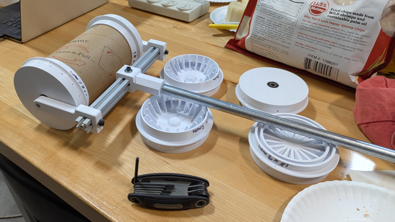
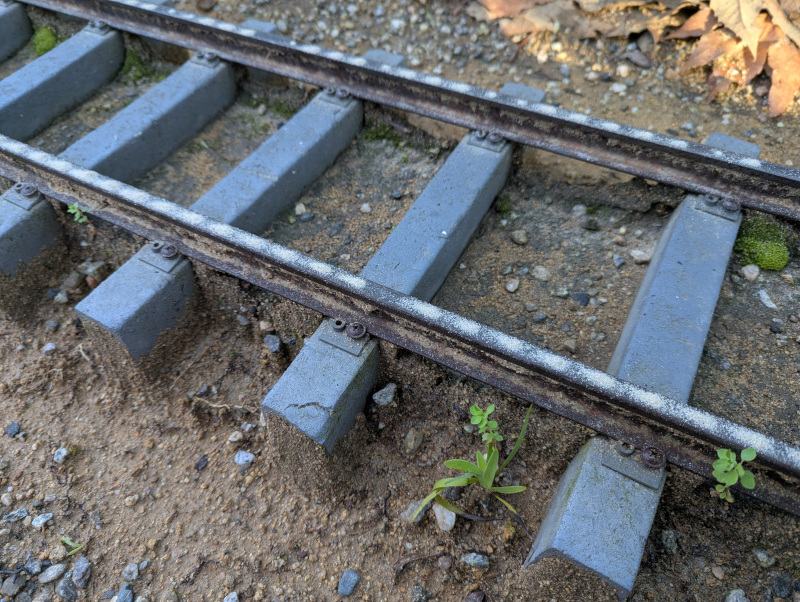

+++
date = '2026-02-17T18:40:52-08:00'
title = 'Sand Dispenser'
+++

# Sand Dispenser Project

## Motivation

Steel wheels on steel rail means very low friction. Which is great for
efficiency once a train is moving, but could be problematic when some extra
friction would be helpful, for example climbing up an incline. For this reason
trains have a
[reservoir of sand in a box or a dome](https://en.wikipedia.org/wiki/Sandbox_(locomotive)).
This allows the train crew the option to drop some sand on track, for the
wheels to get a little extra grip as needed.

From reading the above Wikipedia link and a few other sources, it feels like
sanding the rail is among the last resorts because of secondary consequences.
That sand doesn't just sit obediently on the rail. The wheels can kick them up
putting grit in all sorts of mechanical joints and electrical connectors that
do not welcome them.

Model railroads share the same concerns as full size trains: trading traction
now for possible mechanical or electrical issues later. But if you need it,
you need it. However, most model locomotives do not have functional sand
dispensers, so we'll have to sprinkle sand manually.

## Goal

This project is to make a sand dispenser to be used (sparingly as-needed) on
7.5" gauge model railroads. Immediate applications are the rail layouts of
[Los Angeles Live Steamers](https://lalsrm.org/about-us-cont/)
and
[Descanso Gardens](https://www.descansogardens.org/visit/train/)
thus they will dictate primary design decisions including the following:
* Minimize operator training requirements.
* Built and maintained without specialized tools.
* Durable and reliable operation

## Tube Core

LALS used to have a sand dispenser, which I've been told was worn out and
got tossed. That's not a surprise. Sand grittiness work both for and against
us simultaneously. But this is why an easily built design was an explicit
goal. Erosion will eventually win so we should expect to need replacements
periodically.

From verbal description the disposed dispenser was a cylindrical reservoir with
caps that the end imitating train wheels, with small holes for sand to escape
all around its perimeter. So that's what I built for my first prototype.

### Version 1.0

The cylindrical reservoir was a cardboard tube used by McMaster-Carr to ship
certain items, cut to approximately 7" in length. This tube forms the core of
the dispenser.

The rectangular cross-beam is a 20mm x 20mm extrusion beam from Misumi left
from the
[Luggagle PC project](https://hackaday.io/project/19583/)

The handle is a length of electrical conduit.

Two commodity 608 bearings help it roll.

Plastic pieces were 3D printed with PLA filament.
[Click here for CadQuery design file](./tube_core.py)
which is parametric for a design easily adjustable within a sensible (to me)
range of values. Things like diameter of holes and number of holes.

#### 2026/2/21 Test Run

I brought it to Descanso Gardens for their garden train maintenance staff to
take it on a test drive. The good news is the concept proved very promising
right off the bat, which always bodes well. It's not perfect but the initial
prototype wasn't expected to be.

Observations from the test run:
* Descanso rails get sanded in the morning due to morning condensation on
rails. This water gets combined with sand and the resulting mud can plug up
holes. A plugged hole leaves a gap in the line of sand. (Pictured above.)
* 2mm hole diameter seems to dispense a good amount of sand, but smaller holes
are more prone to clogging.
* 3mm hole diameter is more resistant to clogging but dumps out more sand than
necessary, emptying the reservoir faster.
* 18 holes around the perimeter seems to work pretty well. More holes may be
interesting to explore but not critical. Fewer holes are not expected to offer
any practical advantages.
* I always envisoned pushing the sander ahead of the operator, so I was
surprised when one test run was done dragging the device behind. This idea had
never occurred to me and was a delightful surprise that seemed to work better.
This is why prototypes should be tested by multiple people!
* Dragging it behind seems to help it stay on the rails better than pushing,
but either way, it seems to be prone to fall off the rails. Especially when
the handle is at an angle relative to rail centerline exerting a sideways
push/pull force.

Problems I expected ahead of time, but decided to not worry about it until the
basic concept has proven to work:
* Refill is a time-consuming process and need to be easier.
* Holes start dribbling as soon as sand is put in the tube and continues
until empty.  It would be nice to have some way to keep sand from falling out
until we're ready.

Now that the concept has been proven to work, I need to figure out fixes.

### Version 1.1

After thinking over the results of 1.0 test run, plan for 1.1 are:
* For better stability staying on track, I recieved suggestion that I make
the wheel flanges deeper with a sharper (less smooth) transition from
horizontal to vertical. This will violate the official
[IBLS Wheel Standard](http://ibls.org/mediawiki/index.php?title=IBLS_Wheel_Standard)
but maybe doing so is OK in this case.
* To improve refill time, I want to avoid the need to unbolt fasteners and
pull the entire wheel cap to refill. I have yet to think of a good way to
make wheel removal a fast tool-free experience, so I'll go with plan B: add
a hole to the wheel so we can stick in a funnel inside for filling without
taking the wheel off. Obviously this hole will need some kind of door or plug.
* To reduce likelihood of sand turning muddy, raise the holes slightly off
the surface and see if that prevents them from soaking up surface moisture.
This space will come from a small groove around the wheel. Will this fix the
problem or will we just end up with a muddy groove? The next test will tell us!
* Print a ring that snaps into the groove to keep sand inside instead of
dribbling. When we're ready to go, pop ring off groove to release sand.
* Turn a small piece of aluminum down to 2mm diameter end as a hole clearing
tool, design and 3D print a holding clip to keep it handy on the dispenser.
