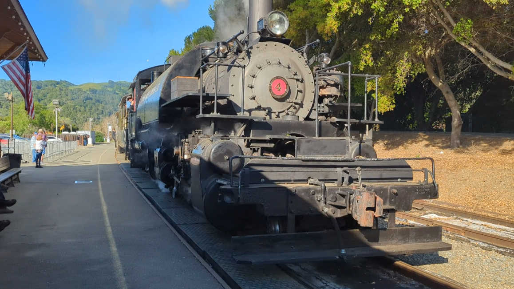
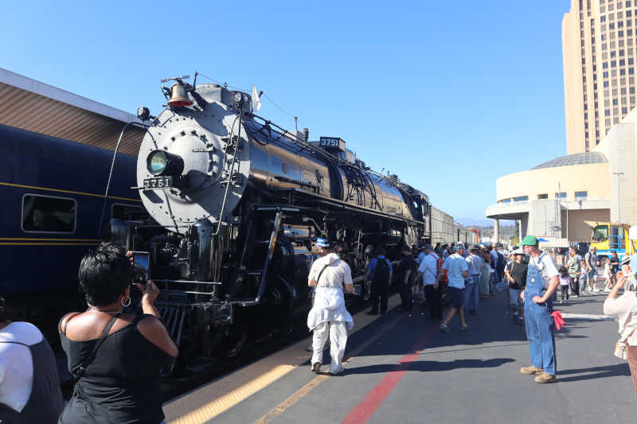

+++
date = '2026-08-08T19:29:11-07:00'
title = 'Train Places'
+++

# List of Train Places I Want to Visit

TODO: Put this on a map for a spatial layout instead of alphabetical list.

# United States

## California State Railroad Museum
Sacramento, CA

https://www.californiarailroad.museum/

## Colorado Railroad Museum
Golden, CO

https://coloradorailroadmuseum.org/

via Hyce on YouTube

## Cumbres and Toltec Scenic Railroad
Chama, New Mexico

https://cumbrestoltec.com/

Home of one of two surviving K-27 locomotives. https://en.wikipedia.org/wiki/Rio_Grande_class_K-27

123 miles from Durango & Silverton

## Durango & Silverton Narrow Gauge Railroad Museum
Durango, CO

https://durangotrain.com/

## Huckleberry Railroad
Flint, MI

https://geneseecountyparks.org/huckleberry-railroad/

Home of one of two surviving K-27 locomotives

## Illinois Railway Museum
Union, IL

https://www.irm.org/

via Mercedes Streeter of The Autopian

## Nevada Northern Railway Museum
Ely, NV

https://nnry.com/

Ride in a passenger car pulled by a steam locomotive? That's cool. Ride in the
cab with my hands on the throttle? Way better.
https://nnry.com/be-the-engineer-steam-engineer-hands-on-history/

## New Mexico Heritage Rail
Albuquerque, NM

https://2926.us/

Stewards of Santa Fe 2629, restoration site is open to the public. https://en.wikipedia.org/wiki/Santa_Fe_2926

## Niles Canyon Railway
Fremont, CA

https://www.ncry.org/

Multiple steam locomotives including Clover Valley Lumber Co. #4 2-6-6-2 Mallet.

## Railtown 1897
Jamestown, CA

https://www.railtown1897.org/

Home of Sierra No. 3 a.k.a. locomotive in Back to the Future: Part III https://en.wikipedia.org/wiki/Sierra_Railway_3

Recurring event: Hostling Tour to see No. 3 steaming up https://www.railtown1897.org/events/hostling-tour

## San Bernardino Railroad Historical Society
San Bernardino, CA

https://www.sbrhs.org/

Stewards of Santa Fe 3751. https://en.wikipedia.org/wiki/Santa_Fe_3751

## Southern California Railway Museum
Perris, CA

https://socalrailway.org/

Recurring event: Behind the Scenes https://socalrailway.org/scrm-events/behind-the-scenes/

## Train Mountain Railroad
Chiloquin, OR

https://trainmountain.org/

## Western Pacific Railroad Museum
Portola, CA

https://www.wplives.org/

via Kenneth Finnegan (KWF) https://www.wplives.org/staff.html

Novelty: Run a diesel-electric locomotive https://museum.wplives.org/ral/

## Western Railway Museum
Suisun City, CA

https://www.wrm.org/

They have an old BART.

# Japan

## Hokkaido Railway Technology Museum (JR Hokkaido)
Sapporo

Open only on a few days of the month and very limited support for visitors that don't read/speak Japanese.

## Kyoto Railway Museum (JR West)
Kyoto

https://www.kyotorailwaymuseum.jp/en/

500 Series Shinkansen end unit in display hall.

D51 steam locomotive in operating condition.

## Kyushu Railway History Museum (JR Kyushu)
Kitakyushu

https://www.k-rhm.jp/

## SCMAGLEV and Railroad Park (JR Central)
Nagoya

https://museum.jr-central.co.jp/

## The Railway History Park in Saijo (JR Shikoku)
Saijo

https://s-trp.jp/

## The Railway Museum (JR East)
Saitama

https://www.railway-museum.jp/

Note: Hands-on program participants are selected via raffle app for privilege of paying for an experience.

D51 steam locomotive operations simulator. (¥600)

# 臺灣 (Taiwan)

## 阿里山森林鐵路 (Alishan Forest Railway)
嘉義 (Chiayi)

https://afrch.forest.gov.tw/En

Sometimes the scenic rail service is operated by an old Shay steam locomotive.

## 臺南市體育公園 (Tainan Sports Park)
臺南 (Tainan)

DT251 (once mislabeled as DT259) C55 steam locomotive on static exhibit

DT652 D51 steam locomotive on static exhibit

## 臺灣高鐵探索館 (Taiwan High Speed Rail Museum)
桃園 (Taoyuan)

https://tdiscovery.thsrc.com.tw/index_en.html

## 哈瑪星台灣鐵道館 (Hamasen Museum of Taiwan Railway)
高雄 (Kaohsiung)

https://museums.moc.gov.tw/EN/MusData/Detail?museumsId=ad8619af-19cc-4489-81c2-e3cb25841f74

DT295 (once mislabeled as DT251) C55 steam locomotive on moving exhibit

Looks like they have a ride-on train in the ballpark of 7.5" gauge.

## 國家鐵道博物館 (National Railway Museum)
臺北 (Taipei)

https://www.nrm.gov.tw/

## 花蓮鐵道文化園區 (Hualien Railway Culture Park)
花蓮 (Hualien)

https://linktr.ee/hrcp.2021
https://en.wikipedia.org/wiki/Hualien_Railway_Culture_Park

## 彰化扇形車庫 (Changhua Roundhouse)
彰化 (Changhua)

https://en.wikipedia.org/wiki/Changhua_Roundhouse
