+++
date = '2025-01-01T00:00:00-08:00'
title = '2025 Timecards'
+++

## Sunday 2025/12/28

**Objective** Complete probationary membership requirements. (Fail)

I thought I would complete probationary requirements today but when I double
checked records I found I double-counted conductor hours on 12/7. So instead
of a few hours over, I'm actually a bit short. I made this mistake because I
had been writing down name of the engineer of train I was conducting. This
system broke down when Ronne and Rodstein traded off engineering
Santa Fe Electric on 12/7. Which meant my "conductor for Ronne" hours and
"conductor for Rodstein" hours were actually the same hours. Lesson learned,
note-keeping system will evolve!

Morning walk found a broken sprinkler cap just east of covered bridge.
Couldn't find matching broken pipe. Informed Nelson and Harper, Harper says
he'll look into it.

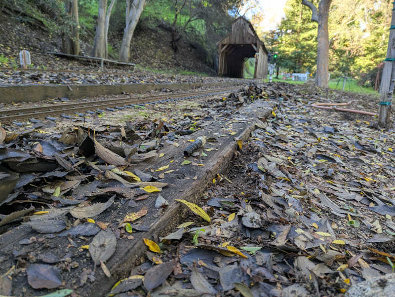

Took Santa Fe Electric for a no-passenger full lap under Cammarata
supervision. I will need to study signals further and get more experience
watching the points on switches.

Lunch options tamales or skirt steak.

Jay Leno stopped by with [Doble E-20 steam car](https://www.youtube.com/watch?v=rUg_ukBwsyo) and filled up on boiler water.

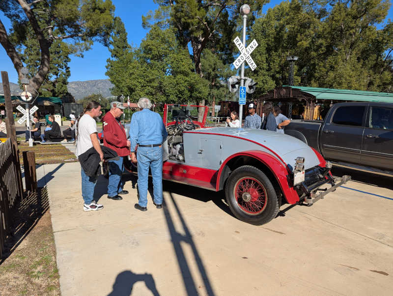

### Activity

* 8:30AM - 10:45AM (2.25 hrs facility)
  * Leaf blower ticket/line area and train platform.
  * Leaf blower on track.
  * Track walk. Still learning, Rodstein found stuff I missed.
* 10:45AM - 11:00AM (0.25 conductor)
  * Safety meeting for all train crews.
* 11:00AM - 3:15PM (4.25 hrs - 0.5 hrs lunch = 3.75 kitchen)
  * Restock cold drinks.
  * Help serve lunch.
  * Wash dishes.
* 3:15PM - 3:45PM (0.5 conductor)
  * Cammarata summed me to conductor for Nelson's train because Rodstein needed to leave.
* 3:45PM - 5:00PM (1.25 facility)
  * Assist 6-month task of reversing cars

### Tally

* 7.5 hours total
  * 3.00 facility (33.5 out of 18)
  * 0.75 conductor (16.5 out of 18)
  * 3.75 kitchen (7.75 out of 6)

## Sunday 2025/12/21

Christmas themed day along with Carolwood (Disney) barn. We had Santa, we had
Grinch!

Murphy brought Baofeng configuration equipment and set me up so I can use my
own radio.

Met another Roger. T and C sounded too similar over radio, though, so I
pronounced my last name instead of just initial.

Shawn brought and ran a Roger Goldmann (of original
[livesteamlocomotives.com](https://www.livesteamlocomotives.com/))
designed 2-8-0 steam locomotive pulling public rides.

Boschan brought and ran a small steam locomotive that fit in the trunk of a
Honda Civic, a reassuringly accessible size! Boschan works professionally in
a heat exchanger fabrication company, and offered to answer questions
about building boilers when I reach that point. The little locomotive is an
articulated 2-4-4-2 modeled after the
[Columbia River Belt Line 7 a.k.a. _Skookum_](https://en.wikipedia.org/wiki/Columbia_River_Belt_Line_7)

### Activity

* 8:45AM - 10:45AM (2.0 facility)
  * Water wheel mesh cleanup & startup
  * Leaf blower ticket/line area and train platform.
  * Leaf blower on track.
  * Track walk.
* 10:45AM - 11:00AM (0.25 conductor)
  * Morning safety meeting
* 11:00AM - 12:00PM (1.0 kitchen)
  * Restock cold drinks.
  * Wash dishes.
* 12:30PM - 1:00PM (0.5 facility)
  * Guest exit gate duty while Jack eats lunch.
* 1:30PM - 3:00PM (1.5 conductor)
  * Conduct for Nelson train
  * Handed over to Ames to conduct a train with her friends riding aboard.
* 3:15PM - 3:30PM (0.25 conductor)
  * After Ames-conducted ride completed, help Nelson put away SPPA.

### Tally

* 5.5 hours total
  * 2.5 facility (30.5 out of 18)
  * 2.0 conducting (15.75 out of 18)
  * 1.0 kitchen (4 out of 6)

## Saturday 2025/12/20

Stopped by for a bit of yardwork, make things more presentable for Disney
weekend. It's going to be a busy day. Kallgren said I just missed Jay Leno and
his Chrysler Turbine car by less than 15 minutes. That would have been awesome.
Ah well.

Kountry Kitchen seating area was getting pretty cluttered with pine cones and
needles. Somebody needs to clean it up and today that somebody is me.

Similar buildup around the adjacent caboose.

Rinsed off Carolwood driveway. Better but still not mud-free.

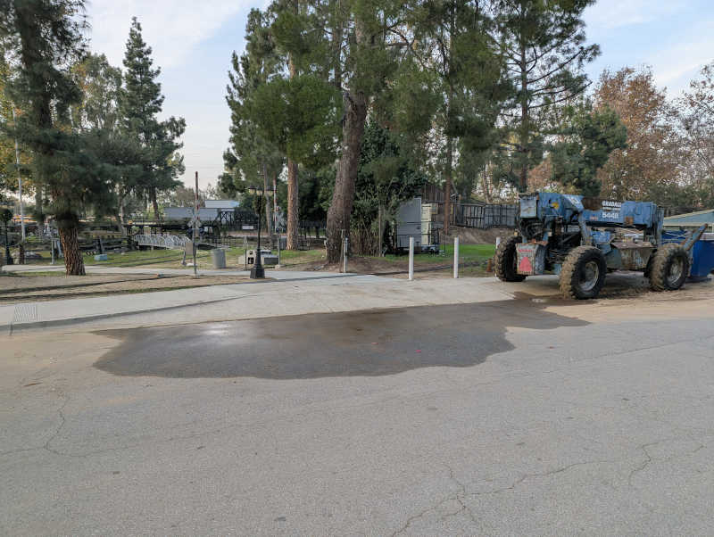

### Activity

* 1:30PM - 4:30PM (3.0 facility)
  * Leaf & pine cone/needle cleanup
  * Kountry Kitchen
  * Kountry Kitchen seating area
  * All around adjacent caboose
  * Sherwood station (even if I had to do it again next morning it'll be easier.)

### Tally

* 3.0 hours total
  * 3.0 facility (28 out of 18)
  * 0.0 conducting (13.75 out of 18)
  * 0.0 kitchen (3 out of 6)

## Monday 2025/12/15

Joined Nelson work crew to finish up Bagley wall project. After that, helped
to set new metal posts to replace wooden ones on a rail side billboard that
has rotted and toppled.

Under Nelson supervision, operated the center cab (a.k.a. work train) for about
half of east loop. My first time engineering a locomotive, exciting!

Learned the
[nearby Habit burger](https://maps.app.goo.gl/rJ5K8iNDwctFeKU29)
is a common lunch spot by joining for lunch afterwards.

### Activity

* 9:00AM - 12:30PM
  * Put horizontal wall logs behind new vertical posts.
  * Refill dirt behind wall.
  * Clean up work site.
  * Remove broken rail side billboard.
  * Drill holes for new vertical posts.
  * New posts in concrete.
  * Clean up work site.

### Tally

* 3.5 hours total
  * 3.5 facility (25 out of 18)
  * 0.0 conducting (13.75 out of 18)
  * 0.0 kitchen (3 out of 6)

## Sunday 2025/12/14

Murphy instructs me to send text reminder about Baofeng configuration equipment
next Saturday evening. Today my train engineer had an extra radio I could use
so I didn't need to check out a club radio.

Liz ran her Allen 2-6-0 Mogul steam locomotive around the track during public
run hours. Guests were entertained. Towards the end of the day shortly after
our public train left the station, we ran parallel to her train climbing up
towards Davis mine. I had a clear view through her locomotive running gear
and can see Stephenson valve eccentrics working away. Oh yeah! THIS is why
I am here!

### Activity

* 8:30AM - 10:45AM (2.25 facility)
  * Water wheel mesh cleanup & startup.
  * Leaf blower cleaning around Sherwood station.
  * Sherwood station umbrella raising.
* 10:45AM - 4:00PM (5.25 - 0.5 lunch = 4.75 conducting)
  * Conduct for Blake in Santa Fe Electric.
  * That was a long ass day! We were the first train out in the morning and ran two trains after official 3PM closing. We were the final train assigned to lock west gate.
  * Helped put away Santa Fe Electric.

### Tally

* 7.0 hours total
  * 2.25 facility (21.5 out of 18)
  * 4.75 conducting (13.75 out of 18)
  * 0.00 kitchen (3 out of 6)

## Sunday 2025/12/07

Whenever I'm ready to upgrade from my starter whistle, Ronne recommends
[Acme Thunderer](https://www.acmewhistles.co.uk/whistles-accessories/acme-classics/acme-thunderer)
58 or Titanic.

Lazarus ran public trains with one of his steam locomotives. This made guests
happy and I was happy to see and hear it run.

Liz fired up her
[Allen Models of Nevada 2-6-0 Mogul](https://allenmodels.com/locomotives/allen-mogul.html)
coal-burning(!) steam locomotive but unfortunately some misplaced fire grate
rods meant she couldn't run it. Liz was very friendly and answered questions
as I watched her go through procedure to shut her engine back down for
the night.

Liz loves the K-27 locomotive, specificially
[engine 463](https://en.wikipedia.org/wiki/Rio_Grande_463),
and was very excited to hear I'm contemplating building
[Kozo Hiraoka's K-27](https://secure.villagepress.com/store/items/list/group/961).
Sounds like I'll have an appreciative fan if I go make one a 463.

Since we were on the topic of favorite locomotives, I expressed my eventual
goal is to have a 4-8-4 Northern. Preferably the Santa Fe 3751 but I would
not complain about Santa Fe 2926. In response Nick G. answered his favorite
Northern was the Southern Pacific 4360. Quick internet search says this is
a MT-3 class 4-8-2 Mountain. Did I get the wrong one? Ask Nick later.

### Activity

* 8:30AM - 10:45AM (2.25 facility)
  * Water wheel mesh cleanup & startup
  * Heavy pine needle buildup around Sherwood station required broom cleanup
  * Leaf blowered lightweight remainder around Sherwood
  * Raise umbrellas
* 10:45AM - 3:15PM (4.5 conducting)
  * Conduct for Ronne/Rodstein in Santa Fe Electric
* 3:15PM - 3:30PM (0.25 facility)
  * Water wheel shut down
  * Lower umbrellas

### Tally

* 7 hours total
  * 2.5 facility (19.25 out of 18)
  * 4.5 conducting (9 out of 18)
  * 0.0 kitchen (3 out of 6)

## Saturday 2025/12/06

Joined Nelson's Bagley Wall crew in the morning, then stayed around for
additional independent facility work in the afternoon. Dorado tri-tip is very
tasty, hope I'll get more of it in the future.

Bagley wall work anticipated some roots may have grown behind the wall, but
they were far beefier than expected putting up a terrific fight. We even had a
few battles where wood triumphed over metal tools. I can see how this growth
exerted pressure making Bagley wall lean in.

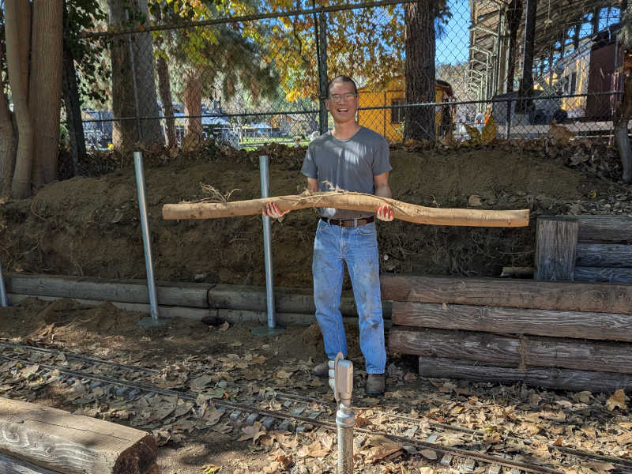

After the Bagley posts were set in concrete, the big crew had lunch then
dispersed. Since I'm already here and have time, I looked around at what else
I could do by myself.

The water wheel reservoir collected quite a bit of sediment after recent storm
so I started shoveling them out.

Before/after view of the reservoir wall.

Before/after view of the reservoir underneath rail bridge.

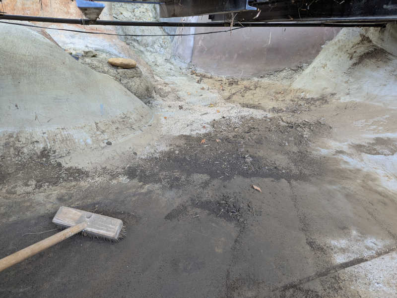

We also had quite a few leaves drop on rail layout. I can't do the whole
layout by myself in a day, but I can pick a section and make it better.

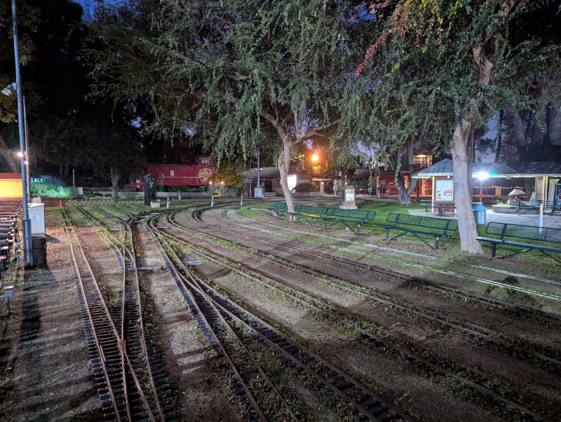

None of this will last, of course. Mother nature always wins in the end.
All we can do is to have it look nicer for a little bit.

### Activity

* 8:30AM - 11:45AM (3.25 facility)
  * Bagley wall disassembly
  * Set new vertical posts in concrete
* 1:15PM - 2:45PM (1.5 facility)
  * Shovel sediment buildup out of waterwheel reservoir
* 3:15PM - 5:15PM (2 facility)
  * Rake leaves from multilane track adjacent to steaming bays, west of Sutchville station.

### Tally

* 6.75 hours total
  * 6.75 facility (16.75 out of 18)
  * 0.0 conducting (4.5 out of 18)
  * 0.0 kitchen (3 out of 6)

## Wednesday 2025/12/03

I was in the area and had a few hours to spare, stopped in for some facility work.

Met Rick and Russ(?) as they sorted through their inventory in the storage
unit adjacent to elevated Gauge-1 layout. Rick's got a Audi TDI with DR GROSS
plate. Russ has a big truck and that's not a tow hitch in the back: it's a
train coupler. Cool!

Trees on the west end have started bearing fruit. Not ripe enough for eating
but big and heavy enough to droop down within reach of public ride passengers.
Several passengers on trains I conducted this past Sunday pantomimed reaching
to pick fruit. This is not good. It's a bit sad to waste food but safety is
paramount. I lopped off the literal low-hanging fruit to remove the temptation.

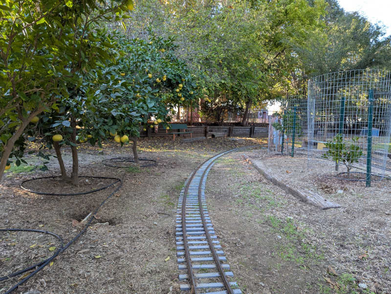

The driveway leading up to Carolwood barn collected quite the layer of mud
during recent storm. I don't like how it looks and I don't think guests will
want to walk over caked mud.

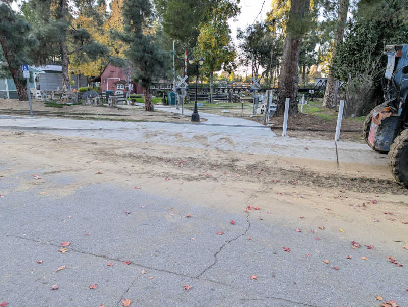

This is what I could do with shovel and broom. I think I need a pressure
washer or something to rinse off the final fine layer. But at least there's
no sinking guest shoes into mud anymore.

### Activity

* 2:00PM - 4:30PM (Subtract Rick/Russ chat time = 2.0 facility)
  * Lopped off grapefruit tree branches that had grown too close to track.
  * Trimmed other potential forehead-smackers on western end.
  * Shoveled thick (~1") layer of caked mud out of Disney barn entrance ramp.
  * Misc. cleanup requested by Glen Manchester

### Tally

* 2.0 hours total
  * 2.0 facility (10 out of 18)
  * 0.0 conducting (4.5 out of 18)
  * 0.0 kitchen (3 out of 6)

## Sunday 2025/11/30

My plan: After completing conductor training with Chavez, I came to see if I
can get a few ride-alongs and maybe a check ride.

Actual: "You finished the class?" "Yeah." "You passed the test?" "Yeah, 9/10."
"You're conducting today."

Normally I would talk to engineers to find out who needs a conductor, but today
is different because of an unexpected shortage of conductors resulted in some
shuffling and reassignment by safety coordinators.

### Activity

* 8:30AM - 10:00AM (1.5 facility)
  * Water wheel mesh cleanup and startup
  * Leaf blower around Sherwood station
  * Raise umbrella
* 10:45AM - 3:45PM (minus lunch = 4.5 conducting)
  * Conduct for Bassett in SPPA
  * Unexpectedly ran out of fuel in afternoon, eventually traced to fuel leak.

### Tally

* 6.0 hours total
  * 1.5 facility (8 out of 18)
  * 4.5 conducting (4.5 out of 18)
  * 0.0 kitchen (3 out of 6)

## Sunday 2025/11/23

I hung around Sherwood station (staying out of the way the best I can) to
learn what happens during Sunday public ride operations. Crabbe was very
helpful explaining what's going on and why.

Listened to several conductors' safety speeches.

One ride-along with McCabe conducting.

I got to see the fabled Engine No. 8, club-owned steam locomotive. Tour
by Anthony who just barely missed being able to run it when it broke down
nearly a year ago.

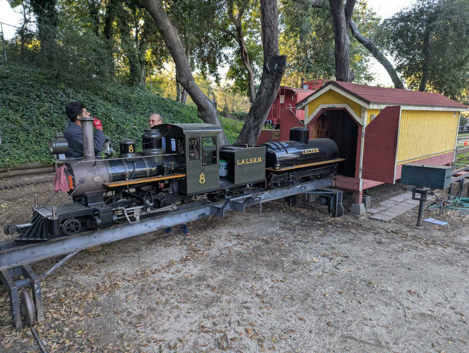

Chatted with Eber and Nick G. about 3.5" gauge steam engines. I consider
myself properly warned that smaller engines are more challenging to run
smoothly due to smaller margins in maintaining proper level of fire and water.

### Activity

* 3:15PM - 3:45PM (0.5 facility)
  * Help with end-of-day teardown
  * Lower umbrellas
  * Help put passenger cars away

### Tally

* 0.5 hours total
  * 0.5 facility (6.5 out of 18)
  * 0.0 conducting (0 out of 18)
  * 0.0 kitchen (3 out of 6)

## Sunday 2025/11/09

Introduce myself to the Kountry Kitchen and start helping out.

Dorado: "If you need hours, there is always something that needs doing
around here."

### Activity

* 1:30PM - 4:30PM
  * Instructed on how to restock cold drinks.
  * Put instruction to practice.
  * Instructed on dish washing sink.
  * And put that to practice, too.

### Tally

* 3.0 hours total
  * 0.0 facility (6 out of 18)
  * 0.0 conducting (0 out of 18)
  * 3.0 kitchen (3 out of 6)

## Saturday 2025/11/08

Welcome to the club, Roger! Now GET TO WORK!

There was a crew removing a switch and track that had gone unused and caused
more problems than it was worth. They seemed to have enough people so Mike F.
thought I could be more useful elsewhere. The first task was to move some
piles of plant trimmings to the organics bin, then I was assigned to clear
dirt around a sprinkler control system that was at risk of being innundated
by hillside erosion.

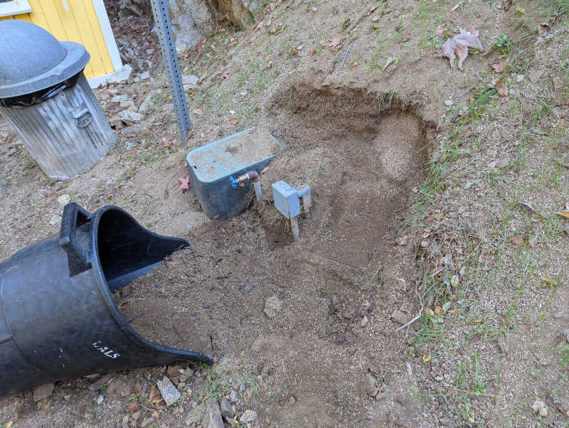

Some shoveling later, I've given the sprinkler controls some elbow room.

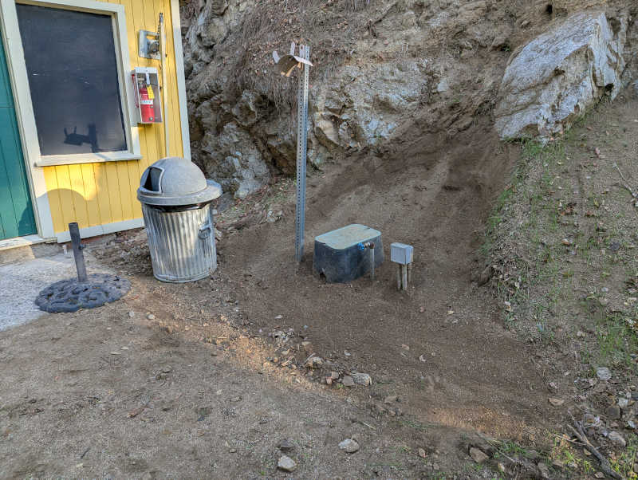

### Activity

* 8:30AM - 10:30AM (2 facility)
  * Collect piles of trimmings and put them in organic waste bin
* 10:30AM - 3:00PM (minus lunch break = 4 facility)
  * Shovel away dirt and rocks (eroded hill side) that threathened to bury the sprinkler control valves next to the member entrance booth.

### Tally

* 6.0 hours total
  * 6.0 facility (6 out of 18)
  * 0.0 conducting (0 out of 18)
  * 0.0 kitchen (0 out of 6)
