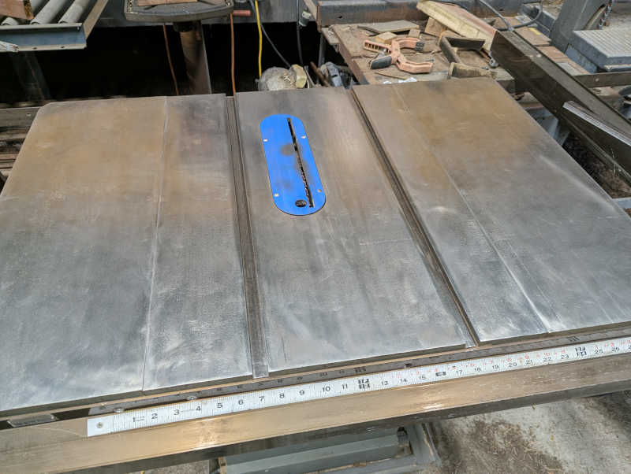
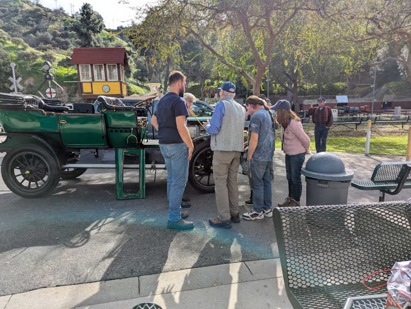
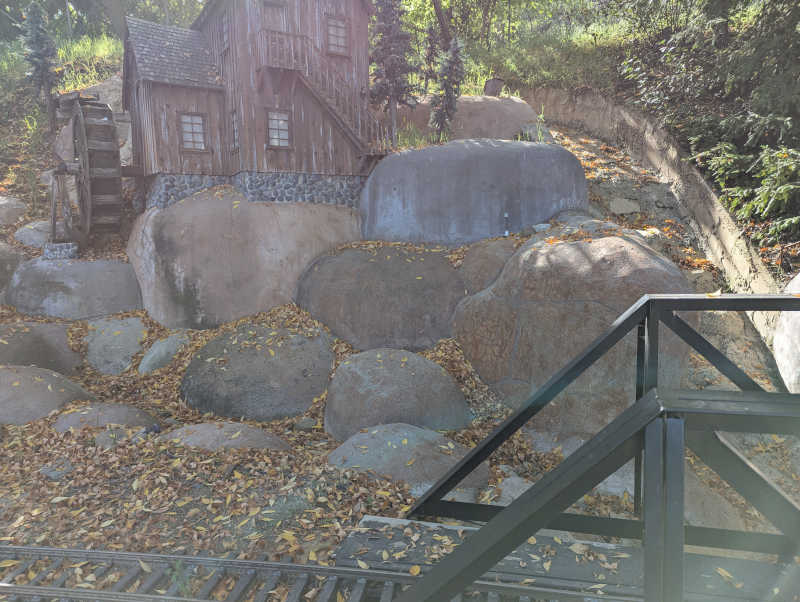
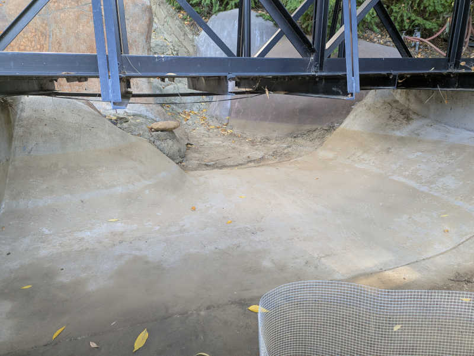
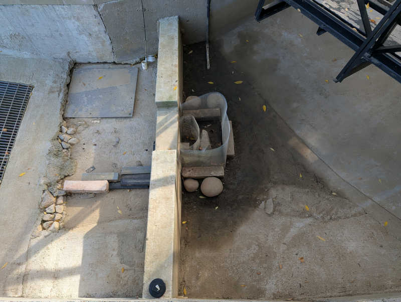
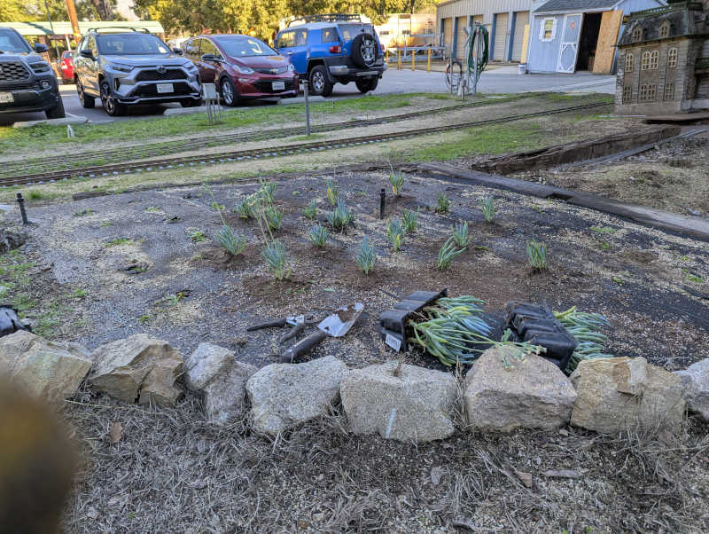
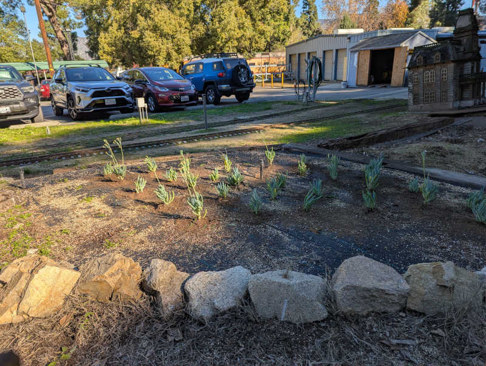
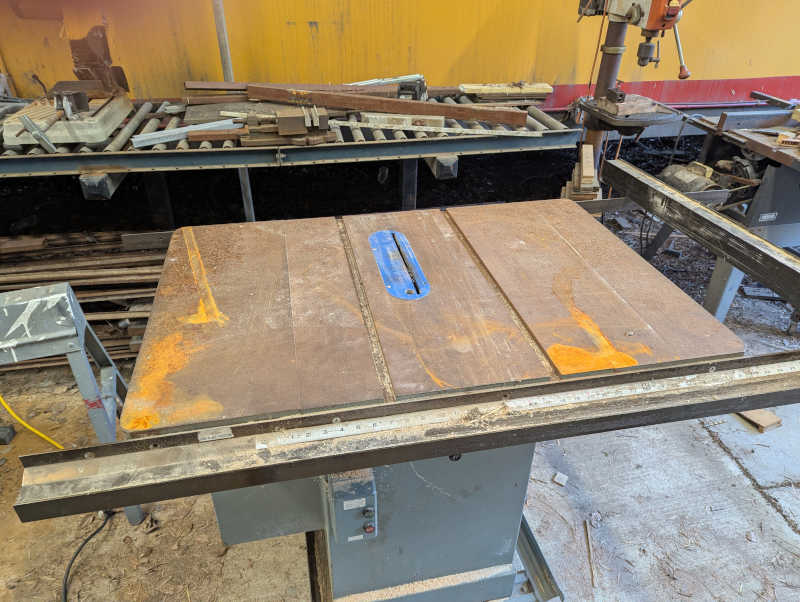
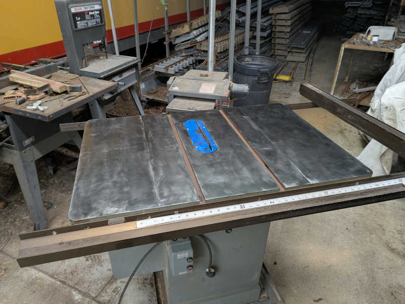

+++
date = '2026-01-05T17:23:49-08:00'
title = '2026 Timecards'
+++

---

## Tuesday 2026/1/27

* 7 hours total
  * 7 facility (61.25 out of 18)
  * 0 conductor (23.75 out of 18)
  * 0 kitchen (7.75 out of 6)

#### 9:45AM - 1:00PM (3.25 facility)

Joined for a full day of signal work! Started by helping Strawn make panel I
talk to panel R so that a red signal in zone I will trigger the appropriate
yellow signal in zone R. Learned valuable lesson that these panel connections
have isolated ground wires. In hindsight it was something both of us should
have known.

After that success, moved on to panel S. I put my familiarity with leaf
blowers to work clearing out leaves to help see where wires already existed.
Once wires were located and identified, it didn't take long for Strawn and
Harper to restore power timer functionality. The timer module needs a bit of
programming to make it display a countdown and adjust the time span, this
is now on Strawn's to-do list.

On the way out to lunch, we noticed false red/red displaying for main line /
mountain division. Strawn and Harper agreed that should take priority over
what they had on their to-do list for the afternoon.

#### 2:00PM - 3:45PM (2.75 facility)

After lunch Strawn opened up panel H to see why mountain division has a false
red/red. Found several error conditions that led to replacing two broken bond
wires and one broken track resistor. Unfortunately the light is still not
behaving quite right. Now the signal is green for main line, which is correct,
but mountain division light has both red and yellow illuminated even though
track voltage levels are consistent with a green. With wiring fixed and
voltage correct, the problem is likely somewhere within Smith proprietary
analog logic circuits.

We also found the both adjacent western blocks are completely unpowered with
zero train presence sensing voltage. Thus trains on those blocks are not being
tracked by the signal system. This has repercussions beyond today's scope of
work, will have to come back later.

After today's session I feel I can do some basic signal issue diagnosis using
a voltmeter, looking for 12-16VDC vs. 6-8VDC vs <1V DC. Probably can't
fix anything without access to signal panels, but can gather information to
help make repairs faster.

For next session: bring ferrule crimp kit and bring iPad online with Test
Flight for the signal system reference app.

#### 4:45PM - 6:00PM (1.25 facility)

After Harper and Strawn departed, I went back to my solo project: club's old
table saw. I cleaned off the top surface on Jan 10th but the grinder-mounted
Merryland strip disc could not get into the pair of recessed guide rails so
they remained rusty.

Today I brought some drill-mounted steel wire wheels that I can use to clean
out those slots. Taking care not to (further) mar the top surface with those
steel bristles.

Once those were clean, I put the guide back into the slot and noticed it was
also covered with rust. Good thing I saw it while I have all my tools handy,
so I could make it all nice and shiny too.

After applying a coat of oil to keep rust from immediately returning, I am
content to call the table saw project done for now. Pending evaluation and
feedback for improvement.

---

## Sunday 2026/1/25

* 5.5 hours total
  * 2.25 facility (54.25 out of 18)
  * 3.25 conductor (23.75 out of 18)
  * 0 kitchen (7.75 out of 6)

#### 8:30AM - 10:45AM (2.25 facility)

Lots of leaves dropped on the water wheel feature. Blew and raked three
garbage cans worth of leaves for the organics bin while McCabe worked on the
debris screen. I wasn't confident I could put it back together so I hadn't
taken it apart in my previous work sessions. Today was the first time I could
watch McCabe take it apart, shovel accumulated dirt, and put it back together.
Now I can handle doing the same the next time I shovel out the reservoir.

Learned the fine mesh filter looped over the drain pipe exit were nylon sheer
knee-high socks. The old one was retired and a new one installed, with a few
extras available for the future.

After the water wheel was sorted out, took the leaf blower and walked the
west loop. Leaf clearing was easier because Tagochi had already done some
of it with a gas-powered blower. Usual rocks and branches, nothing major.

As I completed my west loop walk, Rodstein reported a problem with the east
loop: rails over a bridge were loose, moving as much as 1/4" laterally which
is bad. I join the crew making an expedient field repair to steady the
rails for Sunday ride operation. A real fix will be needed later.

#### 10:45AM - 11:00AM (0.25 conductor)

After safety meeting I was slated to conduct SPPA, but Tagochi needs more
conductor hours so I gave up that seat.

#### 11:45AM - 12:45AM (1.0 conductor)

Santa Fe Electric conductor duty. McCabe handed off to me, and I handed off
to (?) at lunchtime.

#### Lunchtime entertainment

During lunch break, saw Jay Leno stop by with his White (that's the
brand name) steam car. Judging by its green color, I guess it is the
[1909 Model M featured in this video](https://www.youtube.com/watch?v=pw2Tm9o6fiQ).

Love that the thing was designed without an electrical system. Not just lack
of electronics: lack of electricity! No spark plugs, no ignition. All lights
are acetylene gas burning lamps, including the dashboard instrument light.

As he departed he gave us a toot of the horn -- a multi-tone steam whistle, naturally.

#### 1:30PM - 3:45PM (2.25 conductor)

Resumed conducting Santa Fe Electric engineered by Blake. Continued for the
rest of the day including last train of the day duty of locking west gate.

#### Miscellaneous

Saw that someone performed the experiment discussed at general member meeting.
I cautioned against using vinegar on corrosion concerns. Well, they were right
it would kill weeds, and I was right it greatly accelerated rail corrosion.
(And probably fasteners, switches, etc.)
I stand by my opinion rail condition is an important concern at a train club.

The pump house clock has been one hour off for several months, since the time
we were supposed to "fall back". Alexander helped me adjust the clock so it
reads correctly again. That was an adventure but we should be able to
do it faster in a few weeks when we "spring forward". Afterwards we were told
Harrison could do it quickly so I should ask him about it the next time I
see him.

Got a chance to look inside the club library, saw the collection included a few
out-of-print titles that I would be interested in digging into later. Including
Kozo Hiraoka's Climax and Pennsylvania A3 Switcher books.

Dinner at Tallyrand. They do a solid chicken fried steak.

---

## Tuesday 2026/1/20

* 2.5 hours total
  * 2.5 facility (52 out of 18)
  * 0 conductor (20.5 out of 18)
  * 0 kitchen (7.75 out of 6)

#### 2:00PM - 4:30PM (2.5 facility)

Accepted Strawn's invitation to join in signal work today though I only got
to participate towards the end as I had an existing eye doctor's appointment.
Still, I got to help a bit and learned a lot doing it.

The biggest lesson of the day: all my past career skills trying to make sense
of poorly documented legacy code built up over decades will transfer directly
to making sense of poorly documented track signal wiring built up over
decades.

Past work have not necessarily been done with maintainability in mind, as
demonstrated by fasteners only accessible from below. Which today means we
would need to pull up the track segment to get to it. They likely built the
assembly while laying the track and plopped them into the ground together.
Not accounting for the possibility someone may need to service the switch
independently at a later date, like today.

History can also be found in wires that today goes nowhere and connect to
nothing, trying to tell me stories of projects past.

I had expected to see major differences between the components I've used for
my indoor electronics projects and track signal equipment out in the
elements. Like extensive waterproofing to mitigate corrosion and
studious grounding to maintain signal integrity. I didn't see much of that at
first glance. I hope I'm just overlooking mechanisms I don't yet recognize,
but if not maybe it is a contributing factor of signal reliability issues.

One thing I am confident of: there will be no shortage of work that needs
doing here.

---

## Sunday 2026/1/18

* 5 hours total
  * 2.25 facility (49.5 out of 18)
  * 2.75 conductor (20.5 out of 18)
  * 0 kitchen (7.75 out of 6)

#### 8:30AM - 10:45AM (2.25 facility)

Introduction to track signal system from Strawn. Included some history on both
technical and non-technical issues surrounding the signal system.

Cleaned up some of leaves built up overnight on water wheel, then turned on
water pump. Watched until I was satisfied the water flow closed the cycle
correctly.

Pre-run inspection walk for west track. Rodstein verified. Rock fall is
active: a big rock fell on the track in the time between my walk and Rodstein's.

No leaf blower on track today because somebody took the bucket of batteries. In
hindsight I should have gotten on the radio and asked who's got it. That's what
a radio is good for!

#### 10:45AM - 12:30PM (1.75 conductor)

Safety meeting.

Conductor for Santa Fe Electric engineered by Cook. Handed off to Ames for my
lunch break. I took this opportunity to go thank Carolwood staff for being
friendly and waving to our guests.

#### 1:45PM - 2:45PM (1 conductor)

Conductor for Rio Grande UP 1989 engineered by Nelson. A bit of unwelcome
excitement in the form of engine derailment at mausoleum when first axle of
second bogie went off track. Joked with guests this is an extended tour of
rail operations at no extra charge. Needed to disconnect engine from train
to put the engine back on the tracks. I learned that a
[powered slug](https://en.wikipedia.org/wiki/Slug_(railroad))
would have made this particular derailment recovery much more difficult so it
was a good thing our engine was not configured as such.

Several pairs of eyes found no plausible explanation for derailment. Engine
went through the same location just fine afterwards. Shrug.

Handed off to Bickel to conduct a train with his family on board. He finished
off the day at that post.

---

## Saturday 2026/1/17

* 2 hours total
  * 2 facility (47 out of 18)
  * 0 conductor (17.75 out of 18)
  * 0 kitchen (7.75 out of 6)

#### 12:30PM - 2:30PM (2 facility)

Stopped in to shovel sediment out from water wheel reservoir so tomorrow's
Sunday public run can use the lower outlet pipe instead of filling up the
reservoir and spilling over the wall like last week.

Shoveling was easier than the last time I did it, partially because it hasn't
built back up as much and partially because I am getting more practiced at it.

The dirt is the functional concern, but the buildup of leaves was a secondary
appearance concern. I can clear out the dirt but, as the tree is actively
dropping leaves every time there's a breeze, clearing out all the leaves is
impossible. I can only make it better than it was.

Thick buildup of leaves on the structure before my work, a thin layer of fresh
leaves when I called it quits.

Dirt and leaves at reservoir entry under the rail bridge, before and after.

Reservoir dam, before and after.

McCabe happened to stop in as I wrapped up my labor, he reviewed and approved
of my results.

#### 3:15PM - 4:00PM (0.75 facility not counted)

Tried to improve appearance of old table saw without success. Not counting
this wasted time.

---

## Sunday 2026/1/11

* 4.25 hours total
  * 3 facility (45 out of 18)
  * 1.25 conductor (17.75 out of 18)
  * 0 kitchen (7.75 out of 6)

#### 8:30AM - 10:45AM (2.25 facility)

Track morning walk with leaf blower to clear loose leaves from track.
Also removed derailment risks like rocks, branches, and pine cones.
Since I had the leaf blower, finish my morning routine by clearing off
Sherwood station platform and guest entry area.

The water wheel feature is still a bit of a mess after recent rains. I found
the grate lifted, implying somebody was in the middle of a project.

#### 10:45AM - 11:00AM (0.25 conductor)

Train crew safety meeting. Three trains had their engineers and conductors
so I'm relief conductor on an as-needed bases. Frees me up to go back
and look at the water wheel.

#### 11:00AM - 11:45AM (0.75 facility)

After 11AM and no sign of McCabe, reached out via text message. Received
assignment: Reinstall grates, clear out whatever leaves are easy to clean,
then activate water wheel. Campbell helped execute this plan.

It took a while for water reservoir level to build up to flow over the wall.
The pump had to cycle on and off several times before reaching a state of
steady flow.

#### 1:45PM - 2:45PM (1.00 conductor)

Late in the afternoon I conducted Fuad's train for an hour then helped put
the bench cars and the engine away at the end of the day.

#### 3:15PM

Turned off water wheel electric power and water valve. See what the reservoir
looks like next time.

---

## Saturday 2026/1/10

* 7.5 hours total
  * 7.5 facility (42 out of 18)
  * 0 conductor (16.5 out of 18)
  * 0 kitchen (7.75 out of 6)

Work day! Good turnout means getting lots done alongside with general meeting
people and socializing.

Followed up with Paul Boschan about boilers. I should try to get my hands on
[ASME BPVC](https://www.asme.org/codes-standards/bpvc-standards)
section 1. It sets up the basics and also define miniature boiler
which applies to scale steam models and locomotives.

#### 9:00AM - 10:00AM (1 facility)

Work began with a Nelson assigned task: plant some baby Blue Chalksticks
([Senecio Mandraliscae](https://en.wikipedia.org/wiki/Curio_talinoides))
to see how they do. Previous plant experiments got eaten by
park animals, hopefully they don't find these as delicious.

There are a few more holes in the weed cloth than there were plants. I filled
the middle leaving borders around. If these survive, we can either plant more
to fill out the perimeter or hope the plants will fill out.

#### 10:00AM - 12:15PM (2.25 facility)

Next up is a Finch assigned task to rake leaves. I accidentally gathered a
crew for this task as Bickel and Chu asked how they can help with work day.
Might as well invite them to join me!

Three people working as a team cleared up leaves built up in front of the
two leaf-infested ground level tunnels. We finished up in time for lunch.

Lunch of tasty Mama Bear sandwiches and chatting with club members I have yet
to meet.

#### 1:00PM - 2:45PM (1.75 facility)

After lunch I was assistant for Perez project of setting up radio repeater.
There were a few minor misadventures including a lost & found antenna cap
but it's nominally up and running. To test range I walked over to Bagley wall
while Perez walked to member entrance gate. Sounded really good!

With the new repeater antenna active, the old antenna was coiled up. It will
be removed later but it stops being a trip hazard now.

After radio project declared a success, took a break to chat with Perez and
Chu and Chu (father and son) about trains and the club. For driving large
brushed DC motors Perez recommends the
[Dimension Engineering Sabertooth 2x32 driver](https://www.dimensionengineering.com/products/sabertooth2x32)

After they departed for home I moved on to my solo project.

#### 3:30PM - 6:00PM (2.5 facility)

At the board meeting Suncin asked for volunteers on several projects, I signed
up to remove rust from the old table saw. Suncin specified
[Merryland Strip Disc](https://www.amazon.com/dp/B0DFM46FYS)
for the job so I bought a pack and had it along with my angle grinder ready in
my car. I brought them to the rusty table saw surface.

The rust was more advanced than I had thought. It had grown beyond light
surface rust to having a pretty hardy black layer. The strip disc was up to
the task of removal but it wasn't as gentle as I hoped it would be. While
better than a steel wire brush, it still left swirls of a rotary power tool
at work. Nevertheless, the top flat surfaces are now rust-free.
The two guide channels and the guide bar itself are still rusty, as the
Merryland disc isn't the right shape to address those items.

This was a good place to pause, as I've maxed out the daily work hours limit.
I found a quart of random motor oil in a cabinet. I applied a thin coat to
keep rust from immediately returning while I think about what to do next.

---

## Sunday 2026/1/4

* 1.0 hours total
  * 1 facility (34.5 out of 18)
  * 0 conductor (16.5 out of 18)
  * 0 kitchen (7.75 out of 6)

#### 9:00AM - 10:00AM (1.0 hrs facility)

No public rides today due to rain, but stopped in to walk around the track in
reverse direction from what I've been used to so far. Trying to imagine what
I would watch for to ensure passenger safety. No leaf blower today, but I did
pick up large branches as I went along.

Walking down mountain division eastward from water wheel, my left foot found
a sinkhole collapsing to nearly my knee. Thankfully I did not twist my ankle.

Here's a picture showing its location relative to train storage barn.

The hole is immediately above a water drain hole. Looks like dirt has been
draining out of that hole along with water.

To ensure my good intentions won't end up being counterproductive I consulted
with Nelson via text message. After confirmation I'm good to go, I grabbed a
shovel and filled the hole back up with dirt conveniently at hand.

Since it's raining, things are still muddy. Will need to revisit after it
has a chance to dry and settle, but at least now it presents no risk to
anyone else's ankles.
