+++
date = '2026-01-05T17:23:49-08:00'
title = '2026 Timecards'
+++

---

## Sunday 2026/2/15

* 5.5 hours today, 27.75 hours this quarter.

Public rides on Carolwood day. It was not a smooth running day. I had to call
for more train stops just today than I ever had to do since the day I started
conducting for LALS public rides.

#### 10:00AM - 12:30PM (2.5 hours)

After enjoying a French toast breakfast by the kitchen, I helped Cammarata
adjust Sutchville clock which I hadn't noticed earlier. Also tried to adjust
the station clock, but nobody on site has a key to get into the library. We'll
have to do that later.

When we "Spring Forward" in a few weeks, the list of clocks in rough order of
difficulty are:
* Kitchen
* Sutchville station (x 2)
* Pumphouse (8 foot ladder + two person job + member key)
* Sherwood station (6 foot ladder + two person job + library key)

At this month's board meeting it was suggested that we skip the water wheel
today, in order to ensure Crystal Springs stays dry for slurry seal.
Since the slurry plan has been postponed due to expected rain, I turned the
water wheel on.

Just before safety meeting I grabbed a leaf blower and did a quick "better
than nothing" round to clear Sherwood station of pine needles and leaves.

This morning was also classroom instruction for the next batch of train
conductors. I started the day conducting for Santa Fe Electric operated by
Blake, with Eigan and Clouse as ride-alongs. Quite the "teaching moments"
today, with one derailing caboose and multiple unruly passengers. Ames
took over conducting just in time for me to go eat and calm down.

Elsewhere on the grounds, a private train derailed with much onboard
drama, a train suffered a brake system failure causing uncommanded brake
activation, and reports of signal & switch issuees that will need to be
checked out later.

#### 1:00PM - 4:00PM (3 hours)

After lunch, on standby floating conductor duty. Cammarata also needed
a floating engineer. When I said I hadn't been certified to be engineer for
public trains, was told to work on that. Will do!

In midst of filling miscellaneous public ride operations needs, also joined
Ames for a round of kitchen dishwashing. It went a lot faster with two
on the job.

Ames returned to conducting, then I took over when Ames had to leave
promptly at 3PM. Carolwood day crowds meant we ran well past 3:30PM before
we drained the queue. Not helped the fact I had to call for another stop
due to misbehaving passengers. What is up with today!?

To support "work on that" mentioned earlier, I was given my first opportunity
to operate engine 1989 as we put away bench cars and put the engine back into
its berth. Looking forward to getting checked out on all club engines.

I turned off the water wheel.

Newly applied Southern Pacific caboose graphics looks great. I also learned how
to work the rail gate plank thing for when I can't duck under 1-gauge elevated
layout for whatever reason.

---

## Saturday 2026/2/14

* 7.5 hours today, 22.25 hours this quarter.

Monthly LALS work day. I stayed with Strawn and Harper to resume where we
left off yesterday.

#### 9:15AM - 12:15PM (3 hours)

Day started with panel H. Strawn's train was parked alongside. It looks
good in front of rail town Minden. Crabbe, Rodstein, Tagochi, and probably
others dug Minden out from eroded cliff that had threatened to bury it.

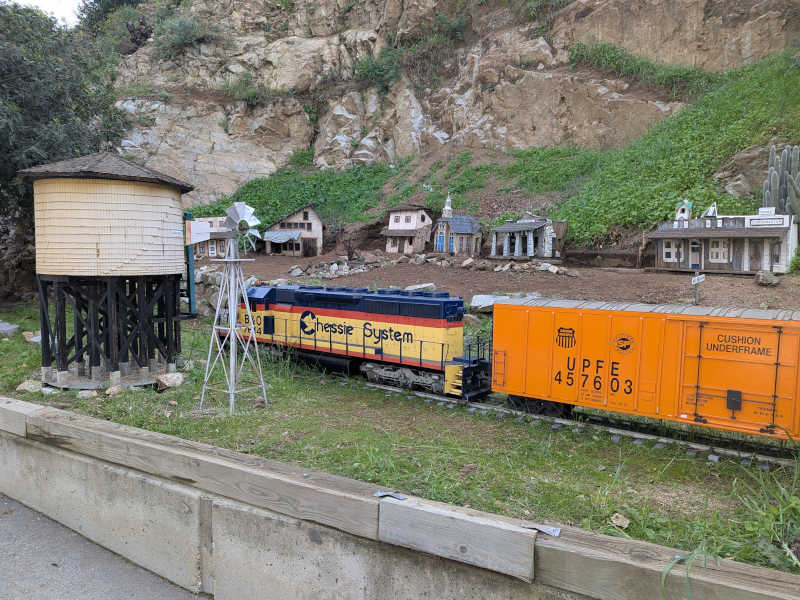

One board and one conduit wire run replacement later, we have resolved the
false red+yellow coming down from mountain division. It's been a long time
since we saw green on that light!

Panel H still has a long to-do list but this is good enough to support Sunday
public run operations. We switched focus to panel L so it can do the same.
First task was to find the open circuit for rail block 1. Tracing feed wires
through vaults, we found one not connected to anything. "Well there's your
problem!"

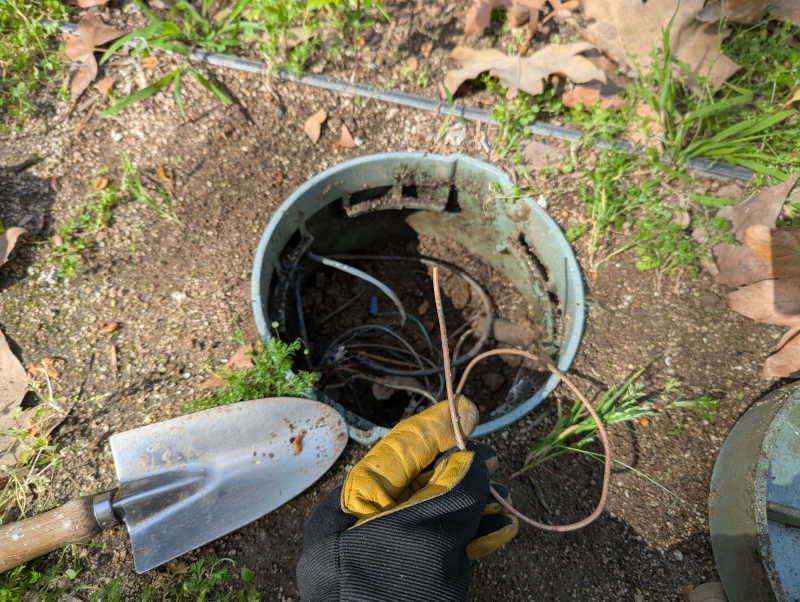

It looks like a wire nut failure. After fishing out the corresponding wire,
a new lever connected them and panel L block 1 was back in business.

Panel H block 4 was identified as a concern yesterday, but it's not on
mainline and it is heavily contaminated with leaves so it is lower priority
for later.

Clouse was working in that area whacking weeds and noticed a broken wire
on panel L block 12. This wire bridged the outer rails of the switch and
would explain the inconsistent detection on that block. This would mean the
detector would see train on one side of the switch and not the other, and the
detector would not see a fault. Installing a replacement wire restored
block 12 detection.

#### 1:15PM - 3:00PM (1.75 hours)

Signal light LI green LED turned out to have _two_ intermittent connections.
The wire not loose in the connector terminal. After that was reseated, found
another loose connection between the connector and the LED backplane board.

Hypothesis: The increased resistance associated with the loose wire heated
up the connector plastic housing. Distorting the associated spring terminals
which no longer gripped the solid metal post soldered to the LED backplane
board.

Proper fix: Replace all components suspected of heat damage, which means both
the connector and the LED backplane.

Today's hack: bend the LED backplane metal post a tiny bit so it makes better
contact with connector spring terminals. If this doesn't work, then let's
proceed with the proper fix.

Between yesterday and today, we've restored all known signal issues relevant
to standard Sunday public ride operations. However note light IE shows either
yellow or red, never green. This is masked by the fact Sunday route goes up to
the waterwheel. So IDA/IDB will show red/yellow. When this is true IE is
supposed to show yellow anyway.

#### 3:00PM - 5:45PM (2.75 hours)

As Harper and Strawn departed, I saw Hitchcock setting up the fabled super
sucker machine. I went over to learn how to use it. Brief training session
was followed by getting some field experience with it.

It's very cool but it isn't quite a miracle worker. The flexible suction hose
is getting old and brittle and today's use ripped a pretty big hole. We had to
take a break to find some duct tape for patch work.

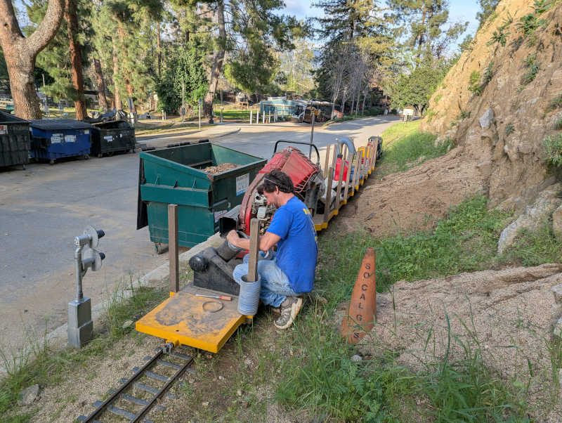

Even after it was patched I learned it is quite easy to overload the pipe
causing a blockage. Between patching holes and clearing blockages, we lost
daylight before we could vacuum up all the piles of leaves we had raked up.

#### 5:45 PM - late (no club credit)

The super sucker is stored on a pit rail dedicated to equipment, which is the
center of three tent-covered rails. Also on that rail is the caboose that
came as a set with engine No. 8. While the engine is kept in a barn, the
caboose has been sitting outside. Hitchcock rolled it into the maintenance
bay for some cleaning TLC. I watched and learned and chatted.

This week's rain dropped some water on the old table saw, causing a few new
rust spots. Being fresh and very minor they were quickly cleared up with a
wipe of rust preventative LPS 2 highly recommended by Hitchcock. I should be
able to find a can for myself near WD-40 on hardware store shelves.

---

## Friday 2026/2/13

* 4.25 hours today, 14.75 hours this quarter.

Mid-week signals work day focused on panel L

#### 11:00AM - 11:45AM (0.75 hours)

Preparation for running wires through underground vaults for detector block 11
which will replace current above ground wires vulnerable to damage.

#### 11:45AM - 1:15PM (No club credit)

The panel J motor 1 project required some support from Nelson's home machine
shop so made a trip combined with lunch.

#### 1:15PM - 4:45PM (3.5 hours)

Ran four wires through several underground conduits and vaults. Two wires for
detector 11. One to adjacent potential timer block (future project), and the
last wire as backup in case timer block could not share feed/return wire with
detector 11.

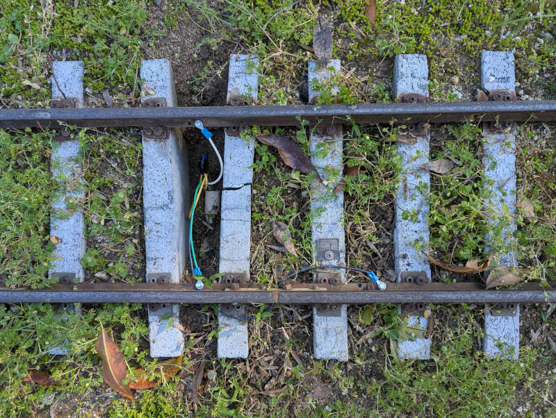

Afterwards, checked everything associated with panel L. Found several problems.
* Block 1 failed to detect. Board sees full voltage indicating open circuit.
* Block 4 failed to detect. Board sees proper voltage.
* Block 12 (associated with switch motor 3) inconsistent detection.
* Signal light LI green LED has intermittent connection somewhere.

To be continued...

---

## Sunday 2026/2/8

* 4.5 hours today, 10.5 hours cumulative

#### 8:30AM - 1:00PM (4.5 hours)

Arrived at LALS to see the fabled "Gold Rusher" locomotive out for some
maintenance work. It gleamed beautifully in the morning light. I hope to see
it choo-choo down the rails at some point in all its shiny glory.

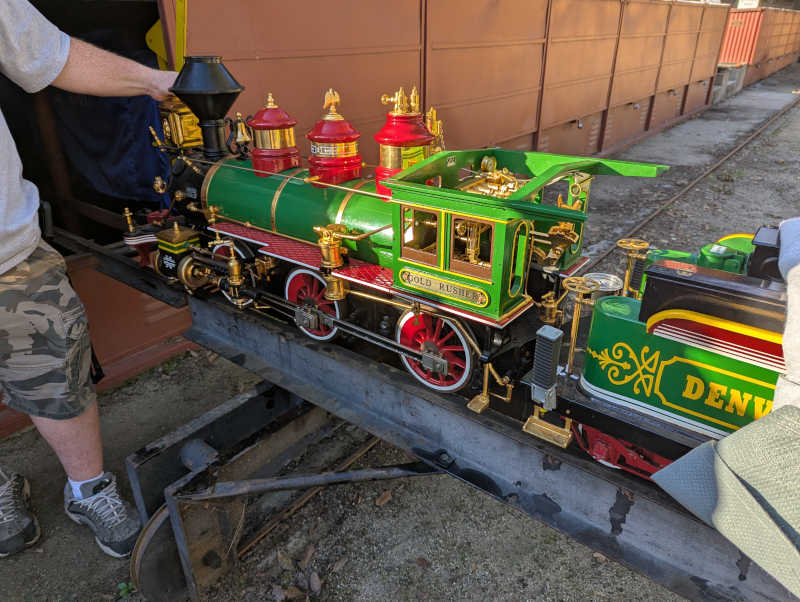

I grabbed a leaf blower and walked the west loop. Noticed several pieces of
rusty debris in close proximity to each other but with no obvious source.
All rail within ~4' in either direction looks fine to my eyes. Later Kristman
identified them as heavily corroded rail tie plates and associated fasteners.
I think I would have noticed missing tie plates so where did these come from?
Still a mystery.

While I had the leaf blower in hand, blew pine needles and such off the
concrete areas of Sherwood station: both the customer waiting line area
and train platforms.

The signal (KAB?) by the curved westbound rail leading to O'Brien-Moore
bridge was correctly green as expected when I walked past. But later coming
back the other way, I happened to look over my shoulder and saw it was red
with no train. This may be related to that oddly dual-purposed rail segment
B-K2. For the moment I can only report it as a known false red to Strawn and
at the safety meeting to Sunday operations train engineers.

Helped Alexander restock the cold water refrigerator in the ticket booth.
Then figured I might as well stay on the theme and went over the Kountry
Kitchen beverage cooler as well. Several flats of drinks are now all in the
refrigerator, opening up storage shelf space.

While moving bottles towards the front, I found there's something brown and
sticky (Coca Cola? Pepsi? Dr. Pepper?) on the bottom. I wiped up the stainless
steel, and also bottoms of several cans that were sitting in that stuff.

Sent pictures of updated status (storage shelf, cooler left, cooler right)
to Dorado for his information.

Meeting up with friends for lunch today so departed at 1PM.

---

## Friday 2026/2/6

* 3.0 hours today, 6.0 hours cumulative

#### 11:00AM - 1:30PM (2.5 hours)

Met up with Strawn and Harper by panel K to see why signal light KD is dark.
An ultimately unsatisfying session because after probing some panels and wires
the light came back on without any intentional change on our part. Intermittent
connections make us tear our hair out.

While probing panel K, learned that a segment of rail (B-K2) has an associated
train presence detector board for signal purposes AND hooked up to another
detector that triggers a timer to control signal panel power. The timer
functionality is usually done by a short dedicated length of rail. What are
the tradeoffs between using dedicated rail versus dual-purposing like this?

Panel K is also unusual in having an always-on exhaust fan pushing warm air
out of the enclosure. This may be related to the timer board (since it needs
to stay on 24x7 to control whether the rest of the panel comes on) or it may
be due to the fact this panel gets a lot of sun exposure. New idea for the
project to-do list: add a rail side scenery facade building that also act as
panel K sun shade.

With some lessons learned about panel K and KD illuminated, attention moved on
to a rail switch motor control module in panel J. The new module is not an
identical drop-in replacement for the old so wiring verification and remapping
had to be done first. This was more difficult than it should be, partly due to
technical problems like a jumper wire that didn't actually jump, and to non-
technical issues like low blood sugar. Fix for the former: different jumper
wire. Fix for the latter: get lunch.

#### 2:30PM - 3:00PM (0.5 hours)

Continue panel J rail switch motor board replacement. Good news: the new board
sees user pressing on the rail side pole switch. Bad news: the new board isn't
commanding the MOSFET to send power to the motor. Without power the motor
doesn't turn and the switch doesn't get thrown.

I had to be out the gate by 3, Harper and Strawn continued working.

---

## Monday 2026/2/2

* 3.0 hours today, 3.0 hours cumulative

First yellow time card as full member!

#### 1:00PM - 4:00PM (3 hours)

Helped Strawn with signal work.

Opened up the Sherwood station crossing signal boxes because they aren't
doing anything as if they don't have power. Tracing through the power
supply board, everything looks to be in order. That's when we noticed the
signals are now powered up. Hypothesis: there's an intermittent connection
somewhere in the power supply board, and it woke up when we were poking around
with a meter. Not fixed, but at least we've narrowed it down and it's working
for now. I guess we can try wiggling the power board the next time it happens.

Moving on to panel G to diagnose missing red light on the signal bridge.
Flipping the light driver board to test mode, we saw it was not even
trying to illuminate red. Swapping out the board allowed red light to
illuminate. I performed this board swap as my first hands-on signal work and
I was supervised by no less than five other people. I feel important.

Next: why is it trying to show red light when there's no train? Found a busted
bond wire to replace and now signal bridge lights show red when there's a
train and green when there is not. Success!

Next up panel H. While waiting for Smith to arrive, probed to find current
mapping from rail segments to detector boards. Then consulted with Smith to
understand why there's a signal showing red and yellow simultaneously,
something that should never happen. Traced electrical behavior through rail
and found another bond wire to replace, but light is still showing both red
and yellow simultaneously. Smith will look at it some more.

While working on H, Strawn noticed light going up to Mountain Division is
indicating a train when there isn't one. This is new behavior within the past
few hours. Harper was working in that area in preparation for future work
and may have inadvertently damaged a feed wire. Fortunately it was quickly
diagnosed and repaired.

#### 7:00PM Board Meeting

Among various club business, three probationary members were voted to full
membership: Syring, Turner, and me!

---

## Sunday 2026/2/1

* 1.5 hours total
  * 0 facility (61.25 out of 18)
  * 1.5 conductor (25.25 out of 18)
  * 0 kitchen (7.75 out of 6)

Last orange card as probationary member.

#### 8:45AM - 10:00AM (No club credit)

Two training laps on Santa Fe Electric with Ronne in the first car going over
things as we went. I had to articulate what track signals I see, explain what
I think they meant, and what I should do about it (if anything.) Also
included a few randomly called whistle stops for me to practice stopping
promptly without being jarring. Learning the throttle engagement
curve on SFE control knob feel a lot like learning a car manual transmission's
clutch engagement zone. Practice makes perfect!

Ronne thinks I'm doing very well and on track towards my goal of getting
certified as an engineer on club engines for public runs. A good vote of
confidence as I work towards fulfilling other requirements.

#### 10:45AM - 11:00AM (0.25 conductor)

Safety meeting

#### 12:00PM - 1:15PM (1.25 conductor)

Lunch relief conductor on Santa Fe Electric

#### Misc

Plus other minor facility tasks like helping to take out the garbage of
Kountry Kitchen. Nothing big enough to track.

Reviewing my photo record of my time card, I realized I forgot to put down
my name and today's date on the card. Oops! Thankfully I have more than
enough hours to finish out my probationary period and missing these 1.5 hours
won't matter.

---

## Tuesday 2026/1/27

* 7 hours total
  * 7 facility (61.25 out of 18)
  * 0 conductor (23.75 out of 18)
  * 0 kitchen (7.75 out of 6)

#### 9:45AM - 1:00PM (3.25 facility)

Joined for a full day of signal work! Started by helping Strawn make panel I
talk to panel R so that a red signal in zone I will trigger the appropriate
yellow signal in zone R. Learned valuable lesson that these panel connections
have isolated ground wires. In hindsight it was something both of us should
have known.

After that success, moved on to panel S. I put my familiarity with leaf
blowers to work clearing out leaves to help see where wires already existed.
Once wires were located and identified, it didn't take long for Strawn and
Harper to restore power timer functionality. The timer module needs a bit of
programming to make it display a countdown and adjust the time span, this
is now on Strawn's to-do list.

On the way out to lunch, we noticed false red/red displaying for main line /
mountain division. Strawn and Harper agreed that should take priority over
what they had on their to-do list for the afternoon.

#### 2:00PM - 4:45PM (2.75 facility)

After lunch Strawn opened up panel H to see why mountain division has a false
red/red. Found several error conditions that led to replacing two broken bond
wires and one broken track resistor. Unfortunately the light is still not
behaving quite right. Now the signal is green for main line, which is correct,
but mountain division light has both red and yellow illuminated even though
track voltage levels are consistent with a green. With wiring fixed and
voltage correct, the problem is likely somewhere within Smith proprietary
analog logic circuits.

We also found the both adjacent western blocks are completely unpowered with
zero train presence sensing voltage. Thus trains on those blocks are not being
tracked by the signal system. This has repercussions beyond today's scope of
work, will have to come back later.

After today's session I feel I can do some basic signal issue diagnosis using
a voltmeter, looking for 12-16VDC vs. 6-8VDC vs <1V DC. Probably can't
fix anything without access to signal panels, but can gather information to
help make repairs faster.

For next session: bring ferrule crimp kit and bring iPad online with Test
Flight for the signal system reference app.

#### 4:45PM - 6:00PM (1.25 facility)

After Harper and Strawn departed, I went back to my solo project: club's old
table saw. I cleaned off the top surface on Jan 10th but the grinder-mounted
Merryland strip disc could not get into the pair of recessed guide rails so
they remained rusty.

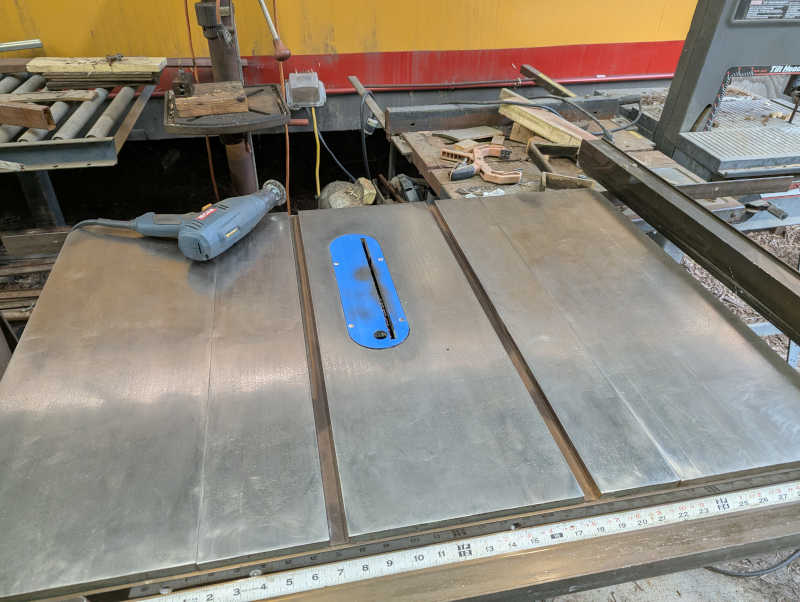

Today I brought some drill-mounted steel wire wheels that I can use to clean
out those slots. Taking care not to (further) mar the top surface with those
steel bristles.

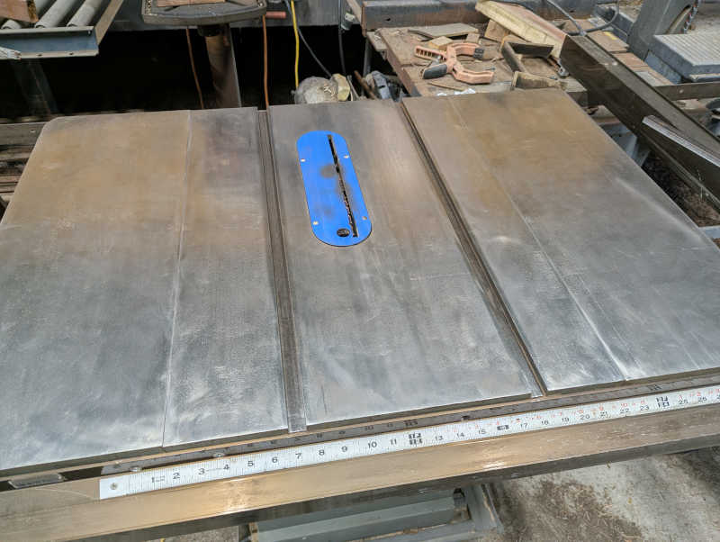

Once those were clean, I put the guide back into the slot and noticed it was
also covered with rust. Good thing I saw it while I have all my tools handy,
so I could make it all nice and shiny too.

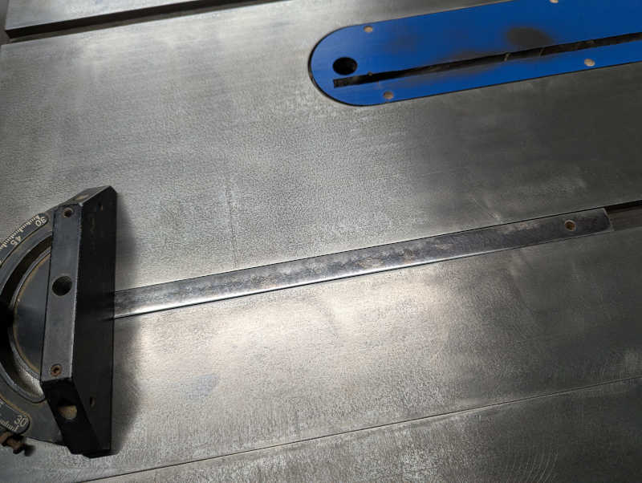

After applying a coat of oil to keep rust from immediately returning, I am
content to call the table saw project done for now. Pending evaluation and
feedback for improvement.

---

## Sunday 2026/1/25

* 5.5 hours total
  * 2.25 facility (54.25 out of 18)
  * 3.25 conductor (23.75 out of 18)
  * 0 kitchen (7.75 out of 6)

#### 8:30AM - 10:45AM (2.25 facility)

Lots of leaves dropped on the water wheel feature. Blew and raked three
garbage cans worth of leaves for the organics bin while McCabe worked on the
debris screen. I wasn't confident I could put it back together so I hadn't
taken it apart in my previous work sessions. Today was the first time I could
watch McCabe take it apart, shovel accumulated dirt, and put it back together.
Now I can handle doing the same the next time I shovel out the reservoir.

Learned the fine mesh filter looped over the drain pipe exit were nylon sheer
knee-high socks. The old one was retired and a new one installed, with a few
extras available for the future.

After the water wheel was sorted out, took the leaf blower and walked the
west loop. Leaf clearing was easier because Tagochi had already done some
of it with a gas-powered blower. Usual rocks and branches, nothing major.

As I completed my west loop walk, Rodstein reported a problem with the east
loop: rails over a bridge were loose, moving as much as 1/4" laterally which
is bad. I join the crew making an expedient field repair to steady the
rails for Sunday ride operation. A real fix will be needed later.

#### 10:45AM - 11:00AM (0.25 conductor)

After safety meeting I was slated to conduct SPPA, but Tagochi needs more
conductor hours so I gave up that seat.

#### 11:45AM - 12:45AM (1.0 conductor)

Santa Fe Electric conductor duty. McCabe handed off to me, and I handed off
to (?) at lunchtime.

#### Lunchtime entertainment

During lunch break, saw Jay Leno stop by with his White (that's the
brand name) steam car. Judging by its green color, I guess it is the
[1909 Model M featured in this video](https://www.youtube.com/watch?v=pw2Tm9o6fiQ).

Love that the thing was designed without an electrical system. Not just lack
of electronics: lack of electricity! No spark plugs, no ignition. All lights
are acetylene gas burning lamps, including the dashboard instrument light.

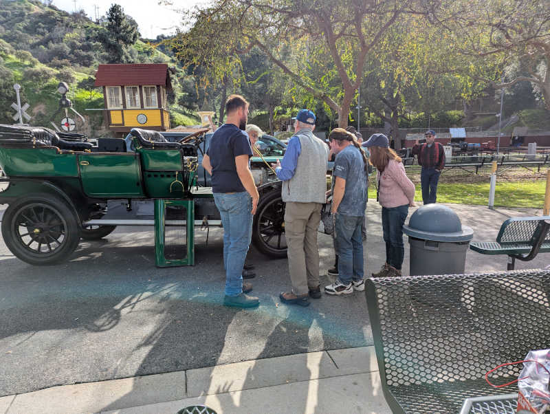

As he departed he gave us a toot of the horn -- a multi-tone steam whistle, naturally.

#### 1:30PM - 3:45PM (2.25 conductor)

Resumed conducting Santa Fe Electric engineered by Blake. Continued for the
rest of the day including last train of the day duty of locking west gate.

#### Miscellaneous

Saw that someone performed the experiment discussed at general member meeting.
I cautioned against using vinegar on corrosion concerns. Well, they were right
it would kill weeds, and I was right it greatly accelerated rail corrosion.
(And probably fasteners, switches, etc.)
I stand by my opinion rail condition is an important concern at a train club.

The pump house clock has been one hour off for several months, since the time
we were supposed to "fall back". Alexander helped me adjust the clock so it
reads correctly again. That was an adventure but we should be able to
do it faster in a few weeks when we "spring forward". Afterwards we were told
Harrison could do it quickly so I should ask him about it the next time I
see him.

Got a chance to look inside the club library, saw the collection included a few
out-of-print titles that I would be interested in digging into later. Including
Kozo Hiraoka's Climax and Pennsylvania A3 Switcher books.

Dinner at Tallyrand. They do a solid chicken fried steak.

---

## Tuesday 2026/1/20

* 2.5 hours total
  * 2.5 facility (52 out of 18)
  * 0 conductor (20.5 out of 18)
  * 0 kitchen (7.75 out of 6)

#### 2:00PM - 4:30PM (2.5 facility)

Accepted Strawn's invitation to join in signal work today though I only got
to participate towards the end as I had an existing eye doctor's appointment.
Still, I got to help a bit and learned a lot doing it.

The biggest lesson of the day: all my past career skills trying to make sense
of poorly documented legacy code built up over decades will transfer directly
to making sense of poorly documented track signal wiring built up over
decades.

Past work have not necessarily been done with maintainability in mind, as
demonstrated by fasteners only accessible from below. Which today means we
would need to pull up the track segment to get to it. They likely built the
assembly while laying the track and plopped them into the ground together.
Not accounting for the possibility someone may need to service the switch
independently at a later date, like today.

History can also be found in wires that today goes nowhere and connect to
nothing, trying to tell me stories of projects past.

I had expected to see major differences between the components I've used for
my indoor electronics projects and track signal equipment out in the
elements. Like extensive waterproofing to mitigate corrosion and
studious grounding to maintain signal integrity. I didn't see much of that at
first glance. I hope I'm just overlooking mechanisms I don't yet recognize,
but if not maybe it is a contributing factor of signal reliability issues.

One thing I am confident of: there will be no shortage of work that needs
doing here.

---

## Sunday 2026/1/18

* 5 hours total
  * 2.25 facility (49.5 out of 18)
  * 2.75 conductor (20.5 out of 18)
  * 0 kitchen (7.75 out of 6)

#### 8:30AM - 10:45AM (2.25 facility)

Introduction to track signal system from Strawn. Included some history on both
technical and non-technical issues surrounding the signal system.

Cleaned up some of leaves built up overnight on water wheel, then turned on
water pump. Watched until I was satisfied the water flow closed the cycle
correctly.

Pre-run inspection walk for west track. Rodstein verified. Rock fall is
active: a big rock fell on the track in the time between my walk and Rodstein's.

No leaf blower on track today because somebody took the bucket of batteries. In
hindsight I should have gotten on the radio and asked who's got it. That's what
a radio is good for!

#### 10:45AM - 12:30PM (1.75 conductor)

Safety meeting.

Conductor for Santa Fe Electric engineered by Cook. Handed off to Ames for my
lunch break. I took this opportunity to go thank Carolwood staff for being
friendly and waving to our guests.

#### 1:45PM - 2:45PM (1 conductor)

Conductor for Rio Grande UP 1989 engineered by Nelson. A bit of unwelcome
excitement in the form of engine derailment at mausoleum when first axle of
second bogie went off track. Joked with guests this is an extended tour of
rail operations at no extra charge. Needed to disconnect engine from train
to put the engine back on the tracks. I learned that a
[powered slug](https://en.wikipedia.org/wiki/Slug_(railroad))
would have made this particular derailment recovery much more difficult so it
was a good thing our engine was not configured as such.

Several pairs of eyes found no plausible explanation for derailment. Engine
went through the same location just fine afterwards. Shrug.

Handed off to Bickel to conduct a train with his family on board. He finished
off the day at that post.

---

## Saturday 2026/1/17

* 2 hours total
  * 2 facility (47 out of 18)
  * 0 conductor (17.75 out of 18)
  * 0 kitchen (7.75 out of 6)

#### 12:30PM - 2:30PM (2 facility)

Stopped in to shovel sediment out from water wheel reservoir so tomorrow's
Sunday public run can use the lower outlet pipe instead of filling up the
reservoir and spilling over the wall like last week.

Shoveling was easier than the last time I did it, partially because it hasn't
built back up as much and partially because I am getting more practiced at it.

The dirt is the functional concern, but the buildup of leaves was a secondary
appearance concern. I can clear out the dirt but, as the tree is actively
dropping leaves every time there's a breeze, clearing out all the leaves is
impossible. I can only make it better than it was.

Thick buildup of leaves on the structure before my work, a thin layer of fresh
leaves when I called it quits.

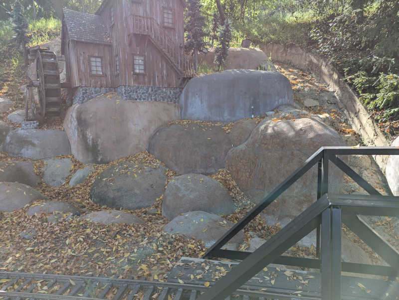
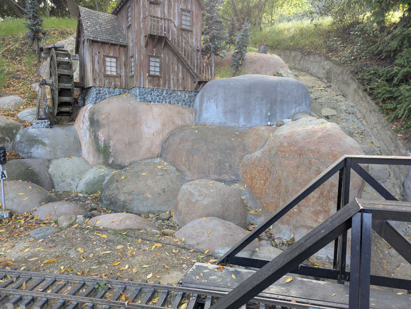

Dirt and leaves at reservoir entry under the rail bridge, before and after.

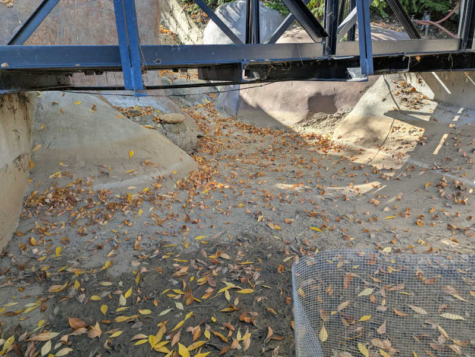
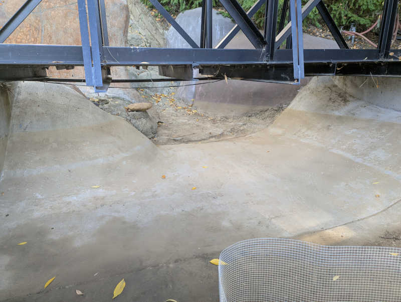

Reservoir dam, before and after.

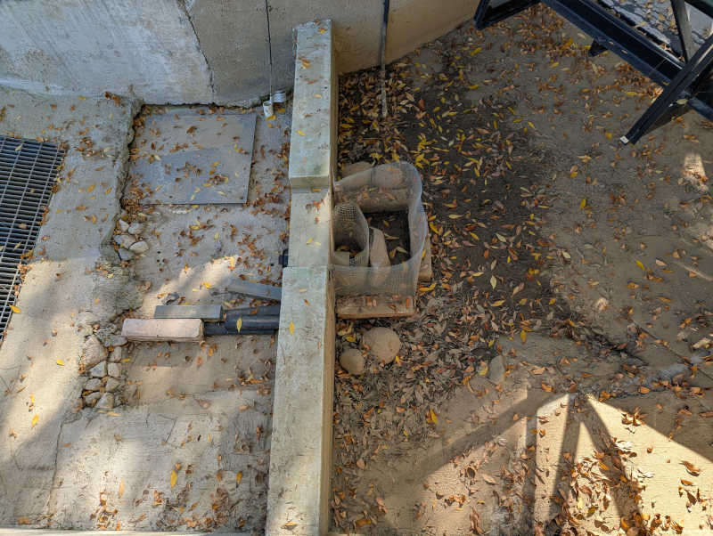
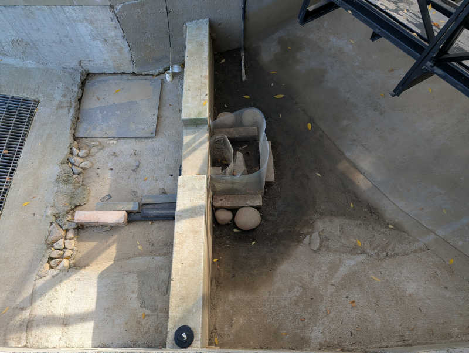

McCabe happened to stop in as I wrapped up my labor, he reviewed and approved
of my results.

#### 3:15PM - 4:00PM (0.75 facility not counted)

Tried to improve appearance of old table saw without success. Not counting
this wasted time.

---

## Sunday 2026/1/11

* 4.25 hours total
  * 3 facility (45 out of 18)
  * 1.25 conductor (17.75 out of 18)
  * 0 kitchen (7.75 out of 6)

#### 8:30AM - 10:45AM (2.25 facility)

Track morning walk with leaf blower to clear loose leaves from track.
Also removed derailment risks like rocks, branches, and pine cones.
Since I had the leaf blower, finish my morning routine by clearing off
Sherwood station platform and guest entry area.

The water wheel feature is still a bit of a mess after recent rains. I found
the grate lifted, implying somebody was in the middle of a project.

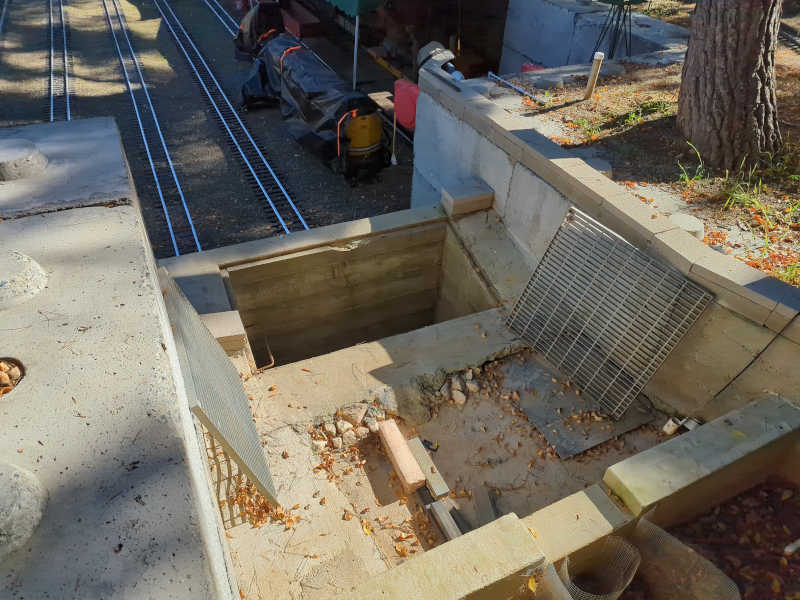

#### 10:45AM - 11:00AM (0.25 conductor)

Train crew safety meeting. Three trains had their engineers and conductors
so I'm relief conductor on an as-needed bases. Frees me up to go back
and look at the water wheel.

#### 11:00AM - 11:45AM (0.75 facility)

After 11AM and no sign of McCabe, reached out via text message. Received
assignment: Reinstall grates, clear out whatever leaves are easy to clean,
then activate water wheel. Campbell helped execute this plan.

It took a while for water reservoir level to build up to flow over the wall.
The pump had to cycle on and off several times before reaching a state of
steady flow.

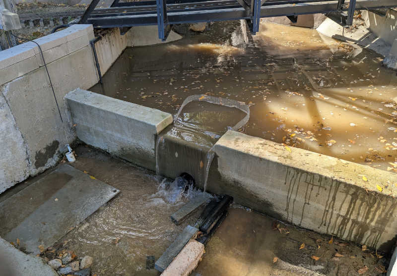

#### 1:45PM - 2:45PM (1.00 conductor)

Late in the afternoon I conducted Fuad's train for an hour then helped put
the bench cars and the engine away at the end of the day.

#### 3:15PM

Turned off water wheel electric power and water valve. See what the reservoir
looks like next time.

---

## Saturday 2026/1/10

* 7.5 hours total
  * 7.5 facility (42 out of 18)
  * 0 conductor (16.5 out of 18)
  * 0 kitchen (7.75 out of 6)

Work day! Good turnout means getting lots done alongside with general meeting
people and socializing.

Followed up with Paul Boschan about boilers. I should try to get my hands on
[ASME BPVC](https://www.asme.org/codes-standards/bpvc-standards)
section 1. It sets up the basics and also define miniature boiler
which applies to scale steam models and locomotives.

#### 9:00AM - 10:00AM (1 facility)

Work began with a Nelson assigned task: plant some baby Blue Chalksticks
([Senecio Mandraliscae](https://en.wikipedia.org/wiki/Curio_talinoides))
to see how they do. Previous plant experiments got eaten by
park animals, hopefully they don't find these as delicious.

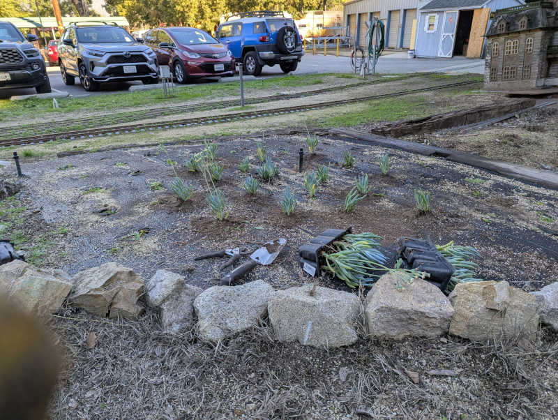

There are a few more holes in the weed cloth than there were plants. I filled
the middle leaving borders around. If these survive, we can either plant more
to fill out the perimeter or hope the plants will fill out.

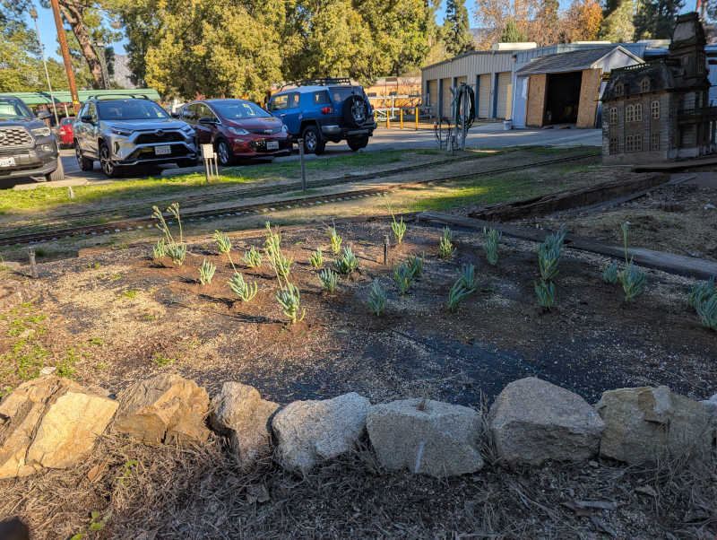

#### 10:00AM - 12:15PM (2.25 facility)

Next up is a Finch assigned task to rake leaves. I accidentally gathered a
crew for this task as Bickel and Chu asked how they can help with work day.
Might as well invite them to join me!

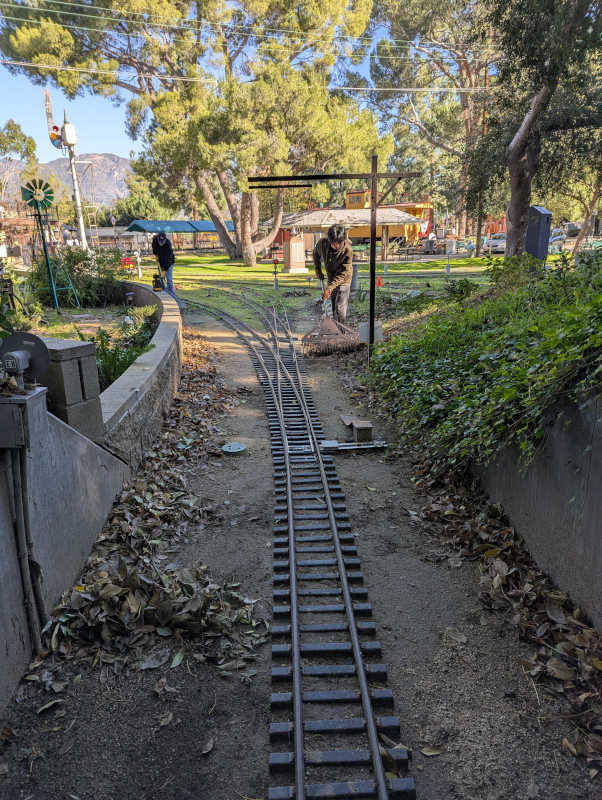

Three people working as a team cleared up leaves built up in front of the
two leaf-infested ground level tunnels. We finished up in time for lunch.

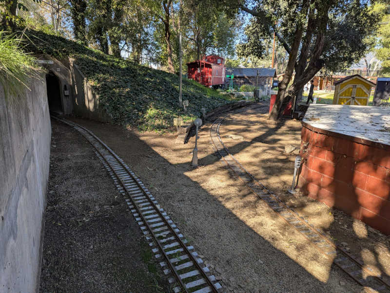

Lunch of tasty Mama Bear sandwiches and chatting with club members I have yet
to meet.

#### 1:00PM - 2:45PM (1.75 facility)

After lunch I was assistant for Perez project of setting up radio repeater.
There were a few minor misadventures including a lost & found antenna cap
but it's nominally up and running. To test range I walked over to Bagley wall
while Perez walked to member entrance gate. Sounded really good!

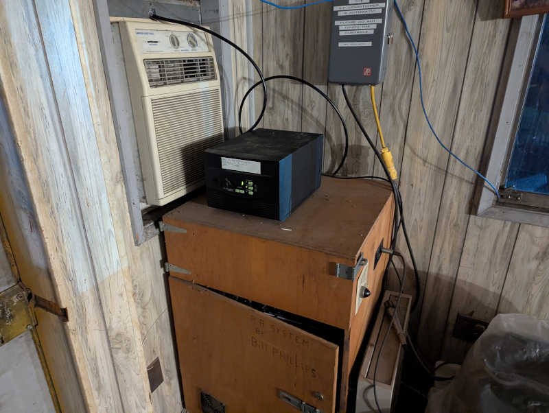

With the new repeater antenna active, the old antenna was coiled up. It will
be removed later but it stops being a trip hazard now.

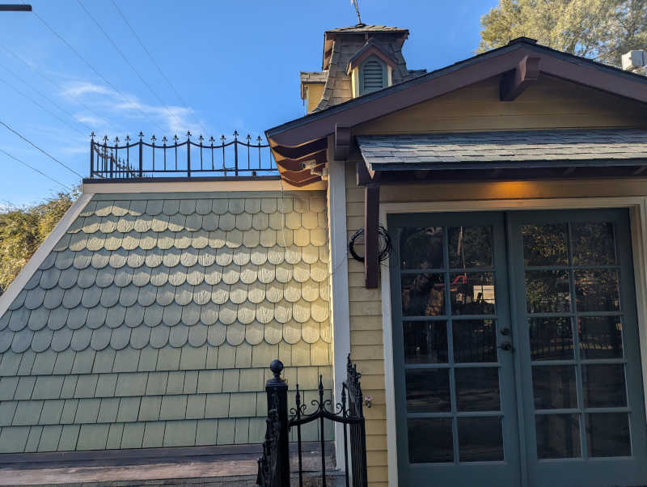

After radio project declared a success, took a break to chat with Perez and
Chu and Chu (father and son) about trains and the club. For driving large
brushed DC motors Perez recommends the
[Dimension Engineering Sabertooth 2x32 driver](https://www.dimensionengineering.com/products/sabertooth2x32)

After they departed for home I moved on to my solo project.

#### 3:30PM - 6:00PM (2.5 facility)

At the board meeting Suncin asked for volunteers on several projects, I signed
up to remove rust from the old table saw. Suncin specified
[Merryland Strip Disc](https://www.amazon.com/dp/B0DFM46FYS)
for the job so I bought a pack and had it along with my angle grinder ready in
my car. I brought them to the rusty table saw surface.

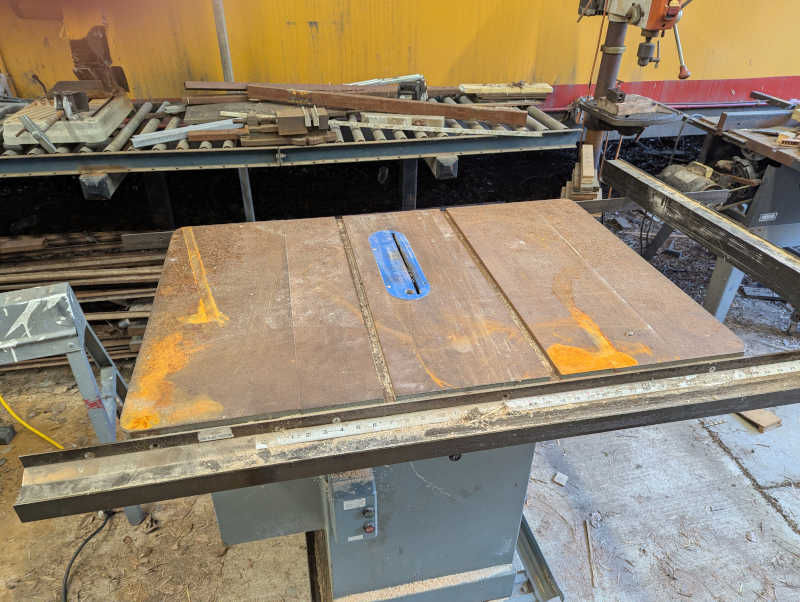

The rust was more advanced than I had thought. It had grown beyond light
surface rust to having a pretty hardy black layer. The strip disc was up to
the task of removal but it wasn't as gentle as I hoped it would be. While
better than a steel wire brush, it still left swirls of a rotary power tool
at work. Nevertheless, the top flat surfaces are now rust-free.
The two guide channels and the guide bar itself are still rusty, as the
Merryland disc isn't the right shape to address those items.

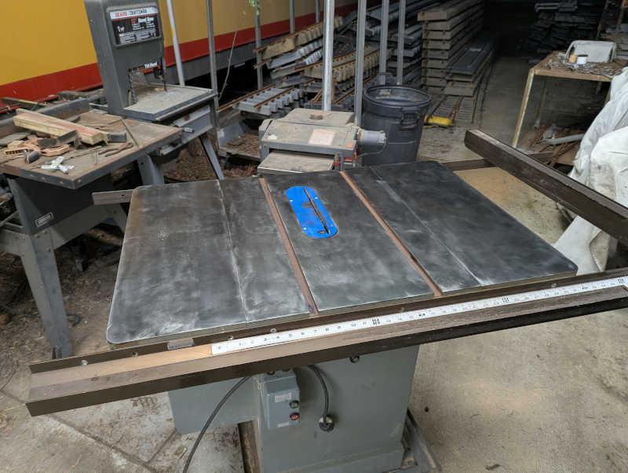

This was a good place to pause, as I've maxed out the daily work hours limit.
I found a quart of random motor oil in a cabinet. I applied a thin coat to
keep rust from immediately returning while I think about what to do next.

---

## Sunday 2026/1/4

* 1.0 hours total
  * 1 facility (34.5 out of 18)
  * 0 conductor (16.5 out of 18)
  * 0 kitchen (7.75 out of 6)

#### 9:00AM - 10:00AM (1.0 hrs facility)

No public rides today due to rain, but stopped in to walk around the track in
reverse direction from what I've been used to so far. Trying to imagine what
I would watch for to ensure passenger safety. No leaf blower today, but I did
pick up large branches as I went along.

Walking down mountain division eastward from water wheel, my left foot found
a sinkhole collapsing to nearly my knee. Thankfully I did not twist my ankle.

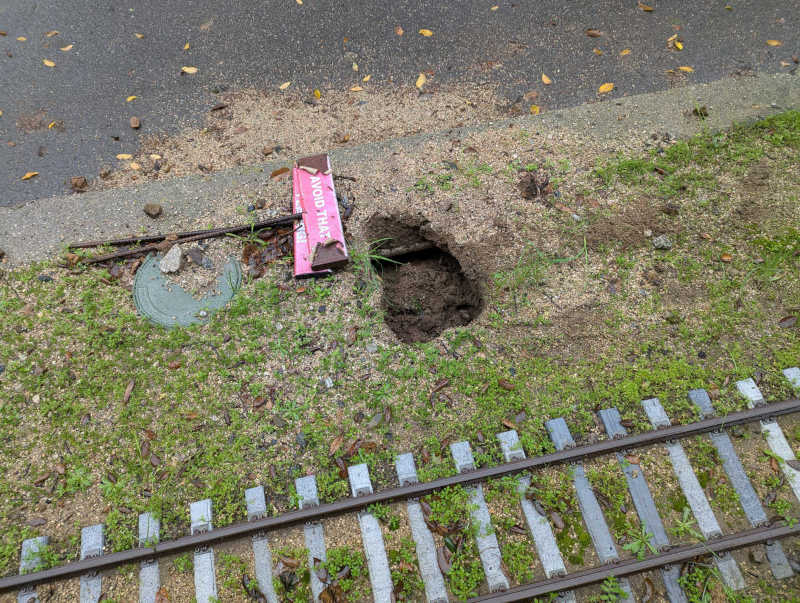

Here's a picture showing its location relative to train storage barn.

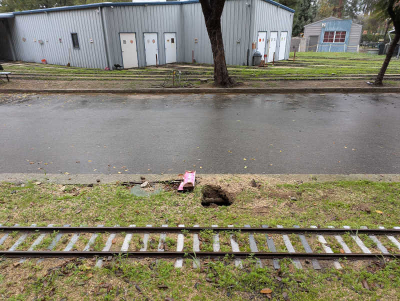

The hole is immediately above a water drain hole. Looks like dirt has been
draining out of that hole along with water.

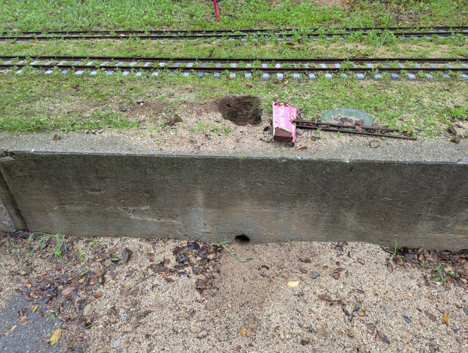

To ensure my good intentions won't end up being counterproductive I consulted
with Nelson via text message. After confirmation I'm good to go, I grabbed a
shovel and filled the hole back up with dirt conveniently at hand.

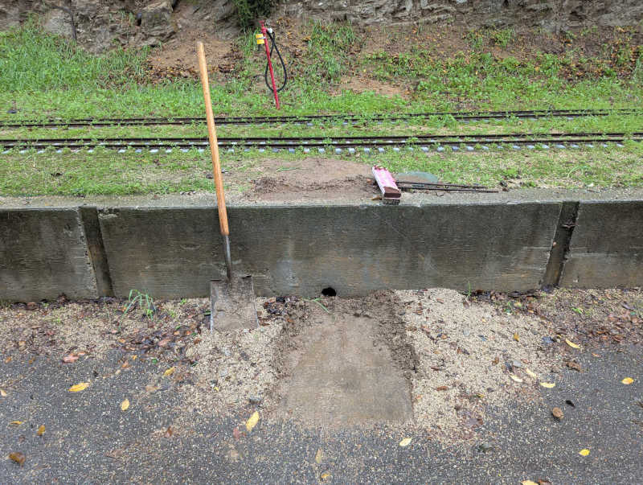

Since it's raining, things are still muddy. Will need to revisit after it
has a chance to dry and settle, but at least now it presents no risk to
anyone else's ankles.
