+++
date = '2026-04-08T16:36:24-07:00'
title = '2026 Q2 Timecards'
+++

---

## Saturday 2026/6/27

* 9 hours today, 267 hours this track year.

Jackson event + bench planks

#### 9:00AM - 1:00PM (4 hours)

With permission from Strawn, brought out Chessie for train rides at Jackson's
event for California Southern Model Railroad HO Gauge club. Always fun to show
and tell to fellow train enthusiasts. Also marked debut of my Chessie colors
outfit.

#### 1:00PM - 6:00PM (5 hours)

Changed into grubby work clothes for some grunt work: acting on Finch's
decision and of dispose all steaming bay bench planks. This means cutting off
a lot of rusty old bolts with an angle grinder cutting wheel because it's
pretty hopeless to try to unfastening them. They're all way past the point
where PB Blaster would do any good.

#### Movie night!

After all the old busted planks were in the dumpster, changed back into my
Chessie colors outfit for movie night fun.

---

## Thursday 2026/6/25

* 11 hours today, 258 hours this track year.

Signals followed by siding rails.

#### 8:00AM - 12:00PM (4 hours)

A pleasantly productive signals day started by disconnecting the malfunctioning
5-way switch and reverting it to a basic switch that toggles between mainline
and yard. Mainline trains won't have to stop and yard trains are probably
stopping soon anyway and so manually throwing the rest of the switches should
not be significant hardship. Let's see what people say after July 1st.

Volt meter says signal BH is putting voltage on red LED and on red out even
when there's no detection. This is consistent with a relay that has failed
closed so the signal driver board was replaced with another.

Signal board CB has been going dark occasionally, usually when things got hot.
Volt meter confirms it wasn't putting power on any lights when it was supposed
to be green, so the driver board was replaced. Unfortunately the replacement
had its own problem: an intermittent connection somewhere meant green is
sometimes fine but sometimes very dark. We're out of Smith boards for today so
this will have to wait a bit longer.

#### 1:00PM - 4:00PM (3 hours)

After lunch we un-isolated the isolated power supply in M and, despite my
fears, nothing blew up. At least not immediately. We're not hooking the NT
board back up yet, just watch this as-is for a while.

While testing the new voltages realized KB4 detection does not turn MB red as
it should. There's no available wire to fix this but fortunately KB4 is pretty
short so this will only be a problem for short trains. Public ride trains are
all long enough to avoid the problem.

Panel R was upgraded to the latest firmware featuring BLE interface for
diagnostics support. This is promising but had some significant first draft
issues. It is also our first taste of RF problems. It is strong enough to
punch through a closed panel, so we can't count on it as a security barrier.
Yet it is also not strong enough to cover the entire physical footprint of
panel R signals.

Ended the signals work day by remapping panel I. We need accurate information
on start/end of each detection block before we can safely perform any upgrades.

#### 4:00PM - 8:00PM (4 hours)

After the signals crew dispersed for the day, moved on to solo project of
removing loose surface rust from a pile of rail selected as candidates for the
new siding project. This was satisfying because we just need the easy part of
rust removal. I don't need to tackle the annoying hard black layer to unveil
shiny metal. Taking off the loose brown stuff is enough for the siding track
crew to see which ones are likely usable and which are likely too rusted and
pitted to use. Got about 2/3 of the way through the pile before I lost
daylight. That's enough for the track crew to get started and I'll finish the
rest later.

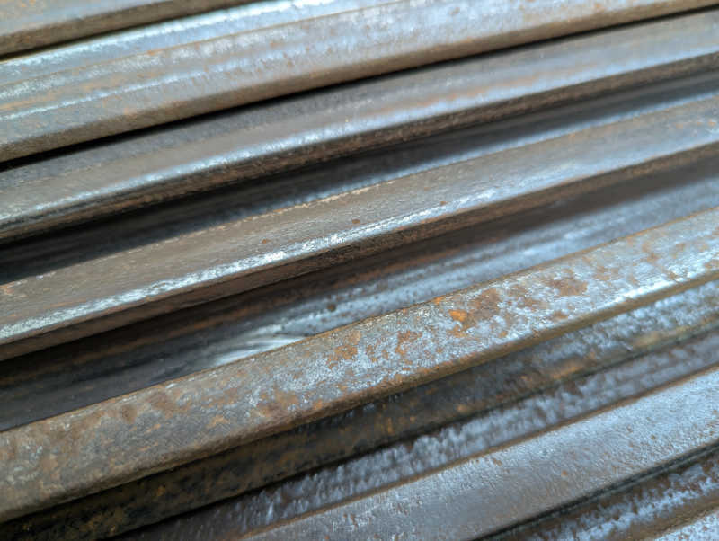

---

## Sunday 2026/6/21

* 8.5 hours today, 247 hours this track year.

Disney Sunday train crew.

#### 8:00AM - 4:30PM (8.5 hours)

Morning prep included a signals check lap with Strawn. False red verified gone
but also found ICA is turning yellow then green too early. As soon as we saw it
we knew it was an overlooked consequence of moving signal IM to MB and
shortening panel I rail blocks. We don't have available wire to fix this so
it'll have to wait for new wires.

Conducted for Smitrovich on UP1989 until lunch time when my voice started
giving out. I first thought it was because I was doing train crew twice in a
row but now I think I've been causing damage to my voice box doing my conductor
safety briefing at the volume I've been doing it. I need to let it heal then
learn to do my speech at a lower and more sustainable volume.

After my lunch I went to cover east gate so McCabe can go get lunch. I don't
need to speak nearly as loudly at this post.

Once McCabe was done with lunch I turned in Carolwood paperwork then returned
to the station. I stepped in as Santa Fe 163 engineer so I don't need my voice.
Thankfully Ronne was willing to switch to conductor role for the rest of the
afternoon.

After the train was put away, emptied a few trash cans I noticed had overflowed
while operating SF163.

---

## Saturday 2026/6/20

* 11 hours today, 238.5 hours this track year.

Club sanctioned event train crew + bench planks.

#### 8:00AM - 3:00PM (7 hours)

Arrived in the morning to get Santa Fe 163 electric out and ready for rides
for Harris event. Part of train crew with Famolare organized by McCabe. First
outing of my Santa Fe warbonnet scheme colors outfit.

After the official event ended I continued chatting with a few people who were
curious about trains, my favorite audience. When one of them expressed some
disappointment that they didn't see any steam engines today, I pulled out
Sankey for them to look over.

#### 3:00PM - 7:00PM (4 hours)

After all the guests have left I changed into grubby work clothes to continue
steaming bay bench plank paint stripping work. Seeing before/after paint
stripping is teaching me to recognize problems hiding under paint. Towards the
end of the day I started going straight for these potential problems for the
final few planks. It saves time, effort, and disc wear to uncover big deal-
breaking problems instead of doing the whole plank.

Final status report:
1. Primed and in great shape
2. Already marked with black dot for discard.
3. Primed but with mild warping
4. Primed but has a significant end crack.
5. Bare wood with significant end cracks.
6. Primed but with rot at end.
7. Black dot
8. Bare with minor end cracks.
9. Black dot
10. No bench (ramp to track.)
11. Significant rotted crack.
12. No bench (bridge to other bay.)
13. Rotted end.
14. Warped with a lengthy crack.
15. Rotted end and knot
16. Cracks all over
17. Bare and looks good except for knot with rot.
18. Warped and misshappen when it was last painted.
19. Black dot.
20. Bare and looks pretty good.
21. Minor warp, small knot, tiny end cracks.
22. No bench.
23. Black dot.
24. No bench (hydraulic lift.)

Now that we know only a small fraction are in good usable shape, Finch decided
we might as well pitch them all and get new planks all around the entire bay.
We didn't know until I started removing paint to see what's underneath, so I'll
still call it a worthwhile research project.

---

## Thursday 2026/6/18

* 9.5 hours today, 227.5 hours this track year.

Signals work day followed by more bench plank paint removal.

#### 8:45AM - 12:15PM (3.5 hours)

Started the day scratching our heads trying to understand the unexpected
interaction between panels I, K, and M. A train wheel rolling past the point
where KB4 and MB1 meet can briefly conduct electricity across those two
panels' electrical systems. Which then somehow affects the panel M NT block
adjacent to IB11, dropping its voltage between rails down to about 3.8V,
which is below detection range but not what a real train would do. This
false detection on IB11 triggered the false reds on II and IG.

No plausible explanation on how this happens but the discovery is enough to
formulate a short term workaround: Disconnect NT block wires from the NT board
in panel M, removing one element of the electrical path. This is acceptable
for Sunday public rides with the rest of the work to be done later. It is
possibly related to the fact power boards for K and S have both failed closed
again, staying on 24x7, less than two weeks after they've been replaced.

I think there's something going with the NT circuit. These are 12V DC relays
and we're running at least 13-15V DC through it in the typical case. If panel
M NT was doing something weird, K and S are two of the closest panels to
suffer electrical consequnces.

Looking at the situation in panel S, Strawn gave the dark NT board a flick and
it came back to life. Wow seriously? Thinking maybe it'll stay on, we closed
up the panel and that was enough of a jolt for it to die again. Bah. Replacing
it with another NT board was straightforward, but the replacement failed to
put power on NT circuit. Few minutes of probing found a loose solder joint.
I have a soldering iron but not immediately at hand. Good time to break
for lunch.

#### 1:30PM - 4:30PM (3 hours)

After lunch resoldering the loose NT board wire restored functionality. We then
moved on to panel J where Strawn could get up to speed on what I've done with
the switch motor board. On the way out we looked at one thing I noticed
earlier: some signals seem to turn from red to green quicker than they should.
Found panel J diode 12 to have failed open circuit and re-routed it to diode
29.

With that small win under our belt we reversed directions to evaluate track
situation for upcoming direction switch on July 1st. The good news is nothing
is fundamentally broken, the bad news is we do have a list of stuff to sort
through some with Sunday run impact. I was afraid we would discover an entire
section of the layout to be dark or something nasty, so this is good news.

#### 4:30PM - 7:30PM (3 hours)

After Strawn left I evalauted reverse direction in Valley division and Disney
loop. A few notes, nothing too major. Tried to fix a few noted issues and found
them working correctly. Intermittent issues, my favorite!

After parking the Strawn engine in new track (so much easier now) went back to
steaming bay benches and took paint off another plank. I started with the
bottom of the plank and a more aggressive wire brush wheel and found the wheel
lacking. It took too much of the soft wood off, and at the same time, wasn't
aggressive enough at taking off thicker bits of paint. The uneven behavior left
a very rough finish. I switched back to the Merryland discs which are slower
but more consistent and leaves a smoother finish.

---

## Wednesday 2026/6/17

* 11.5 hours today, 218 hours this track year.

Non-signals maintenance: leaves, benches, train relocation.

#### 7:45AM - 10:30AM (3.75 hours)

Found Clouse available as extra pair of hands so recruited into some leaf
cleanup in the Bagley area. Since this is definitely official club work it was
also an opportunity to give Clouse an orientation in running the center cab
work locomotive.

#### 10:30AM - 1:15PM (1.75 hours)

After Clouse left I switched to my original goal: more steaming bay bench paint
removal using angle grinder with paint/rust removal wheel.

#### 2:15PM - 5:15PM (3 hours)

Continued paint removal after lunch until I learned it was time to move Strawn
train to a new track.

#### 5:15PM - 8:15PM (3 hours)

Moved Strawn train out of old track and stage it in the designated order for
backing into new track. Because the new track is shorter, three of the cars
have to sit separately in the pit until other track moves are complete.

Logistics of the move were mildly complicated by somebody enjoying dinner
and I didn't want to interrupt them. Or more accurately, I didn't want to
spook them into leaving their catch behind because I didn't want to clean it
up. About a half hour later, they took the leftovers home with them leaving
only a few tufts of fur to mark the picnic site. I appreciate their tidiness.

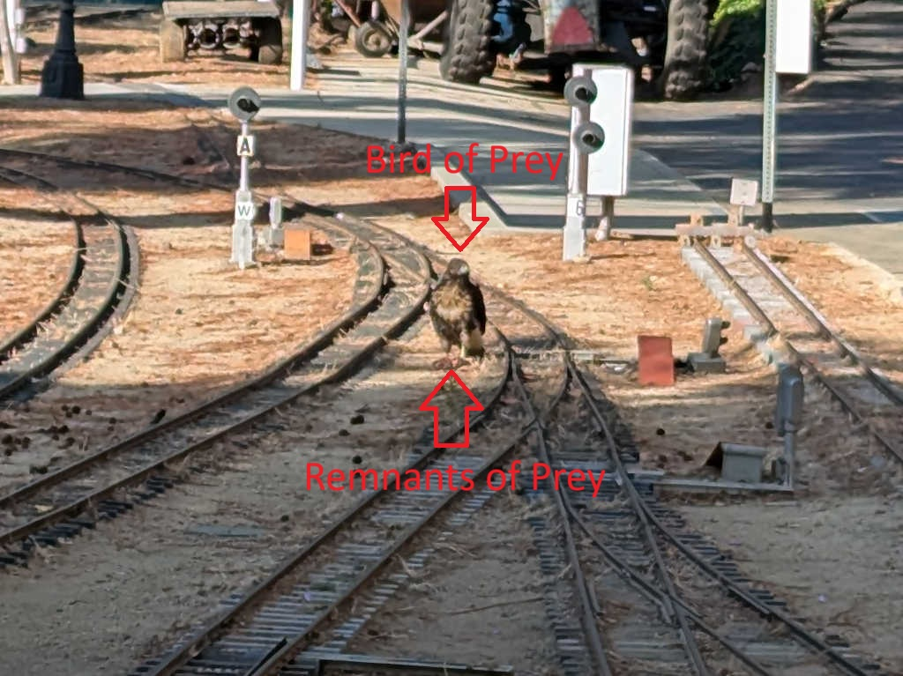

---

## Sunday 2026/6/14

* 8.25 hours today, 206.5 hours this track year.

Sunday public rides crew

#### 7:45AM - 4:00PM (8.25 hours)

Started the day by checking how the primed wood held up to overnight dew. I
can see where water has pooled on some of the lower areas. I should paint over
them soon (instructions say within 7 days) and in the future I should not leave
the primer for more than a few hours (instructions say at least one) before
painting top coat.

Pulled CN2002 out of Phil West barn and connected it up to a set of bench cars.
Alexander arrived with replacement fuel pump and proceeded with installation.
I helped data gathering for upcoming "musical trains" storage shed move.

Conducted for CN2002 pulling public rides for the whole day, minus the lunch
break I'm a little more assertive about today.

After the last public ride train I asked to take CN2002 on a lap around the
public loop. I've gained more confidence with the unique air brake system
and getting close to the point where I feel comfortable running a public ride
with this locomotive.

Alexander was one of the first beneficiaries of this morning's research,
getting to move from a third-level to second-level track.

Defect detector power was restored for reprogramming by Perez. In theory it
should now power up on channel 4. If it starts interfering with channel 1 I'm
cutting power again.

#### Fun time

After train time was done, I asked Alexander to evaluate my thrift store
electric unicycle. It appears to be large functional but have some definite
problems that resulted in a tilted neutral position when pedals are supposed
to be level with the ground. Might still be good enough to learn on. I tried a
bit and got a few inches at a time but I'm not putting any serious effort into
it until I can find my old rollerblade protective gear.

Alexander brought out his Serious Business unicycle to showed how one should
behave. And pulled out his one wheel as well because why not. Calimbahin got
started on the one wheel and made impressive progress for a first session.
Certainly better than what I've done on my unicycle.

---

## Saturday 2026/6/13

* 10 hours today, 198.25 hours this track year.

Steaming bay bench refinishing begins

#### 8:15AM - 12:00PM (3.75 hours)

Started the day with a signals team discussion on how we can move forward.
The current approach is trending generally downward. A crisis point still
feels inevitable. Despite all our efforts we've only slowed the slope of
descent moving the crash site further downrange. We need to find a way to gain
altitude again and there's no obvious way to do so.

After an unsatisfying session I changed gears to something with better odds of
success: stripping off old cracking paint from steam bay benches and try to
refinish them.

Starting with the same paint & rust removal angle grinder wheel I used for
earlier rust removal projects.

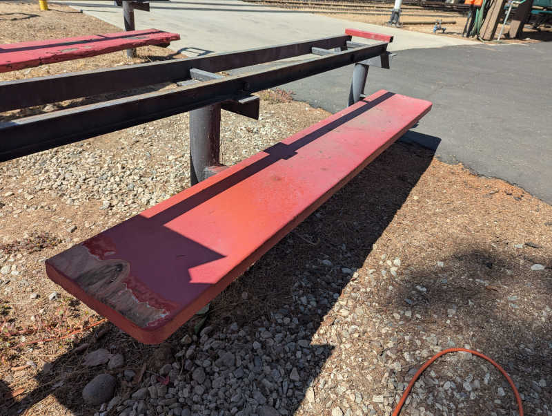

I took the first bench down to bare wood.

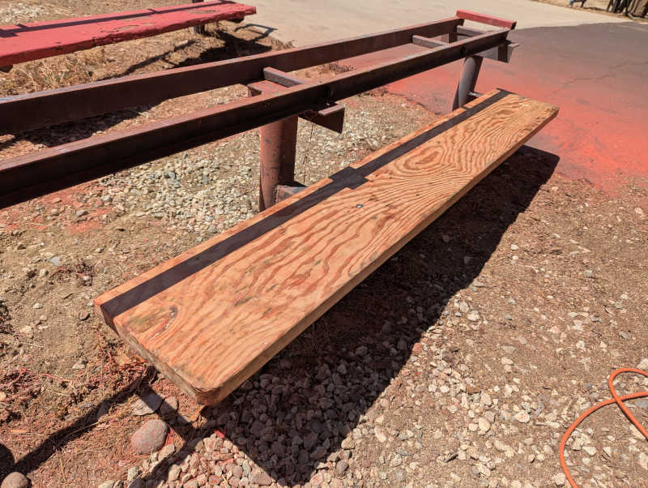

Then put on a few coats of primer.

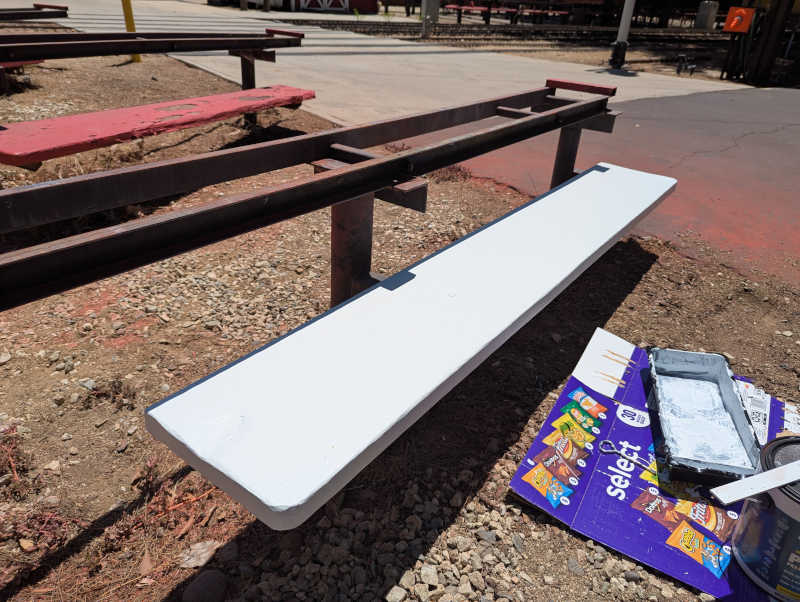

Let the primer dry over lunch and evaluate afterwards.

#### 1:00PM - 7:15PM (6.25 hours)

After lunch the primer seemed to have cured and it looks good. Encouraged
by this success I tackled three more benches. Another one with the plank
in good shape, and two others in marginal condition. All taken down to
bare wood and primed.

I am not optimistic about the two marginal planks, but they got primed as
well because I wanted to see if the primer is good enough to cover the
cracked and rotted areas. The result: they are not. I'm not going to prime
any more benches that show large cracks or rot after paint removal.

---

## Tuesday 2026/6/9

* 4.5 hours today, 188.25 hours this track year.

Emergency panel K rescue

#### 7:45AM - 12:15PM (4.5 hours)

Morning started with a quick Finch assignment to cut away busted old handle
covers on the Phil West transfer table as part of preparation for painting.

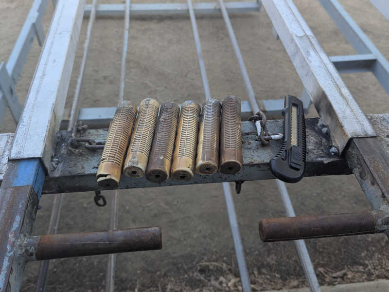

Then it was time for the unpleasant stuff.

In order to repair panel K, I was given the ESP32 brain and I/O boards that
were slated for panel J. The I/O boards weren't identical so the ESP32 code
had to face some ugly hacks in order to perform today's emergency rescue.
Doing this on my laptop sitting next to panel K under the scorching sun
squinting to read the screen was a 0/5 star experience. Would not recommend.

I got K back up to feature parity with where it was before I installed the
defective power board, but the older rev. C boards didn't have input capability
which means some of the future to-do items for K would have to wait until we
get more rev. E boards to replace those that got fried.

Since this replacement hardware was originally slated for panel J, the ESP32
upgrade for J would have to wait as well.

This whole episode could have been avoided if we used components that had any
kind of QA process and plenty of spares for easy direct replacement if they
fail. The reason we don't have that are not technical, they are people, and
those people weren't here facing the consequences of their decisions.

---

## Monday 2026/6/8

* 11 hours today, 183.75 hours this track year.

Signals work - one step forward, two steps back.

#### 8:15AM - 1:15PM (5 hours)

Started the morning by finishing rail switch position sensor for JF. Now the
signal head correctly shows red over yellow for diverging switch. Then to
panel K to continue wiring up some of the cross-panel status wires that mostly
serve to turn signals yellow when the next one is red. Strawn and Harper moved
signal KB from inside to outside O'Brien-Moore Bridge while I worked on wires.

#### 2:15PM - 8:15PM (6 hours)

After lunch I finished up connected the known wires followed by a few tests to
verify they were connected. Easy part was over! Now we need to find the wires
that we know should exist but they were not labeled so we don't know which ones
they are. Some annoying wire tracing followed.

The good news: it looks like we have five unused wires running between K and
L available for future plans like LB13.

The bad news: switch 3 wires weren't what we thought they were. Wire color and
thickness at the switch doesn't match anything coming into the panel, so there
is a wire joint somewhere. That's going to be even more annoying to trace
through and a project for later.

The worst news: I installed new power boards in K and S, and the new board
for K was defective. Panel K stopped working and a frantic debugging session
ensued. Just before we lost daylight the cause was pinpointed to a bad solder
joint on the new power board, so one of the ground terminals weren't connected
to ground. Lacking a proper ground, 15.6V DC found their own way to ground
through I2C components expecting 3.3V DC and that's very bad for their health.

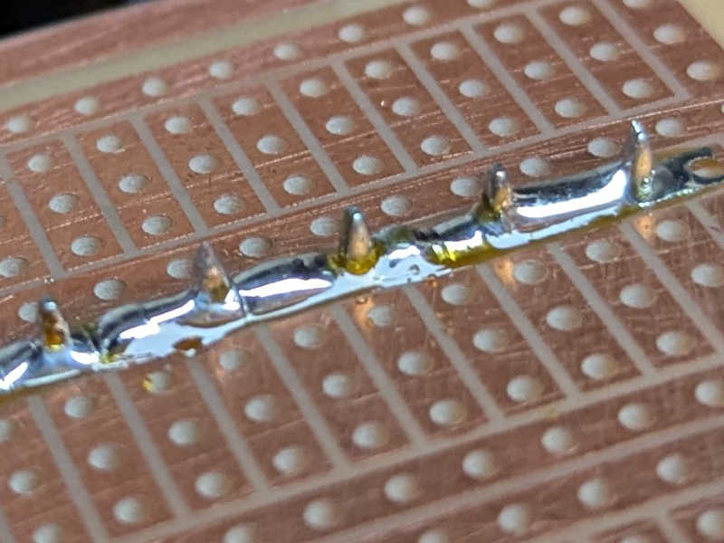

It's bad enough that I had to carefully read inconsistent terminal labels, am
I expected to verify every solder joint as well? This is unreasonable.

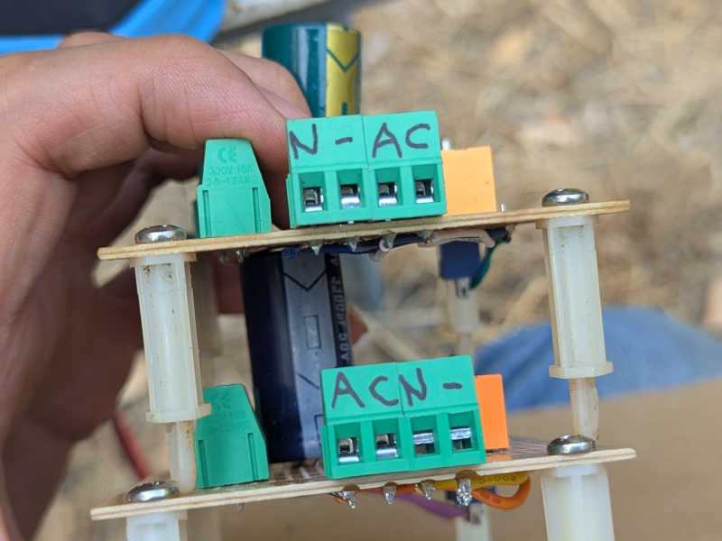

---

## Sunday 2026/6/7

* 7.5 hours today, 172.75 hours this track year.

Sunday public ride operations crew.

#### 8:00AM - 3:30PM (7.5 hours)

Prepped CN2002 for sunday rides: brought it out of the barn, connected dark
green bench car set, performed most checks. Had to wait for Alexander to arrive
with air compressor battery before test lap could take place. During test lap
all signals looked good for public ride operations.

Ronne brought a nifty rail gauge tool. It will be on loan to LALS for a while
under care of Nelson for track evaluation.

Tried 3D-printed bar to see if it'd make SF163 pedal less annoying to use.
Ronne did not care for it, and that's enough to end the project here. Glad a
cheap and simple 3D printed part was enough to get an answer.

Conducted for CN2002 for most of the day. Strawn substituted one run so I could
update Burden and Kristman on Santa Fe 163 status. Lunch break was overly late
and my body crashed hard. Recovered after I got some food but let's not do that
again.

CN2002 had a weird buckling problem that justified a trip into the maintenance
bay. Prime suspect is the rear truck cotter pin chattering against rear mid
axle. Replacement pin now sits at a different position, see if that is better.

Went to refuel at the end of the day and oops the fuel pump is dead. My mistake
in the morning forgetting to turn the switch back to "Off" and now I owe
Alexander a replacement fuel pump. (UPDATE: Strawn said he did it which
would explain why I didn't remember making that mistake at all.)

---

## Saturday 2026/6/6

* 6.5 hours today, 165.25 hours this track year.

Santa Fe 163 electric locomotive maintenance.

#### 9:15AM - 3:45PM (6.5 hours)

Replaced dying fan with a new Comair Rotron PT2B3 purchased from Digi-Key.
The fan is secured with four flat-head Philips screws with 5/16" nylon lock
nuts underneath. Engine 163 body height meant it is nearly impossible for me
to hold a wrench inside and screwdriver outside simultaneously myself. This
task needed two people, one inside and one outside. Recruited Kallgren to help
remove old fan and Famolare to help install the new one. The electrical
connectors were no cakewalk, either, but at least I could do them on my own
given enough time.

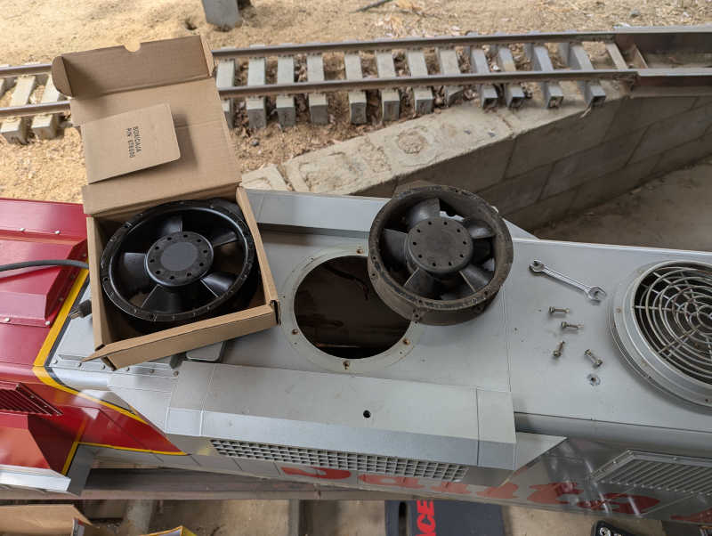

The cosmetic fan grate over this motor had a broken fastener "repaired" by
cleaning up the broken shaft and the head glued back on. I fixed this properly
with a McMaster-Carr shopping spree: tap set for 2-56 thread, small hex
head bolts in 3/16" and 1/4" lengths, matching washers, and a tiny 1/8" socket
wrench to turn those tiny bolts. Now it is a real fastener again.

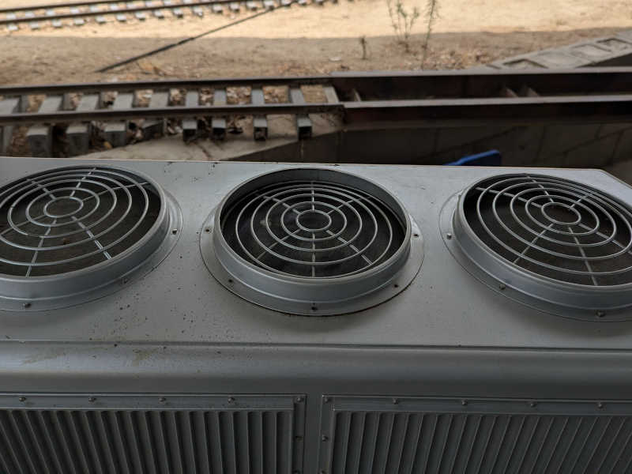

Once 163 had a functional fan, I proceeded with two cosmetic repairs.
The first was to reinstall the collapsed grate over the middle of three false
fan exhausts at the rear of the locomotive. PB Blaster and judicious use of
the 1/8" socket allowed removing tiny fasteners without damage. Looks like
the grate was held with epoxy or similiar material that has since become
brittle and cracked. There's enough remaining inside for me to mechanically
snap the grate back into place but if this happens 2-3 more times there won't
be enough of the brittle stuff left to keep the grate up. Then I will have to
decide on an adhesive or something but that is a concern for later.
Fortunately I have an adhesive repair test run already lined up for that
possibility.

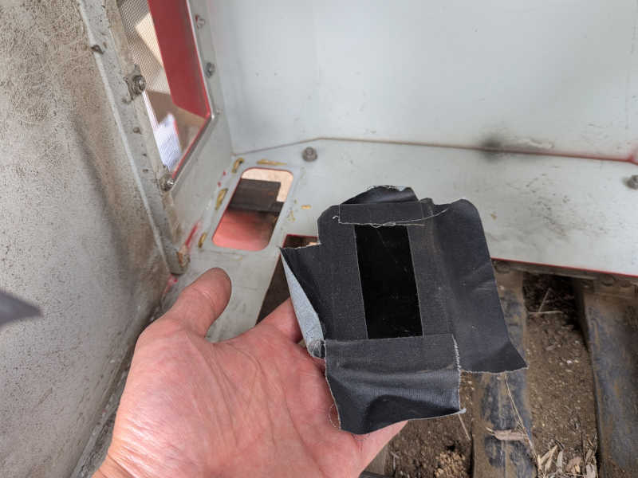

One of the cab windows that had fallen. Somebody tried to tape the window back
up with gaffer's tape but that did not hold for long. Upon Burden's suggestion
I bought a tube of RTV silicone for this job. I bought the clear colored type
in case it bled outside but fortunately I managed to avoid that. This stuff
takes an hour to cure. In hindsight I should have done this first and let it
cure while I worked on other problems. Oh well. If this works out I may use it
to repair the center false fan grate above.

Met [Dolce Wang](https://www.instagram.com/dolcewang/) on the way out.

---

## Thursday 2026/6/4

* 11.5 hours today, 158.75 hours this track year.

Major rework for signals panel K

#### 7:30AM - 12:30PM (5 hours)

Strawn has been working up to this point for quite a while with extensive
planning and preparation, and today is go time. Signals panel K upgrade
from relay logic to microcontroller software defined logic. This will be
a long work day.

Power management and switch motor control board remains in place.

Train presence detection circuits were upgraded beforehand.

Everything else was removed and holes drilled in the backplane to
accommodate an ESP32 microcontroller board, buck converter to power that
board, I/O boards to communicate with that board, and new signal head driver
boards to illuminate lights based on software in that board.

Connecting them all were wires. Lots and lots of wires.

#### 1:00PM - 7:30PM (6.5 hours)

After a quick lunch (short on time! get back to work!) we worked through
getting all internals reconnected and functional. We also got about a third
of boundary conditions communication with adjacent panels by the time the team
ran out of time today.

Some minor wiring issues were found and fixed in the verification and testing
phase, like switch motor polarity needed to be flipped so its power on default
state is mainline instead of diverging.

A long standing mystery was solved today: that dimmer switch in panel K, which
is drawing power but not connected to any signals logic, was for the covered
bridge interior lights. Now we know, and I've labeled it accordingly.

Went down to panel J to reconnect rail switch position sensing wiring for JF.
Got most of the way there but didn't have the proper crimped connector to
reconnect to micro switch spade connectors. Will have to finish this later.

---

## Sunday 2026/5/31

* 10.5 hours today, 147.25 hours this track year.

Sunday crew + SFE

#### 7:30AM - 4:00PM (8.5 hours)

Sunday morning setup work including a signals verification run and monthly
check of fire extinguisher gauge needle in green. (It's close enough to
June.)

Three trains were set up to run public ride operations, so Alexander and I
decided to help the club live up to its name by firing up his live steam
locomotive. The steam and smoke is a delight to our guests. Alexander ran
his engine and I help do things like flipping rail switches ahead and
behind him to minimize disruption to Sunday ride operations.

#### 4:00PM - 6:00PM (2 hours)

After Sunday ride concluded and everything was put away, Alexander helped
me dig into Santa Fe 163 electric locomotive as the maintenance bay hoist
track is now available. The fan is a
[Comair Rotron PT2B3](https://www.comairrotron.com/uploads/pdf/Patriot%20AC/19028254A-02-PT2B3.pdf)
and
[Digi-Key sells a direct replacement](https://www.digikey.com/en/products/detail/comair-rotron/19028254A/10786).
I'm sure compatible alternatives exist but until I have a better feel of what's
going on I'm going for the safety of an identical unit.

One new discovery today: since the fan no longer has control over its
initial startup, it might end up spinning in either direction depending
on the gust of wind (or flick of the finger) that started it. When it is
running in the designed direction, it moves a lot of air with impressively
little noise. When it is spinning the wrong way, that's when it howls like
a banshee. A loud fan had been noted as a problem weeks ago, so this has been
a problem for quite some time. Glad there's an actual explanation now.

As a practice dry run for fan replacement, we determined the fan grill will
need to be removed. We were amazed those tiny little hex heads are real
fasteners, and they are as much of a pain in the butt as we were afraid they
would be. Looks like one snapped off sometime in the past and someone glued it
back on. The other pain in the butt will be the power wires, as the small
spade connectors are right next to one of the nylon lock nuts holding the fan
in place.

Do I remove the nylon locknut first or the spade power wire connectors? That
will be a difficult decision I'd need to make when the replacement arrives.

---

## Saturday 2026/5/30

* 8 hours today, 136.75 hours this track year.

Train crew for club sanctioned event w/ASEPO train crew + signals + SFE.

#### 9:00AM - 5:00PM (8 hours)

Some members of LALS are also members of ASEPO, the Alliance of Special
Effects & Porytechnic Operators, so they're hosting a party here. This is a
club sactioned event so Strawn and I prepped the Santa Fe Electric to ensure
there's a train ride available if anyone wants one. This turned out not to be
a critical problem as Morris and Baker also brought out their trains so there
was enough capacity.

Given there was enough capacity, when intermittent false red on KAA cropped up,
we jumped on it with tools and instruments. Diagnosis: false detection due to
guard rails on O'Brien-Moore Bridge, installed just before Spring Meet. They
conducted electricity across multiple detection blocks, confusing the circuit
board into thinking there was a train on the bridge. This intermittent false
red was a problem during the meet as well so it's nice to have an explanation.

After we had an explanation, the issue was filed away for a future signals work
day and we went back to giving train rides. I noticed Santa Fe Electric's fan
was acting up again.

After the party wrapped up I started probing fan wiring. 120V AC throughout
the circuit. Given there was power, it occurred to me to check the fan itself
and that's the problem: it could no longer spin from a dead stop by itself, so
even though it receives power it couldn't do its job unless an opportune
gust of wind started it turning.

I wanted to pull the cover off again so I could read specifications and start
researching a replacement fan, but the maintenance bay track was occupied and
I will have to wait.

---

## Friday 2026/5/29

* 6.5 hours today, 128.75 hours this track year.

Signals work day

#### 8:00AM - 12:30PM (4.5 hours)

Finish what we started yesterday with panel M upgrade to microcontroller brain.
By lunchtime we have replicated existing functionality that was previously done
with hard wiring, but now software control will allow future complexity.

#### 1:30PM - 3:30PM (2 hours)

Once the brain was up and running, we wired up communication from panel K to
panel M so signals can finally properly turn yellow in response to following
signal being red. Something it couldn't do before.

---

## Thursday 2026/5/28

* 7 hours today, 122.25 hours this track year.

Signals work early + late, with a play break in between.

#### 8:00AM - 11:00AM (3 hours)

Prepare panel M for ESP32 microcontroller brain upgrade.

#### Play break!

Cammarata's Gold Rusher

#### 3:30PM - 7:30PM (4 hours)

Finish up first statge of panel M prep, then moved on to panel J for more
debugging on switch motor board. Caught oscilloscope traces that it can flip
polarity not just once but multiple times, and caught scope trace that panel
voltage sags down to as low as ~6V for a few milliseconds.

Swapped green and yellow wires for JH, sacrificing yellow so we have green.

Performed a quick test loop running in July-Dec direction. Cautiously
encouraged by mostly functional signals.

---

## Tuesday 2026/5/26

* 6 hours today, 115.25 hours this track year.

Santa Fe Electric orientation with Burden, get to work.

#### 2:00PM - 8:00PM (6 hours)

Now that fun time is over, it's back to work. Burden still have a few vacation
days left so I grabbed a time slot to go over what to do with the club-owned
Santa Fe 163 electric locomotive. Covered basics like how to properly remove
the cover and battery water top-off procedure, and some recent history project
to-do like a new fuse holder that fits in with the existing ones.

Once our meeting was over, I got to work. First wiped down dust and battery
acid seepage, then start tracing wires. I found no thermal switch for the
ventilation fan, and I found disconnected wires where the axle reed switch was
indicated on the schematic. More mysteries for later.

---

## Monday 2026/5/25

* 5.5 hours today, 109.25 hours this track year.

Infrastructure crew back at work + cleanup.

#### 11:00AM - 4:30PM (5.5 hours)

Help Harper with siding work moving some track panels around.

Trim some trees whose low-hanging branches are hitting guests in the face.

Fire extinguisher wrangler for green container cleanup. Three extinguishers
were dug up in the debris. One looks like a tiny plastic toy, none of them
have been certified.

General party cleanup. Emptying garbage cans, etc.

---

## Sunday 2026/5/24

* 2 hours today, 103.75 hours this track year.

Gate duty

#### 9:00AM - 11:00AM (2 hours)

Front gate duty with Naimy and Famolare

---

## Saturday 2026/5/23

* 1.5 hours today, 101.75 hours this track year.

Spring meet official club duties

#### 1:30PM - 3:00PM (1.5 hours)

Conductor for special thank-you train ride for middle school band playing at
our memorial ceremony, on top of assisting Walker and Tucker running that
event.

---

## Wednesday 2026/5/20

* 4 hours today, 100.25 hours this track year.

Final prep before spring meet

#### 3:00PM - 6:00PM (3 hours)

Took a lap around most of the layout, not just our Sunday public routes
because Spring Meet guests will be using the full thing. Valley division as
well as highline, mountain division as well as Disney loop. Ignoring the known
standing issues, all signals look good and all switches functional.

After a few minor repairs, it's pencils down time for signals team! Trains will
start running soon and we aren't going to risk making anything worse by making
haphazard repairs in the middle of the meet. All signals cabinets will remain
locked until at least Monday afternoon.

Campers starting to set up tent. While the club officially didn't promise power
hookup, some people have a medical need. (CPAP machine.) Pulled out extension
cords so people could route around our failed 110V AC power sources.

#### 8:00PM - 9:00PM (1 hour)

After spending some time socializing and admiring incoming equipment, resumed
being club staff hosting our guests. Helped with a few last-minute repairs with
stuff found in the work car, and used the center cab work train as yard
switcher to move some passenger cars into the pit while their steam locomotives
are moved onto a steaming bay to be fired up later.

---

## Sunday 2026/5/17

* 10 hours today, 96.25 hours this track year.

Disney Sunday operations crew

#### 7:15AM - 5:15PM (10 hours)

An equally long, but not as exhausting day, as public ride operations crew
because it's fun to see happy faces of kids (and kids at heart) excited for
train rides.

Started with showing Carolwood Foundation crew how to lift the lid on the new
air compressor barn Davis has built. It looks much better than the broken down
old gray thing.

Helped solve a Carolwood morning emergency: the souvenir hut has no power. They
might have lost power the same time Inchberg (and panels A-C) did but nobody
checked until today. Backtracking power wire we saw it was connected to our
steam plant, which also had no power. As a workaround we found an outlet
coming out of the ground next steam plant fence far side of Carolwood souvenir
hut, and running an extension cord would have to suffice for today. On the
upside this gave me an opprtunity to meet more Carolwood people.

SPSF conductor through lunch. After lunch break was reassigned to lunch relief
for Ronne, Santa Fe Electric engineer. After Ronne came back online, I went to
wash and dry dishes and cookware in the kitchen. Disney Sunday meant a
breakfast as well as lunch was prepared in the kitchen so there was double the
amount of stuff stacked in the sink.

---

## Saturday 2026/5/16

* 10 hours today, 86.25 hours this track year.

A very long and tiring day on signals.

#### 9:00AM - 12:00PM (3 hours)

Drove into the parking lot to find Strawn and Brock already in conversation.
Once the topic moved beyond where I can contribute, I drifted off to fix
problems. Top of the list: KAA whose behavior changed yesterday. I found a
wire loose near where I had been working, and a pretty obvious location for
it to go back into, and it is in a chain of wires leading to KAA. That's all
consistent! I put the wire into the obvious place and that appears to have
restored KAA behavior.

I was tracing through wires with a goal of fully understanding what's going
on with KAA (why does it blink weirdly?) when I was called in to join a
meeting talking about how to interface the new signal head driver boards
with old Smith XO boards. I think I understand the concepts now, next up:
hands-on to see if it works.

#### 12:30PM - 7:30PM (7 hours)

Williams arrived at lunchtime, and after food we started looking at power for
panel C. Being a wise man, Williams did not blindly trust our work and asked
to review the whole wiring run. Knowing we are human, I gladly welcome an
experienced set of eyes and walked through our findings and execution of plan.

Satisfied we're not a bunch of boneheads, Williams helped to disconnect the
temporary extension cord workaround. Then he flipped the breaker and there was
light. And no smoke or fire. We are happy.

I had zip-tied the extension cord to adjacent chain-link fence to keep things
tidy. Now I can cut those ties and coil the cord for storage in the tool car
cabinet alongside appliance cord.

Next headache: false red on EAA. Started with the usual suspects: bond wires
and track resistors. Everything worked fine so it didn't make sense why there
is a false detection. I replaced the detector board, and the "detect" LED is
still on even though there's no fault and voltages are good. Spent several
hours trying to backtrack through nonsensical situations until I started
selectively disconnecting wires to isolate elements. This is when I discovered
the "3-into-1" board managing merge priority is backfeeding voltage out of
its input ports, which does things like lighting up a detect LED on a detector
board even when there's no detection. That was a very misleading situation
that wasted several hours.

I disconnected power for 3-into-1 board so it could no longer actively feed
back into the input signal network. We lose the priority referee but at least
we have true red indicating occupied blocks instead of false reds.

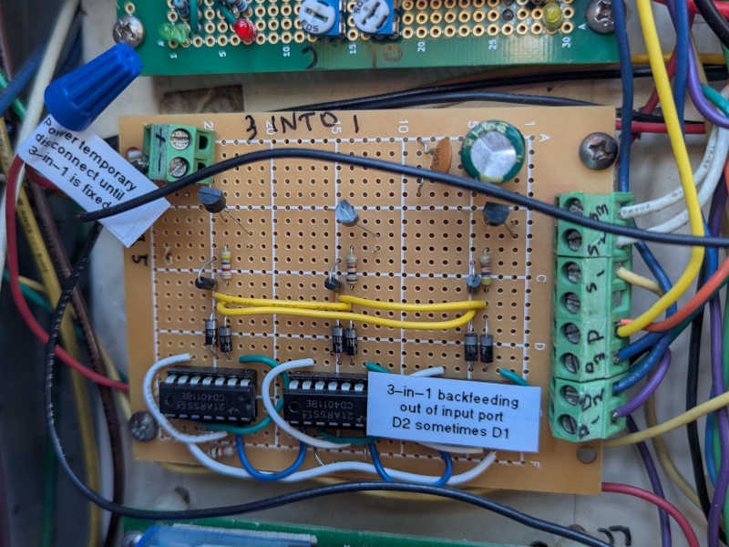

#### 7:30PM Playtime (No club hours)

Fortunately the Russos were visiting and it's always uplifting to chat with
fellow train fans. Gave them a train ride, because why not, and told them
about Disney Sunday tomorrow.

---

## Friday 2026/5/15

* 8.5 hours today, 76.25 hours this track year.

Signals panel K and others.

#### 8:00AM - 12:00PM (4 hours)

Started the day by fixing the Phil West transfer table. The chain has been
popping off and the easiest thing to try first is making sure all chain
sprokets are coplanar. Somehow the topmost sproket has migrated almost two
inches and that could not have helped. Helped De Philip pound that thing
back into proper place.

Picked up where we left off before power crapped out: completing wiring for
panel I-M-K communication. Now short trains won't get lost by the signals
system and potentially causing a false green.

Strawn and Harper investigated pulling fresh wire to KD to address a failed
wire, which has been swapped around so we sacrificed yellow. This will be a
bigger job than originally expected. New signal wire that would have supported
KD yellow remains unconnected until we can actually light KD yellow again.

#### 12:30PM - 5:00PM (4.5 hours)

While Strawn and Harper investigated running new wires for JFA (which has a
dead wire problem similiar to KD) I went over to panel J for another item
that's been sitting on the to-do list: get data on how switch motor board
rev. D interacts with panel J. Voltage and current of unconnected wires were
unremarkable. In comparison, oscilloscope trace was very interesting. The motor
received voltage to flip in the correct direction, but only for less than ten
milliseconds, before power polarity flipped again. This explains why we could
sometimes see a tiny twitch when the rail switch failes to flip.

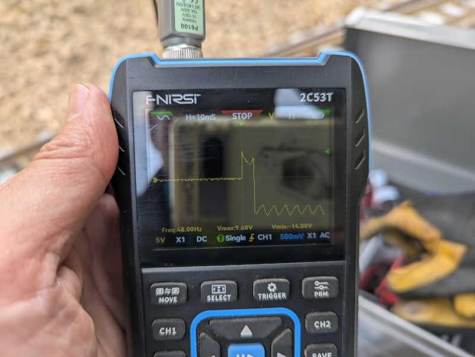

Took an evaluation lap around the layout afterwards looking for problems. Saw
a new one: KAA isn't turning red like it used to (weirdly blinky but still
red) when train entered the block. Crap, I might have broken something and
will need to get back to it tomorrow morning.

---

## Thursday 2026/5/14

* 7.75 hours today, 67.75 hours this track year.

Signals panel C new power conduit

#### 7:45AM - 12:30PM (4.75 hours)

Started the day by turning on signals to see if we have dual side-by-side
false reds on both quad-head coming down Davis and triple-head entering
station. Good news: it's there! Opened up panel C and found another
infamous touch-sensitive block detector boards. Likely bad solder joint
which can also misbehave based on temperature.

One half of this board was responsible for a block on main inner loop, and
the other half a block on main outer loop. So when it faults, it causes
false reds on both inner loop (quad) and outer loop (triple) signals.

The perforated prototype board cracked apart at mount when pulled, slicing
my finger open in the process. That's a bit of extra excitement I did not
need.

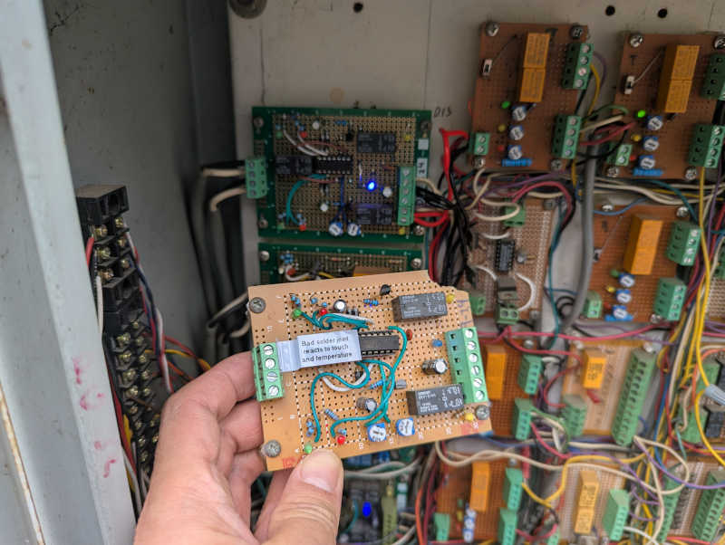

I started troubleshooting a signal that was showing both red and green
simultaneously which it should never do. I got as far as knowing both panels
B and C are involved before I was summoned to help with the new power
conduit project. This faulting signal is lower priority for now as it is for
the opposite direction.

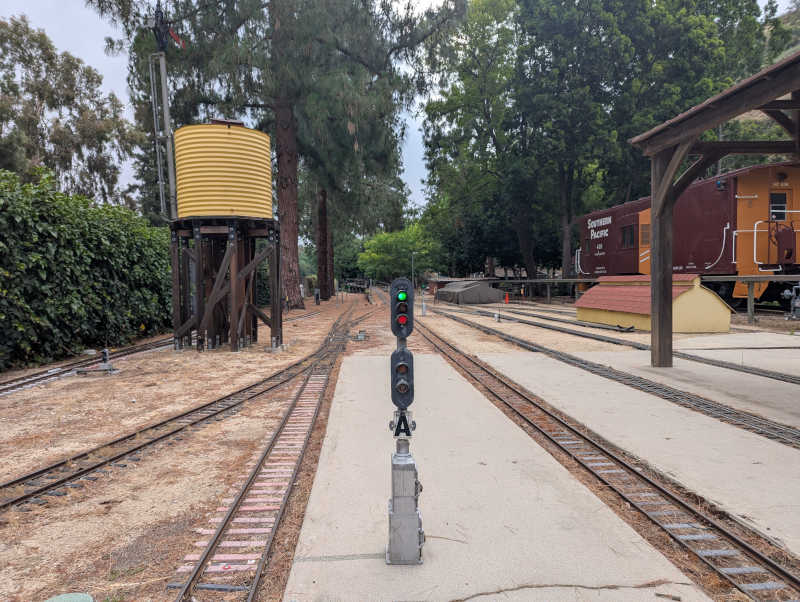

Got as far as we could on the conduit project and built a Home Depot shopping
list for what we still need. Combine shopping run with lunch.

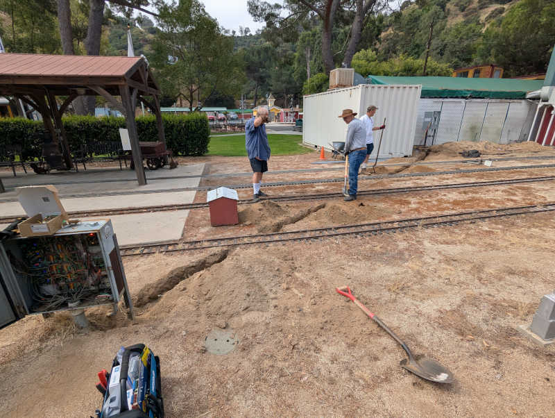

#### 1:30PM - 4:30PM (3 hours)

Finish up the power conduit project then run a trio of wires through the fresh
conduit. They are not connected at either end, that'll be done by people who
know what they're doing with 120V AC.

Fill the trench back in and clean dirt from track so it almost looks like we
were never here.

---

## Sunday 2026/5/10

* 8.5 hours today, 60 hours this track year

Sunday public ride operations crew

#### 8:30AM - 5:00PM (8.5 hours)

Started the day with miscellaneous Sunday public ride setup work, including
helping with certifying Fuad engine for operations, pump house bulb, and
taking a loop with Lincoln to verify signals functionality. No false reds,
everything worked well except two known problematic signal heads. Quad-head
coming down from Davis mine and triple-head entering station.

Was told I would be on lunch relief alongside Alexander. Ate early so we don't
end up doing that on an empty stomach. Mostly conducted but got a loop as
Santa Fe Electric locomotive engineer. Relief crew duty was interleaved with
kitchen fridge restocking.

After wrapping up for the day with Santa Fe Electric back in its quarters,
I walked N. Guzman physically through the known situation around Inchberg so
he knows what we know. After that I found Dorado cleaning the kitchen by
himself so I decided to help.

---

## Saturday 2026/5/9

* 11.25 hours today, 51.5 hours this track year

Signals power restoration + East Valley Lines event train crew

#### 8:00AM - 12:00PM (4 hours)

Investigated suspicion around the 110V outlet in Inchville and suspicion was
justified: that's where the power came from. Wires led to a vault next to
a 4.75" gauge storage barn and to outlets within it. We could access one of
the outlets and confirmed it had lost power as well, but none of signals team
members had access to the rest of the barn and could backtrack no further.

Armed with a borrowed tone tracer I verified all of yesterday's findings: that
everything we thought was on the same circuit was indeed so. Panels A, B, C,
Disney crossing compressor, unconnected wire in shack, Inchberg outlet, and
storage barn.

McMurray joined the crew to lend his electrical expertise. Reviewing our
current findings he agreed they sound reasonable. A plan was devised: we will
sever electrical connection at the defect detector junction box, disconnecting
signals A+B+C+compressor from Inchberg. We will then power it from a separate
source. Long term source is the electric breaker panel behind the kitchen, we
will run a power conduit underground to panel C. But we need power NOW so we
also have a short term solution using a Home Depot extension cord.

Panels A, B, and C returned to life, as did the crossing air compressor.
Inchberg remains without power but committee head Guzman has been notified.

#### 1:00PM - 8:15PM (7.25 hours)

Wrapped up some details after lunch then switched gears to prepare for a
club sanctioned event with East Valley Lines. Connected Strawn's locomotive
("Chessie") to a set of bench cars and also brought out Santa Fe Electric.
It'll be an all-electric ride service today, fitting for a N-gauge train club
as all of their trains are electric.

Chessie didn't look great sitting adjacent to clean and shiny Santa Fe Electric
so I gave Chessie a cursory wipe-down while we wanted for EVL. It made a big
difference but there are many places where I need to come back with cotton
swabs for detail.
Some EVL people came over to chat while I worked and one of them said Chessie
is modeled after a
[EMD SD50](https://en.wikipedia.org/wiki/EMD_SD50)
locomotive.

After EVL event I returned to signals work, pulling out a bag of zip-ties. I
didn't like having the temporary extension cord strewn all over Bowlus siding
so I coiled them up and hung them on the chain-link fence.

---

## Friday 2026/5/8

* 7.25 hours today, 40.25 hours this track year.

Troubleshoot loss of 110V AC power to panels A, B, C.

#### 7.45AM - 3:00PM (7.25 hours)

The signals team reconvened to pick up where we left off Thursday but we had
to throw that plan out the window when panels A, B, and C failed to power on.
I started troubleshooting a power ring network issue but it was worse than
that: we lost 110V AC power to those panels.

Sometime in the past the team determined a specific electrical panel breaker
would cut power to those signals panels. That breaker was fine, so tracing
begain in both directions: from that electrical panel breaker downstream
and from signals panels upstream.

We learned about several electrical breaker panels that we had never noticed
before.

There is a set of power outlets about 18 inches from panel A and, curiously,
they are a completely separate circuit. They both enter into the same
underground wiring vault adjacent to panel A but they are not connected.
Those outlets have power and panel A does not.

No power feed wires were found adjacent to signals panels B or C, either.

The air compressor driving Disney crossing gates is on the same circuit as
these three panels and has also lost power.

Smith remembered that power fed in from a small wooden shack next to the
Disney crossing air compressor. There is indeed an AC power wire in that shack
but it's not connected to anything else and the shack is empty.

One box west of the defect detector has a conduit going underground sweeping
south. This was traced to a pair of 110V power outlets poking out of the ground
in the middle of Inchberg. The wiring in this area is suspiciously complex
for a power outlet.

---

## Thursday 2026/5/7

* 9.5 hours today, 33 hours this track year.

Signals work day + Santa Fe Electric cleanup

#### 8:30AM - 12:00PM (3.5 hours)

Returned to panel L switch motor 1 (main/Akins) which I disconnected Sunday
morning. We could reproduce the unreliable switching behavior that caused it
to be disconnected. Not switching upon button press is merely annoying, but
the loss of trust in a switch motor board means we can't be certain it won't
switch underneath a passing train. A replacement motor control board was the
solution for today.

Resolving the immediate public ride impact issue allowed us to resume working
on panel M and K so they can keep each other updated and turn signals yellow
to warn of red block ahead under juristiction of an adjacent panel.

#### 12:45PM - 4:00PM (3.25 hours)

After a lunch helping us cool off from the heat, continued working on panel
prep concluding with installing a new block detection board in panel L as a
step towards consolidating space so there's room to support new block 13

#### 4:00PM - 6:45PM (2.75 hours)

After the signals crew dispersed, worked on Santa Fe Electric as my solo
project. Wiped down all five bench cars, cleaning off majority of dust, dirt,
and shoe scuff marks. There's one big blob of... bubble gum? I'll have to
attack later with Goo-Gone or similar. Vacuumed off all the benches but
they still look pretty ratty. LALS will need to reupholster these benches
at some point. The caboose also got a wipe-down, though I stopped short of
cleaning off its internal electronics equipment. I'll have to come back later
to learn what they are before I touch them.

---

## Monday 2026/5/4

* 5.25 hours today, 23.5 hours this track year.

Santa Fe Electric diagnosis then cleanup

#### 1:45PM - 7:00PM (5.25 hours)

Started by fixing the false reds on McKelvey signal bridge. (HA/HB) Thanks to
color-coded washers  it was quick to find the ends of the physical detection
block. I found a track resistor with one end loose. Santa Fe Electric and Cook
derailed in this area on their morning test run, due to fallen rocks. I think
someone who helped re-rail the engine inadvertently kicked the resistor loose.
I reattached the track resistor with a shiny new screw and conductive grease.

With false red fixed, I resumed troubleshooting Santa Fe Electric bench car
derailing issue. Some of the couplers were fixed during recertification, but
the derailing bench car's coupler was untouched. Thought it still might be some
sort of multi-car interaction, tried running through with just the problematic
bench car as the only car. Still happens.

Recruited Harper to help diagnose, a second set of eyes and another brain is
always useful. He saw no obvious problems, either, but did notice the couplers
were thrown to near or at end of their swing range in the middle of the S-curve
where derailment always happens. He also brought a bubble level and found the
track was not level in this area. After he leveled the track, derailment
stopped. I went back to the yard to pick up the rest of the train (instead of
just a single bench car) and ran through full length twice with no derailments.

There's still something unique and mysterious about this bench car underlying
its sensitivity to out-of-level track. The critical symptom of derailment
has been mitigated and that'll have to be enough for today.

Had a bit of time to spare so I cleaned out the storage bin on the engineer's
riding car. Several broken things got tossed (we don't need to hold on to a
broken eye bolt...) and the rest rearranged.

I found a trio of identical screws rattling on the bottom. Looked around and
saw they were supposed to help hold the infrequently used rearward-facing
second seat and I returned them to their job.

The lid is designed to be held open with two chains, one towards the front of
the train had come loose leaving just the rear chain. Reattached front chain
so now we have redundancy again.

---

## Sunday 2026/5/3

* 11.75 hours today, 18.25 hours this track year.

Sunday operations

#### 8:00AM - 3:30PM (7.5 hours)

My Sunday operations began with deactivating an unpredictable switch motor
(L SM1 main/Akins) and scoping out new signals issues. Two side-by-side reds
coming out of Davis mine/entering station that cleared up as weather warmed up
and two side-by-side reds on McKelvey that stayed the entire day.

Traced down another odd noise. Fortunately this one was not a piece of rail
threatening to cause derailment, but a tall plant tapping against the underside
of bench cars.

It was an eventful day with high rail traffic and a few derailments. We had
six locomotives on public ride operations though I don't think they were all
running at the same time. The cloudy weather reduced the number of public ride
passengers which was helpful because the operations crew were kept plenty busy
learning how to operate with so many trains.

My public ride operations day concluded with conductor duty for the last few
public rides pulled by CN2002 and locking up west gate at the end.

#### 3:30PM - 4:15PM (0.75 hours)

Orientation and familiarization with engine CN2002, whose throttle control is
very similiar to UP1989 but air brake control is different. There's an air
pressure gauge but it is not easily visible to the engineer so I couldn't use
the same techniques of watching pressure gauge. Alexander is trained enough to
detect brake activation by feel alone, I'm not there yet. Should not run public
ride operations until I do.
After the familiarization lap, help put CN2002 away.

#### 4:15PM - 7:45 (3.5 hours)

Santa Fe Electric usually stays coupled to its own set of bench cars, which had
proven trouble-free but today the last car derailed several times at the same
location in Davis Mine when unloaded. Wheel gauge tests checked out clear, and
all points of articulation are operable. (Though lubricated with graphite dry
lube anyway.)

It is easily reproducible at a specific location in Davis Mine, except at very
low speeds. Nothing visually obvious stood out about that segment of track.
It is the middle of the S-curve, so I took the train through both stations and
their S-curves, no problem.

During recertification day this set of cars were broken up to fit on steam bay
rails, and there was no guaranetee they were put back together in the same
order. As an experiment I moved the last car to the front, and the same car
derails. So it's not some issue of certain bench cars not playing well with
others. At least I can hear it happening more easily, and I don't have to walk
as far to re-rail the bench car.

I lost daylight before I could figure it out. Will have to resume later.

All this practice means I'm getting really good at re-railing bench cars.

---

## Saturday 2026/5/2

* 6.5 hours today, 6.5 hours this track year.

#### 9:00AM - 3:30PM (6.5 hours)

Track hours reset to zero at the beginning of May for a new year of accounting!
My first task of the new year is to join the club equipment recertification
crew at Cammarata's direction. We inspected the locomotives, bench cars, and
cabooses. Most of them passed but we did find a few issues. Some
we could fix now (couplers that had lost their springs) but others will have to
wait for later.

We got some peace of mind our equipment is in good shape, and we got a really
fun club engine group photo out of it.

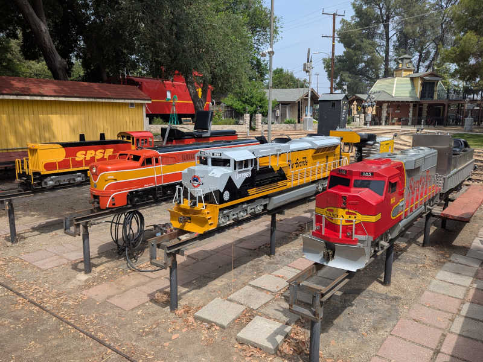

---

## Thursday 2026/4/30

* 10.25 hours today, 258.5 hours this track year.

Signals + Track work with Harper, Santa Fe Electric cosmetic cleaning

#### 8:45AM - 12:15PM (3.5 hours)

Came in at Harper's request to help finish up the underground wiring
infrastructure labeling project, adding color-coded washers to mark locations
of concern to signals team. Mostly to review and compare against reference
map but also to help resolve some mysteries like helping to find feed wires
that aren't where we expected them to be.

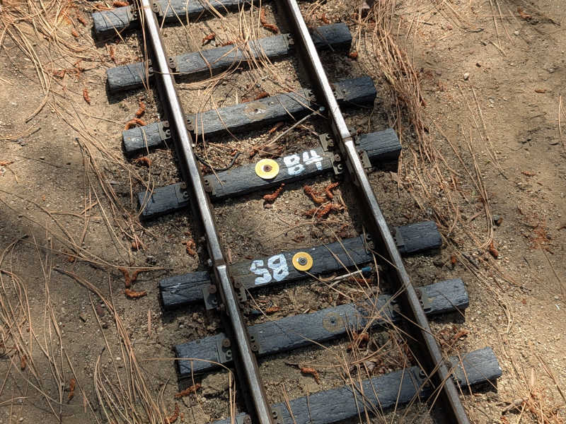

#### 1:15PM - 5:00PM (3.75 hours)

After lunch we wrapped up the label project and start fixing some track issues
we spotted while looking for wires. Such as this fiberglass rail joiner with
only bolts on one side. Where did the bolts for the other side go?

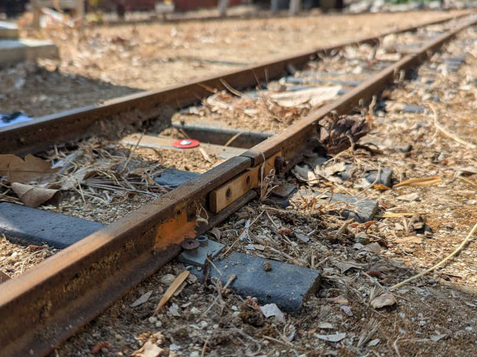

We couldn't fix everything on our plate. While we fixed the insulating rail
switch joiner for reversing track towards valley division, the counterpart for
southern end of narrow gauge barn will need a machine shop to tap and thread
screws at the correct locations.

#### 5:00PM - 8:00PM (3 hours)

After we wrapped up track work I went back to Santa Fe Electric for a cosmetic
refresh. Following Suncin instructions of using lemon-scented Endust and a
micro fiber towel, I got to work making the club's workhorse look
spiffy. Guests take pictures of this engine and it could look better than it
did when I was running public rides with it last weekend.

The biggest danger are decals, which are turning brittle after some number of
years. This is not helped by the fact that whoever applied these decals
took some shortcuts that are now going to bite me. Look at this decal bridging
right over a surface feature hanging over air. This is just begging to get
caught on something and rip.

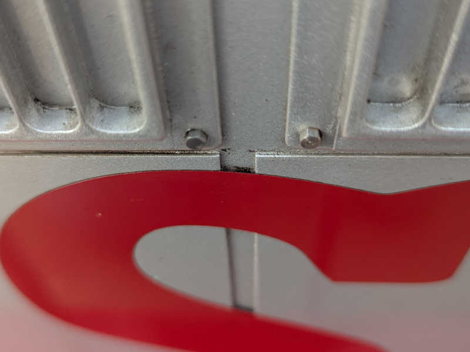

But even if all decalas were applied well, age and sun takes its toll.
This is especially visible on the yellow band on top of the locomotive,
which is visibly cracking and peeling. I'm not sure what can be done about
this except to carefully trim off the peeling bits so they don't pull more
up behind them.

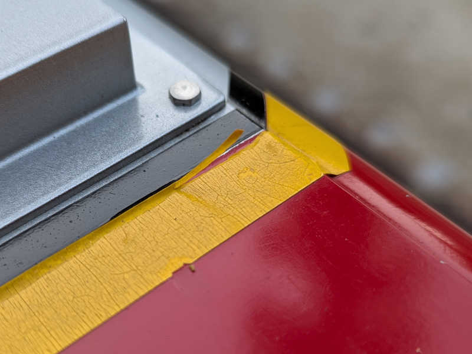

Stuck-on grime below the main deck needed something more powerful than Endust,
and for that purpose I brought Simple Green and switched over to some old
terry cloth towels. Then for the operator's console, I tried some Barkeeper's
Friend which helps but the amount of manual buffing I had to do implies I'm
not using the right tool for the job.

Chatting with Murphy who came over to see what I was doing, I also learned it
was modeled after
[EMD GP60 M](https://en.wikipedia.org/wiki/EMD_GP60)
and there's even a very similar looking engine on that Wikipedia page wearing
the same livery. However that was number 147 and this number 163 does not seem
to correspond to a historically notable engine. Perhaps that number meant
something to the club members who had built it, instead of an actual unit.

---

## Tuesday 2026/4/28

* 6.25 hours today, 248.25 hours this track year.

Signals work, track work, and Santa Fe Electric

#### 8:45AM - 1:00PM (4.25 hours)

Arrived to find Valley division signals on again when the rest of the layout
was off. Walked over to panel S and was surprised to find the power board I
replaced on Sunday is doing the same thing as the previous board: continuity
across AC line terminals regardless of NT status. Is this just an amazing
coincidence that a board failed in less than 48 hours _and_ in the exact
way as the previous? Or is there something else? Since I don't have another
power board to swap in, I have time to ponder while panel S stays on.

Afterwards I resumed signal GF false red investigation. Harper was on hand to
describe recent work in this area and help dig up underground wires. As soon
as I pulled them up I saw the problem: their insulation had been damaged
allowing corrosion to do their thing.

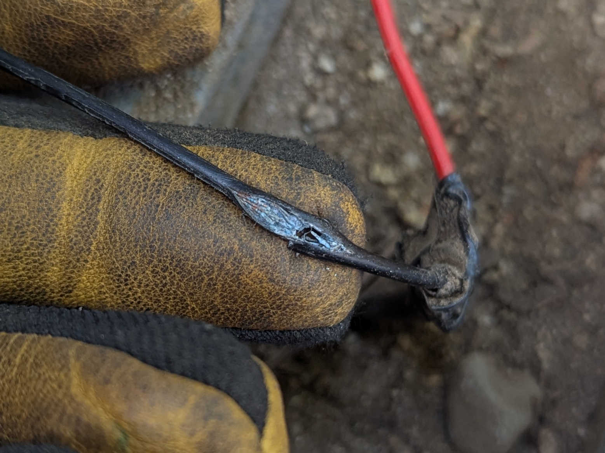

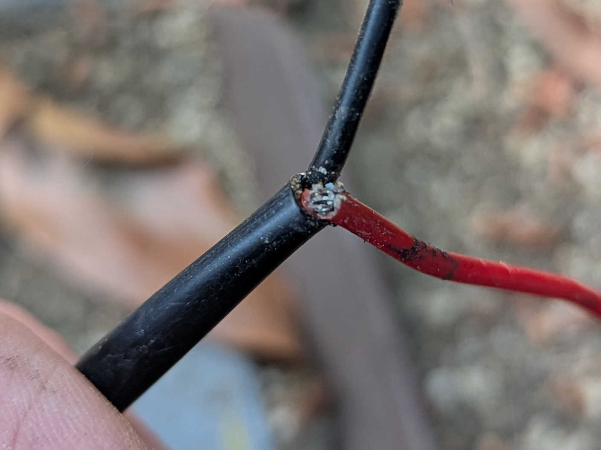

Harper pulled out some extra wire that was previously left in the vault as
spare, and I used that spare capacity to trim the damaged wire and try this
again. GF (and GD and GG) now correctly show green, let's hope it lasts longer
this time around.

Having resolved this signal issues with Sunday impact, I was curious and
followed Harper as he moved on to track work. First on the list was the point
of derailment by UP1989 on Sunday. Determined the rails were a little too
narrow, the rails were not level, and the outside rail took a nontrivial dip
right around that area. This combination of factors could explain derailment.

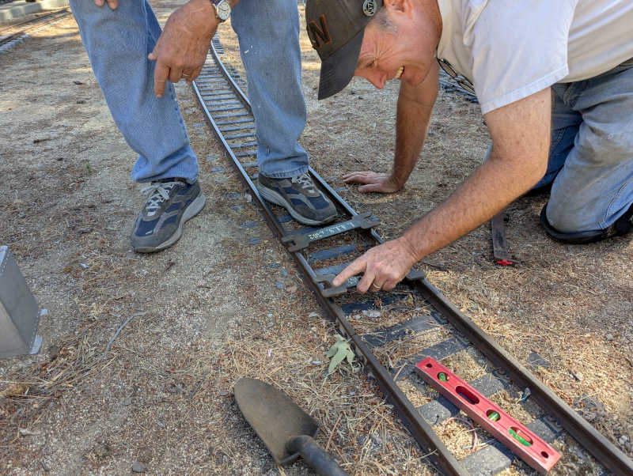

Helped Harper widen the rails a bit and make the two sides more level. The dip
is more challenging to address plus a higher risk of making things worse.
(Like turning a dip into a launch ramp.) So we will await De Phillip opinion.

Second on the list was a short segment of track that was supported by only a
single tie in the middle of the span. Stress of running over this segment went
into loosening the joiner bolts, resulting a short segment that would see-saw
as a train went by. It's only a matter of time before it comes apart and the
train derails. Since this segment was on the rail leading into station, that
raises the priority of getting this fixed.

Tightening the joiner bolts would address the immediate symptoms but not solve
the underlying problem. Doing it right means moving some ties around plus
adding one in order to support all rail joints in that area. Once done, weight
of train goes into the ties instead of into loosening bolts.

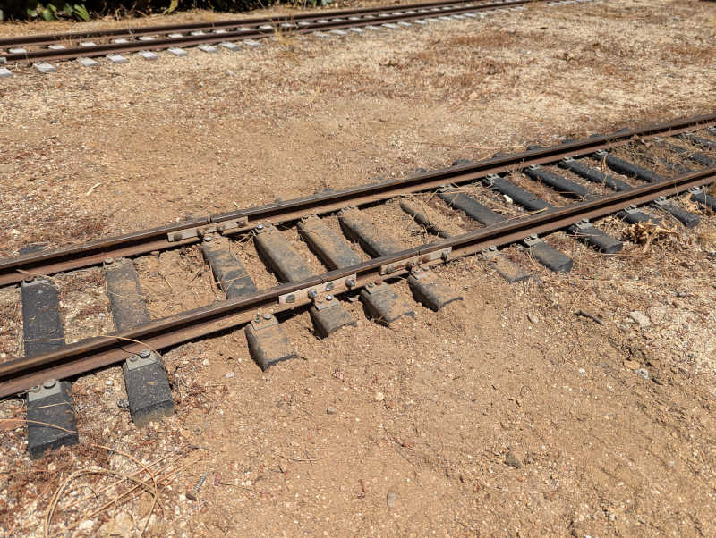

#### 2:00PM - 4:00PM (2 hours)

After lunch break Harper resumed his signals block labeling project using
washers of various colors. I went to look at Santa Fe Electric. My first
lesson is that she's not to be pushed around. After huffing and puffing for
a few feet I gave up and powered her up. Sometime later I want to determine if
this is just the nature of the drivetrain or if there's undue friction that
needs attention. Or perhaps she's got a parking brake that automatically
applied when unpowered? I know that exists on my salvaged wheelchair motors.

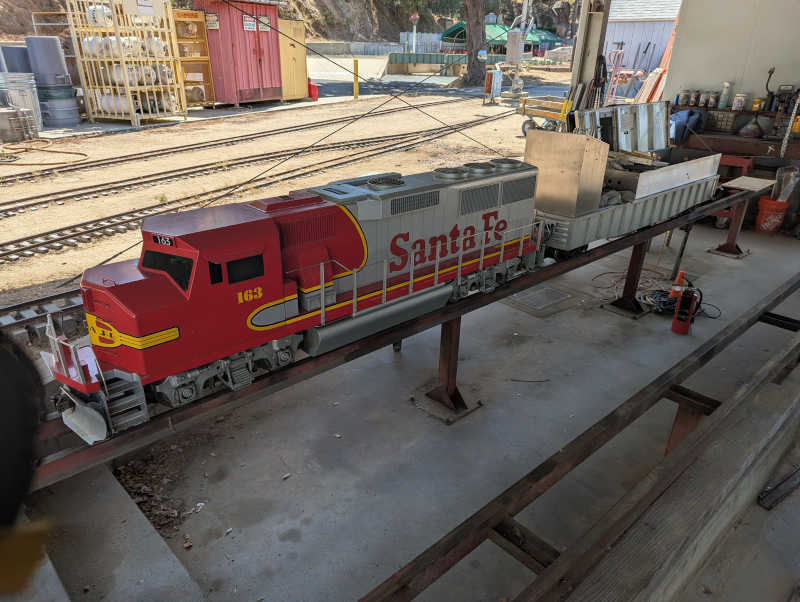

This orientation lookaround was informative. I now know the drivetrain
consists of motor gearboxes whose output shafts are wheel axles. Four
sets of them, one for each axle. The front-most axle also has a skid plate
under the gearbox to protect it from debris. I don't understand how her
suspension articulation works yet, that'll require more future study.

Looking at seams on the body, I have a guess it comes off in two sections but
I won't try it until I can do it under supervision of someone who's at least
seen it done.

Looked around inside the storage box of the riding car and found many items of
interest and a few that can be tossed. For example, a small orange safety cone
that has become brittle with age and cracked in half.

As for actually doing something useful, without lifting the body I really can't
deploy my multimeter. But I can do the first step of electrical diagnostics:
reseat all the connectors. There were several between the engine and the riding
car. Some of them look a little toasty and their replacement would be good
future candidate project. I found a medium-sized two-prong plug was
loose, and the large
[Amphenol connector](https://en.wikipedia.org/wiki/Amphenol_connector) was
also loose. I was able to turn the external ring about 3/4 of a turn before I
encountered resistance, and that resistance felt like it was pushing the plug
back into place.

Once that was done, I plugged in an extension cord already in the maintenance
bay. Within a few seconds, I can hear the cooling fan spin up. I'm not sure if
reseating connectors did the job or merely a big coincidence, but the result
is that we can charge in preparation for next Sunday operations. I'll take that
as a win.

---

## Sunday 2026/4/26

* 13.75 hours today, 242 hours this track year.

Sunday operations plus so much more!

#### 7:45AM - 5:30PM (9.75 hours)

Arriving early eastbound on Zoo Drive by Travel Town, looked over at Smith
Valley to see signal lights. "Oh, someone's already running!" Pulled into the
parking lot to find all signals off. "Uh-oh." Need to look into panel S power
after Sunday public runs.

I asked to run my morning practice laps on Santa Fe Electric. Around and around
I went, learning lessons along the way. The electric drivetrain has more
immediately response than the gasoline-hydraulic of UP1989. Also generally
smoother in transitions, though the transition from resisting sliding backwards
to forward powered motion is quite jarring and must be managed with air brake
system.

On the first and second practice laps, I saw the four-head signal coming down
Davis mine and the three-head entering station were both set to mainline and
both showing false reds. They indicate two different track blocks so it can't
be the same issue... can it? By my third lap, they showed the expected green.
Have to watch for return of this issue and hopefully get more data later.

Since I started my practice before the pre-run inspection checklist basket was
set out, I staged SFE in the station and got it done before the safety meeting.
Found an air leak in the line to caboose. Asked M. Bassett for a second opinion
and he hand-tightened it enough that bubbles no longer formed. Cammarata said
that is good enough: do not use a wrench to tighten any further.

Asked around to see if there's a certified engineer to take over SFE for Sunday
operations, and Cammarata said it can be me if I want it.  Recruited Bickel as
my conductor. OK let's go!

First lap: Cammarata sat immediately behind with feedback along the way. Lap
completed uneventfully and no critical problems requiring Cammarata to take
over. A good start! Cammarata signed off and returned to his normal ops duties.

Second lap: Alexander sat immediately behind me, again with feedback and as
backstop alternate in case he needs to take over.

Third lap: Alexander sat in one of the bench cars further back. Still
available as backup if needed but no more hand-holding for me.

Fourth and onwards: I got confident enough to run solo and did so for the rest
of the day (minus lunch break) all the way to final public train and locking up
west gate.

A successful first day running public!

After Santa Fe Electric was put away, I asked about the proposal to swap two
club owned locomotives: 2468, which is in Alkire behind a general member lock
but not commonly used for public runs, and the center cab work locomotive,
which is locked in Phil West which not everyone has a key. (I don't!) I learned
the next step is to measure overall length of those two engines to see if
there's enough physical space available. Hollis and I went and measured center
cab at 144" coupler-to-coupler and locomotive 2468 at 148" long. The center
cab has about 18" of space to spare between it and the Santa Fe Electric so
the swap is physically feasible. Data points and submitted for consideration!

I then took the center cab to carry my tools over to panel S to examine its
power board. It is indeed stuck on: continuity across the AC line terminals
regardless of NT signal. I see two possibilities:
1. Relay has failed closed, regardless of audible clicking in response to NT
signal.
2. Auto/Manual switch has failed closed, regardless of physical position of
switch lever.

Since they had been soldered in parallel, there's no way to tell without
unsoldering one of them. Which is not a field repair. So in goes the second
power board I received as backup for panel K repair earlier.

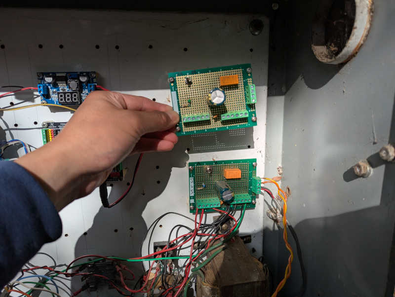

I returned to east end intending to look into a false red, but took a break to
chat with H. Finch for a bit.

#### 6:30PM - 9:30PM (3 hours)

After the chat I looked into a false red that started happening in the middle
of the day. It is signal GF, eastbound entering the Eppich tunnel, an area
with limited visibility and thus important for safety. Looking at surrounding
lights I also saw GD red and GG yellow, all consistent with a failure in panel
G block 10. Opening up panel G I saw the expected fault indicator. I measured
voltage across the detector board terminals to be ~14V and voltage across
feed wire rail terminals to be 0V. Broken feed wire is not good, the fact this
wire was only installed recently is worse. I'm losing daylight so I'll have to
come back later.

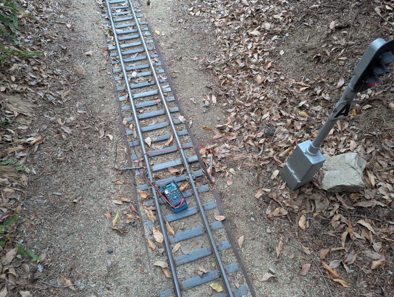

When I returned to the east end I got word the locomotive move has been
approved and I'm free to execute it whenever I want. I liked the idea of being
able to get the center cab out without finding somebody with a Phil West key
so I started immediately on my little Towers of Hanoi project shuffling three
club locomotives around.

A bit after all three trains are at their new homes, I noticed the Santa Fe
Electric cooling fan is not running. This usually happens when it is charging
so I was concerned. Suncin confirmed that the fan is supposed to run.

Maybe it just needs a bit of time before getting warm enough to need a fan?
I decided to wait, taking a break to chat with Burden as he packed up the
Heisler to run at
[Joshua Tree and Southern](https://www.jtsrr.org/home.html).

#### 10:00PM - 11:00PM (1 hour)

I returned to my locomotive move project by pulling out my label maker and
start labeling for the new train positions plus a small forwarding pointer
at their old location explaining where they had gone. Checking the Santa Fe
Electric afterwards and:
* The good news: it is charging as battery percentage is climbing.
* The bad news: the fan is still not spinning.
* The ugly news: metal grate over the non-spinning fan is getting warm just
from convection airflow. I am worried about how hot it must be getting inside.

No combination of levers and switches I tried had managed to turn the fan back
on. I'm not comfortable leaving it plugged in, getting hot without active
ventilation. I'm going to unplug it before I leave and ask Suncin for pointer
on what to do next.

---

## Friday 2026/4/24

* 2.5 hours today, 228.25 hours this track year.

Signals victorious!

#### 8:00AM - 9:30AM (1.5 hours)

Picked up where I left off with false reds HA and HB on McKelvey signal bridge.
Traced it back to bad feed wire joint inside one of the vaults, where the
indoor-use security wire fell apart in this outdoor application. Black wire
and insulation had broken apart. Red wire was barely holding on, but there
wasn't much left of the wire, either. Most of it had turned to greenish dust.

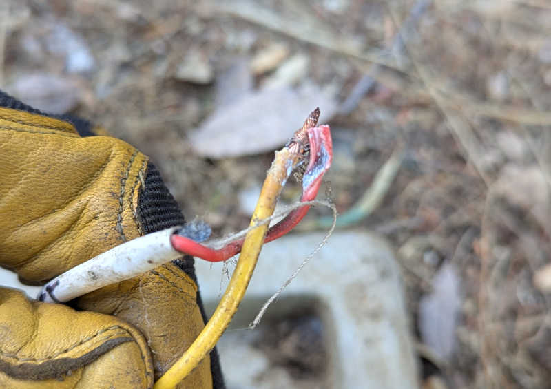

#### 12:30PM - 1:30PM (1 hour)

After going home to get my panel keys I had left there, I could get in panel I
to test a hypothesis formed after a good night's rest: the reason IDA red
would light up in test mode is because both red and white wires received power.

The four-conductor wire bundle for IDA from panel I to signal head had indeed
degraded. There were mega ohms of resistance from ground and green light wires
to other wires, which should have been open circuit (infinite resistance) so
they're already bad. White and red wires are worse, with only kilo ohms of
resistance between them. When dealing with milliamps for lighting LEDs, that
is a problem.

If only red or only yellow received power, as is the case during normal
operation, this degraded insulation meant electrons can find their way to
the other wire and an escape path easier than pushing through to light up the
LED. But when both red and yellow are powered in test mode, the easiest path
to ground is through the red LED.

In order to simulate this condition, I tied red and white wires together
at both ends treating them as a single wire for delivering power to the red
LED. This worked, at the expense of yellow, which I think isn't used anyway.

But still, this is only a hacky workaround. The real fix is to run new wires.

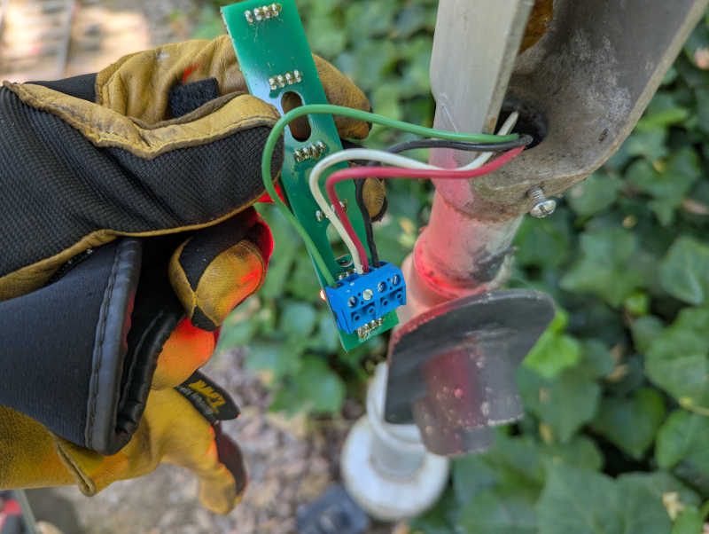

#### Playing with Trains (no club hours)

Spent the rest of the afternoon watching Cammarata work on Gold Rusher and
helped isolate the drivetrain resistance to right hand side piston stroke
moved out of range due to loose set nut.

---

## Thursday 2026/4/23

* 11 hours today, 225.75 hours this track year.

Signals work

#### 8:15AM - 12:30PM (4.25 hours)

During Monday's training train run I noticed every panel K signal stayed dark
the whole time. Even if it were disconnected from NT ring it should have turned
on when we crossed its detector block. Went to look there and found a power
board that never comes on. A replacement board will have to be found and
installed.

Panel S was also off. Opened up the panel and saw master power switch was off.
Flipped it back on and all was well. Last time we remembered working on this
panel was to do ESP32 reflash on 4/17 which improved Stutson crossing bell
logic. We wouldn't have turned the panel off and left it off that day. Weird.

While panel M did turn on when we crossed its detector block, it should have
already been on when we got there. Found a bad connection in the vault right
under panel M, with wire nut holding together NT+ wires for panels I, K, and M.
Cut back damaged wires to expose clean(er) wire and reconnected. Looks like
K-M is back but I-M is still not doing anything. Something for later.

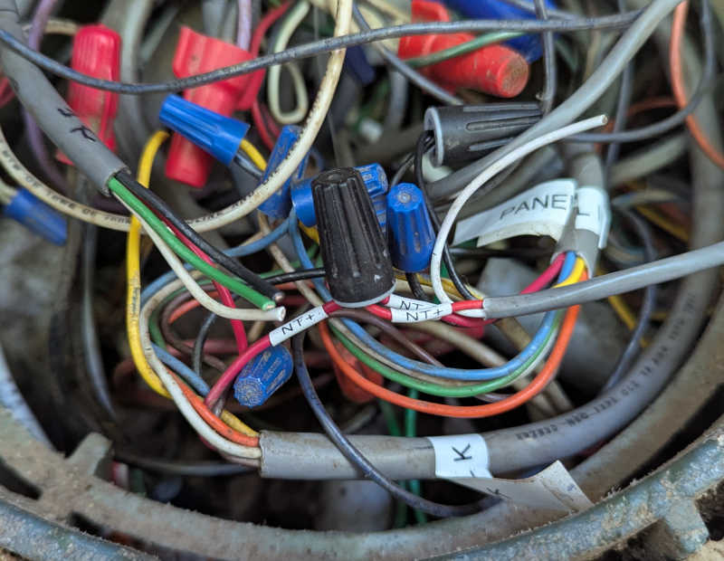

#### 1:30PM - 8:15PM (6.75 hours)

After returning from lunch break and before we head west again, went into IS-1
looking for power board. I was handed two boards. One for panel K today and
another on standby for later.

Most of the afternoon was spent banging our head against IDA red which would
light up in test mode but stays dark during operation. Went down many false
leads, such as concluding we lost power to the board until we learned the
crossover mechanism is supposed to cut main power and then auxiliary power
comes in another terminal. An... unorthodox... approach that threw us off.
Tried a different signal board. (Same behavior.) Tried a different signal
head right at the panel. (Everything worked.) Couldn't figure out a plausible
hypothesis for the "works in test mode" behavior before team had to disperse.

After Strawn and Harper left I went to perform my solo assignments. The first
one was swapping out the power board in panel K as decided earlier today.
This restored K to proper NT ring operation.

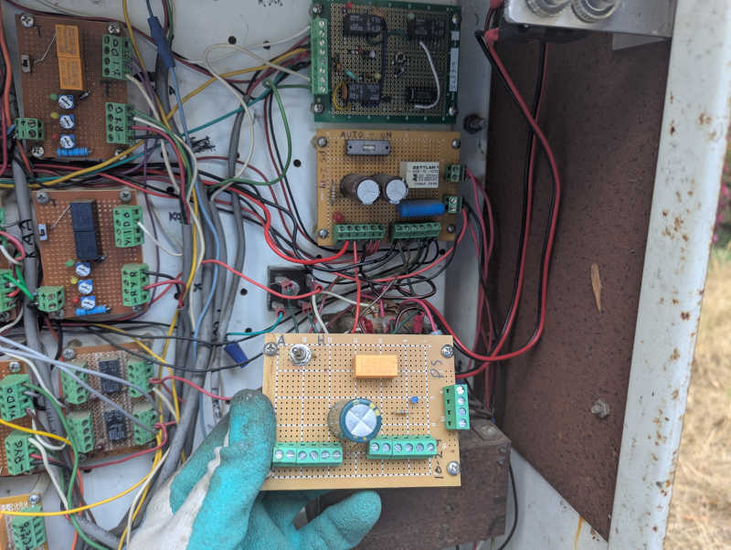

Next was signal head KD, the one exiting Dusty Shores before covered bridge.
This has been dimming over the past few weeks. It used to get really dark
after a rain but now it's dark rain or shine. The underground green wire has
gone bad. As a short term workaround, the lights for green and yellow lights
were swapped. Now green shines bright but yellow is dark. We need to run new
wire soon.

Final task of the day was GG, the Pennsy signal everybody sees on their way
into the parking lot. There was a collection of retired bulbs and I dug up two
green lights for installation. Green now shines steadily to greet LALS members
when they arrive.

I turned around and saw HA/HB were showing false reds. Well, that's new!
Ugh. I'm not dealing with it tonight.

---

## Monday 2026/4/20

* 6.5 hours today, 214.75 hours this track year.

Level 1 Enginner in-class lecture and on-track practice.

#### 8:30AM - 3:00PM (6.5 hours)

Started the day in the meeting car with PowerPoint presentation on Level 1
Enginner responsibilities during public runs. Thankfully none of
the major concepts were new, though there were some fun history. Because of
my time working on signals, I'm past that particular common hurdle for club
engine operators. That lets me focus on the other aspects like synchronizing
throttle and air brakes for smooth starts and stops.

After the in-class portion, fellow classmate Campbell and I pulled out UP1989
for a few practice laps. Got some good tips from Nelson that I don't need to
bleed air all the way down. This makes sense: when coming to a stop in a car
I don't press the brake pedal all the way down. Doing so can result in a jerky
stop - just like what I've been getting with a train! Easing off to 30 PSI or
so instead of 0 PSI seems to help.

For half of my final lap I simulated heavy stop-and-go traffic, stopping at
every signal. Not only was it a good practice of stopping and restarting, the
signal head also serves as a good target for me to practice stopping at a
place of my choosing.

A little more practice is needed, probably this coming Sunday. I'm not ready
for my final exam check ride just yet but I think I'm close.

---

## Sunday 2026/4/19

* 6.75 hours today, 208.25 hours this track year.

Sunday public run crew - Disney intern event

#### 8:30AM - 2:45PM (6.25 hours)

Morning setup and miscellany ended with early lunch so I can relieve crews
getting their lunch. Conductor for Santa Fe Electric with Chavez and Ronne
then switched over to Alexander to more easily transition to intern event.

#### 2:45PM - 5:00PM (No club hours)

Alexander hosted a group of Disney Imagineering interns, who arrived in the
afternoon to visit Carolwood barn then came over to LALS side for a train tour
of our model railroad layout. The group BARELY all fit on a single train.
There were some Q&A both before and after the headline train ride.

Alexander let me handle CN2002 for a lap. I took it down to Smith Valley
where I promptly derailed it. *sigh* Not a great start! The first truck was
fine but the second truck popped off. There were no obvious causes for
derailment, further investigation needed.

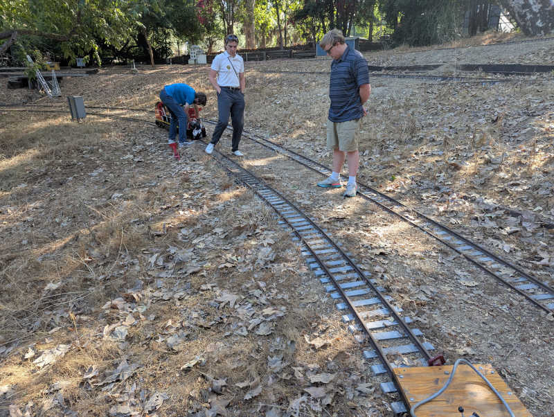

#### 5:00PM - 5:30PM (0.5 hours)

Put away bench cars and CN2002.

---

## Saturday 2026/4/18

* 8 hours today, 201.5 hours this track year.

Big signals work day reblocking and activating panel M!

#### 8:45AM - 12:00PM (3.25 hours)

Taking care of the list of issues yesterday cleared the board today for
the rail reblocking work in preparation for new siding. Pederson joined
Strawn and myself in getting ready. The morning started with reversible
tasks, meaning if we encounter problems we could still restore the
system back to the way it was in time for Sunday public runs. Things
like replacing a few rail links with electrically isolating bars at
new block boundaries, then electrically reconnecting them with
bond wires so they act as they did before.

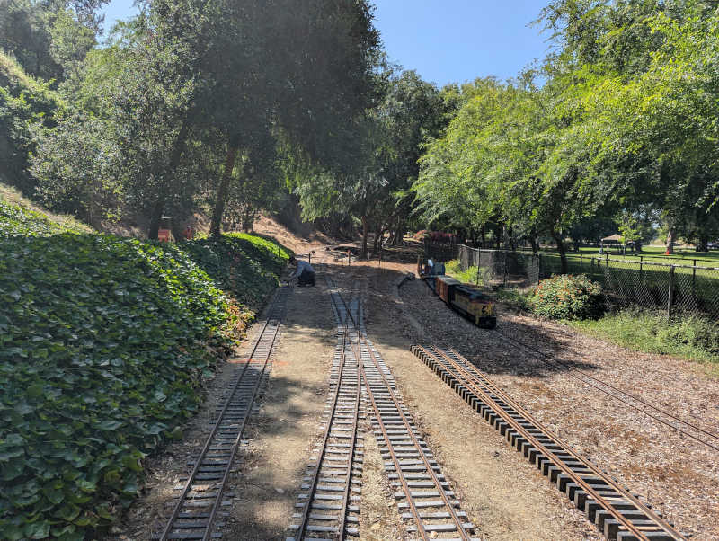

#### 1:00PM - 5:45PM (4.75 hours)

After lunch we quickly ran out of reversible tasks. Looking at the clock
and looking at the remaining tasks, we decided to go for it! Those
backwards-compatible bond wires were removed, new feed wires enegized
then connected to detectors in panel M, as did two signal lights. It all
went about as smoothly as can be expected, and we didn't break anything
critical to Sunday run operations. This was a long, but successful, day.

At the end of the day I took a detour out to signal GG, the Pennsy light
everybody sees on their way into the parking lot. It has been blinking
erratically so I opened it up expecting to hunt for a loose connection.
What I found are old style incadescent bulb sockets with LED retrofit
modules sitting inside. At the time of diagnosis, the bottom green was
blinking and the top was steady.

Experiments:
* Swap two green bulbs. The same bulb (now top) blinks.
* Swap green with yellow bulbs. The yellow bulbs stay on solid.

Not a loose connection, then. It's failure of LED driver module doing its best
to pretend to be an incandescent bulb. I'll have to get some of those bulbs.

---

## Friday 2026/4/17

* 6.25 hours today, 193.5 hours this track year.

Signals stuff that needed to get done before panel M rework.

#### 8:00AM - 12:30PM (4.5 hours)

Arrived to see signals already powered on and nobody on the track. Good
opportunity to figure out who's triggering the false powerup and why.
Unfortunately the diagnostics method is to walk around turning off panels
with NT boards and see if the whole layout turns off along with signals
near that board.

Panel M was supposed to join in the timer ring network via panel I, but
panel M did not turn on when everybody else did. Looks like the wire to I
is a dud so we have to use a wire to K for the purpose.

When I opened up panel S, I saw 12 minutes on the timer which was absent
from other panels. I turned off panel S, and everything went dark. Visual
inspection found no obvious problems with panel S NT block but we can at
least mitigate its effects by reducing timer duration from 120 minutes down
to 30 minutes.

While at panel S we could try the other experiment: a second ESP32 board
flashed with code from the repository was swapped into the panel to test
field-swap capability, and it worked! As a secondary bonus we now have
improved logic for triggering Stutson crossing bell.

Swapped out JFA clear lenses for faceted (bugeye) lenses. Strawn and I
preferred the faceted lens, Harper didn't think they looked very different.
Proceeded to try swapping out JFB as well but.... GAAAH ANTS! The ants are
back trying to rebuild their home. I'll need to bring reinforcements later.

To test new lens, panel J was opened up to switch signal to test mode, and
we noticed its NT board to be dark. It should at least be showing 000 on its
7-segment LED. Probing the wiring, found its arrangement made no sense. It
appears to have been wired with N+/N- mixed up with VCC/GND and a mystery how
that could have possibly worked. Compounding that mystery, it shouldn't kill
the board, either.

#### 2:00PM - 3:45PM (1.75 hours)

Lunch break included a detour to Home Depot to pick up a few items including
a can of RAID ant spray. That cleared out JFB so lenses can be swapped out
without ants crawling all over me.

Leaving the lenses out for their trial run, we installed a motor cover box
just built by Davis for the larger motors. We'll need another anchor to
screw the box tabs into, but we have enough today so it doesn't flop around.

---

## Wednesday 2026/4/15

* 4.5 hours today, 187.25 hours this track year.

Signals @ LALS

#### Morning (no club hours)

Fix Chessie locomotive. Motor field cables were replaced earlier, today a
relay to replace the melted one was installed. Didn't move. Looking closer
we found a cable that would have been power supply for a lot of auxiliary
components (LEDs that shine downwards, etc.) and its insulation had degraded
from heat and is now vulnerable to occasionally shorting against a terminal
that is usually ground. Not good. Once that's fixed, Chessie still didn't
move, but then we figured out it was because "Master On/Off" got bumped
sometime during this morning's work. Flip that to "On" and Chessie is back in
business.

#### 3:00PM - 7:30PM (4.5 hours)

(Lost notes on what happened after lunch in Smith Valley)

Went over to check out latest siding track work by De Philips to compare
against plan for initial & future signals support. The siding work had some
deviation from original plan due to terrain and vegetation, so signals plan
must be updated to suit.

Disconnected all panel J motor 2 wires so I could measure resistance across
them. They are all in the single digit ohms of resistance. The white one is
a little worse but not a huge deal.

|  | Black | Green | White |
|----|----|----|----|
| Red | 2.39 | 2.83 | 4.9|
| Black | - | 3.2 | 4.5|
| Green | | - | 6 |

Went to look at JFA/B wiring. Start by cutting off about 1cm from end of nasty
ant stuff contaminated and corroded ends. This brought back five out of six
wires but JFA green still has about 470 kilo ohms of resistance instead of
single digits like the rest. There's a chance I might just need to cut it some
more to reach shiny copper but it's more likely the wire is gone and need to
be replaced.

Since the wire is degraded and we have no standard lights to replace ant
damaged JFA/B I decided this was an opportunity to try out the 3D-printed
single LED + lens signal head I built, derived from the STL I reverese
engineered. Green is still dim due to wire but the rest look very promising.

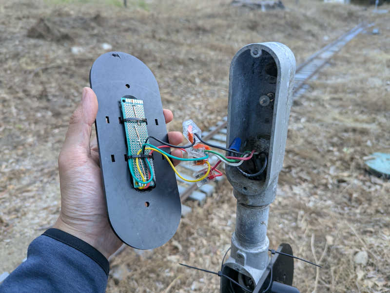

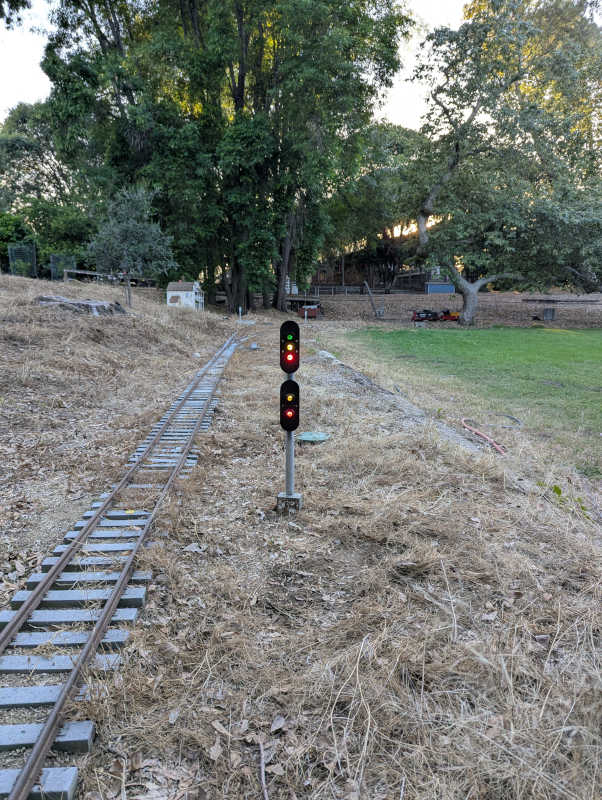

---

## Tuesday 2026/4/14

* 4.5 hours today, 182.75 hours this track year.

Signals @ Home

#### 10:00AM - 11:30AM (1.5 hours)

Getting oriented with the Arduino sketch running in panel S. The basics seem
sound but there was a diagnostic blinking LED pattern (binary counting)
running on unused pins and I couldn't find the code for it. Turns out that was
because Brock never committed them to the repository.

Voiced my position that code repository must match deployed code.

#### 1:30PM - 4:30PM (3 hours)

I've been told the vendor who provided signal heads currently at LALS has new
management who turned highly mercenary about the deal. We may be better off
producing our own in the future. There was past work to generate a 3D-printable
variant but those people are no longer working on the project. I was given a
STL file so I sat down to reverse engineer its dimensions into a CadQuery file.

Now I have a baseline for future work.

---

## Saturday 2026/4/11

* 8 hours today, 178.25 hours this track year.

Signals work with a bit of landscaping for variety's sake.

#### 8:30AM - 11:00AM (2.5 hours)

Finish mapping out wires in the 8-wire bundle running between panel M and
panel K. The good news is that we should have enough to work with, though we'd
have to see if the unconnected wires were unused because they were found to be
broken sometime in the past.

Showed Stark location of hand tools, garbage cans, utility carts, and the
organics bin. All set to rake leaves!

#### 11:00AM - Noon (1 hour)

Q&A session with Smith to sort out some open questions on signals system
design intent and implementation.

#### Noon - 2:30PM (2.5 hours)

Fire up the super sucker for some leaf cleanup action alongside Stark and
Alexander.

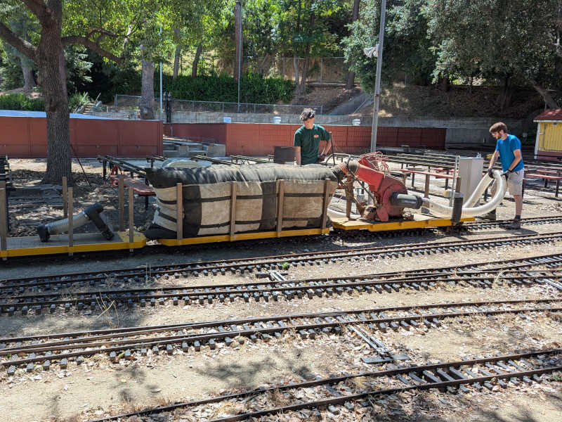

#### 4:00PM - 6:00PM (2 hours)

Returned to panel K to continue working. One of my assigned tasks is to
install a new signal head driver board, my first. I quickly relized I had
a problem as the new board is not compatible with the old form factor. I could
solve this any number of ways so I shoud check if there's a recommended method
before I do anything drastic.

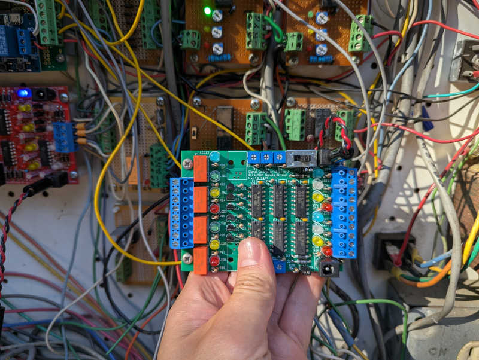

The official task is on hold, but we're here and panel K is open so might as
well make good use of the opportunity. Alexander and I brought up the iOS
reference app, spread the reference printouts before us, and sank our teeth
into learning how all this works together. It was a very productive sesson.

One focus were the signals on either side of the reversing track. Panel
schematic describes design intent of red over flashing red when the reversing
track is selected. Eastbound KEA/B does this but westbound KAA/B
shows dark over flashing red instead. Studying how they differed, we determined the
KAA red signal wire had been repurposed to notify panel I so the previous
signal (IN?) can turn yellow. Armed with that knowedge we returned to KEA/B:
how did it notify its previous signal to turn yellow? The answer: It doesn't!
That's LEA/B which does not turn yellow
when KEA is red. So right now it looks like we can have the intended
red/blinking-red OR transmit status to turn previous signal yellow, but not
both. How would we wire up panel K so we get both? To be continued...

#### Non-club hours

Got to examine a flat bed car being repainted, with components disassembled.
I was most interested in the wheel bogie (truck) because I am still not
confident I understand the articulations required to operate on track. I now
think I have enough of a grasp to 3D print a few ideas and see how they work
before I make them out of metal.

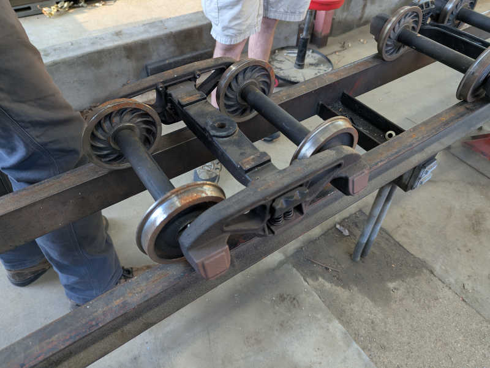

---

## Friday 2026/4/10

* No logged club hours today, 170.25 hours this track year.

Chessie TLC

#### 12:00PM - 3:00PM (no club hours)

Helped fix damage to Chessie locomotive. Two burnt wires were replaced
with generic automotive battery cables from O'Reilly Auto Parts. No luck
finding a local source for replacement 3PDT relay so that'll have to
wait to be delivered. A remnant of speaker box for engine sound system
was removed, which should improve ventilation. I got my first look at the
lighting system inside the cover. Whoever worked on that before did not
belive in trimming wires to length.

After Chessie was put away to rest while relay is in transit, I got to see
an OS Engines Mogul steam locomotive that can use some exercise. It won't
get run today but hopefully soon.

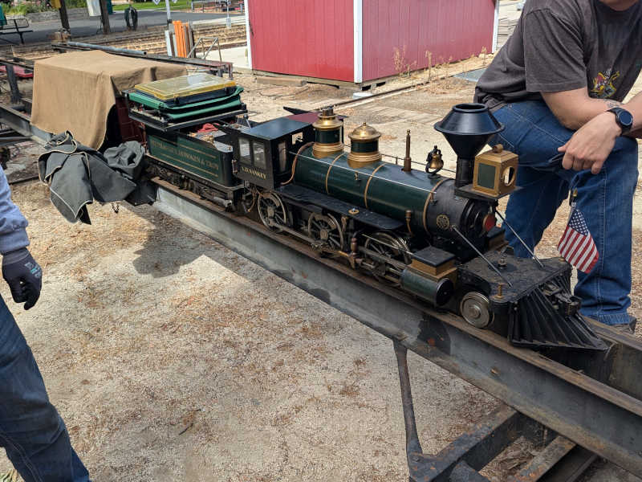

---

## Thursday 2026/4/9

* 9.5 hours today, 170.25 hours this track year.

Minor landscape and major signals work.

#### 8:30AM - 1:30PM (5 hours)

Started the day by installing a
[Harbor Freight solar spotlight](https://www.harborfreight.com/40-lumen-8-in-solar-led-black-finish-spotlight-57704.html)
to replace one that has stopped illuminating. When digging up the old one I
found source of failure: something had chewed through a wire. I might be able
to bring this back and asked Davis where a fourth spotlight could go if I do.
He nominated up on high, second illumination source for the upper structure.

The new light sat charging up through the workday. At the end of the day I
could verify this rail side feature has three spotlights again.

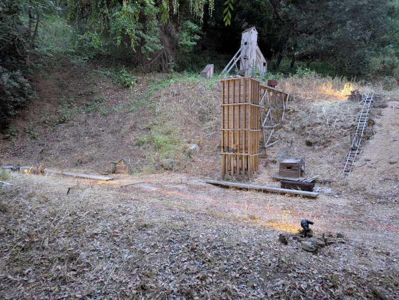

Then it is on to a lot of signals work! As an appetizer to the main wheel we
stopped at a switch known to throw only partway. There were two parts to this
puzzle. The first one is adjustment of motor limit switch positions, and the
second is clearing out a long thin branch that had wedged in the mechanism
preventing it from moving all the way.

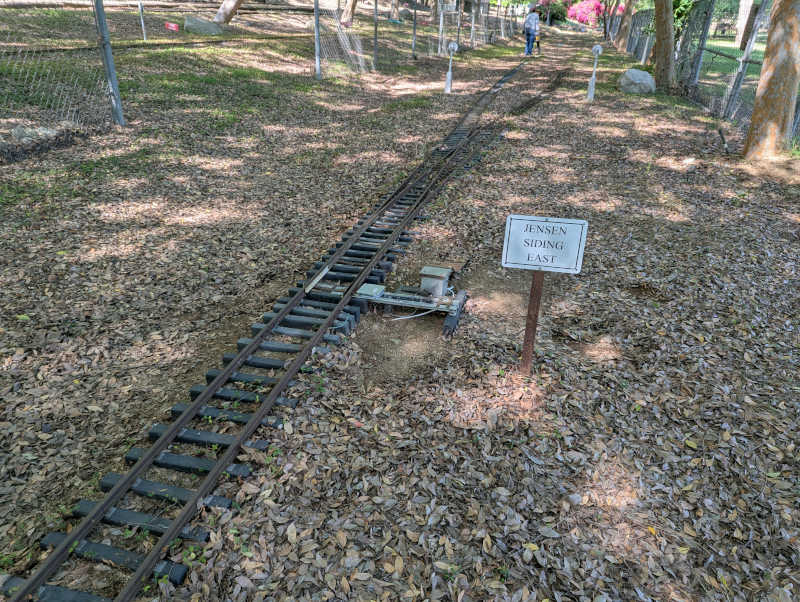

Then we moved on to experiments gathering data points on the new purple switch
motor board failures. Today's focus was on wiring quality as a contributing
factor, with three experiments:
1. Run new wires over the grass. Result: 100% success.
2. Re-test with current in-ground motor wires. Result: 30% success.
3. Re-test with in-ground point switch wires moved over to motor duty. Result:
30% success

Experiment #3 was very valuable because without it #2 might have been dismissed
as a failed wire. But two entirely different pairs of wires failing in
identical ways? Something weird is going on.

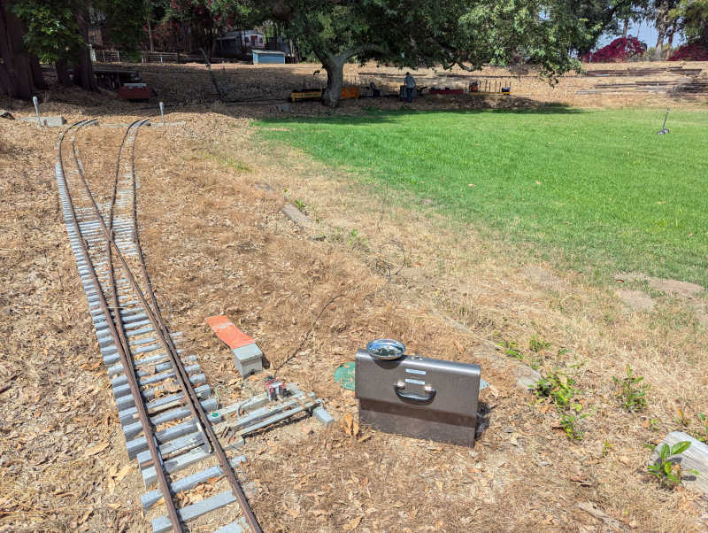

Signal lights JFA/JFB near this test motor has been very dim. Opening
the head immediately exposed the reason: an ant colony had moved in. They
had brought all the comforts of home not caring they blocked light, and their
activities also damaged the circuit board. Hopefully at least the wires might
be OK.

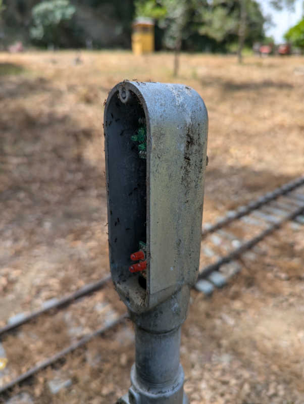

Then we went to map out rail detection blocks in preparation for upcoming work,
and map out existing in-ground wires we might be able to repurpose. Sadly we
found out our Chessie locomotive is not happy staying on "brake mode" to
hold position on a hill for an extended period of time. Some electrical
components were damaged and will need to be replaced before our signals buddy
can return to work. Next time: use mechanical chocks.

At the end of the day I tried to bring a yard rail switch back online as a solo
project. It was the old style of rail switch motor and a never-used spare of
the type had recently surfaced. I asked for it thinking this would be an easy
easy swap but sadly it was not. Two rusted fastener breakage
later, I admitted defeat and stopped digging myself any deeper. I closed it
back up, still in failing state, with intent to revisit later.

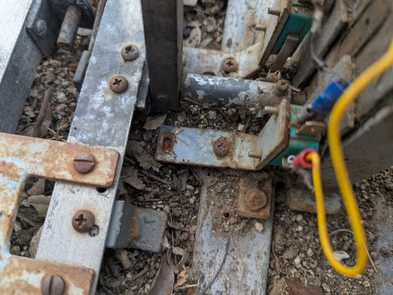

---

## Tuesday 2026/4/7

* 3.5 hours today, 160.75 hours this track year.

Rust removal, signal board replacement, fire extinguisher check.

#### 2.45PM - 6:15PM (3.5 hours)

Came back to finish the job on the south side tool car door. Now it is wholly
shiny.

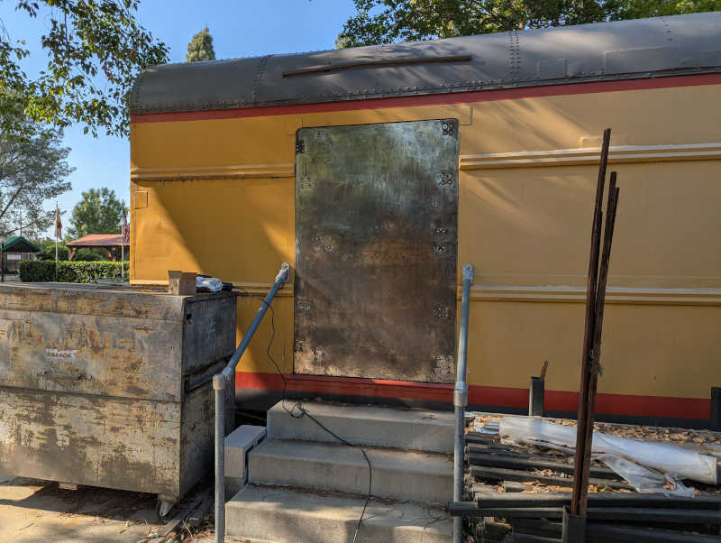

There are still a few spots around fasteners, and I could only get one edge
out of four, but I got the most exposed surfaces so while not perfect it'll go
a long way.

After that was complete I proceeded to execute step 3 of detector block
musical chair and replaced flaky panel G dual block detector board with a
working unit freed up from panel K consolidation.

After that was done I walked around to visually inspect fire extinguishers to
verify their gauges still show needle in the green zone. Helping in this task
is a location map I created on top of a screen shot of LALS layout from
[https://openrailwaymap.app/](https://openrailwaymap.app/#view=17.19/34.155202/-118.303838)

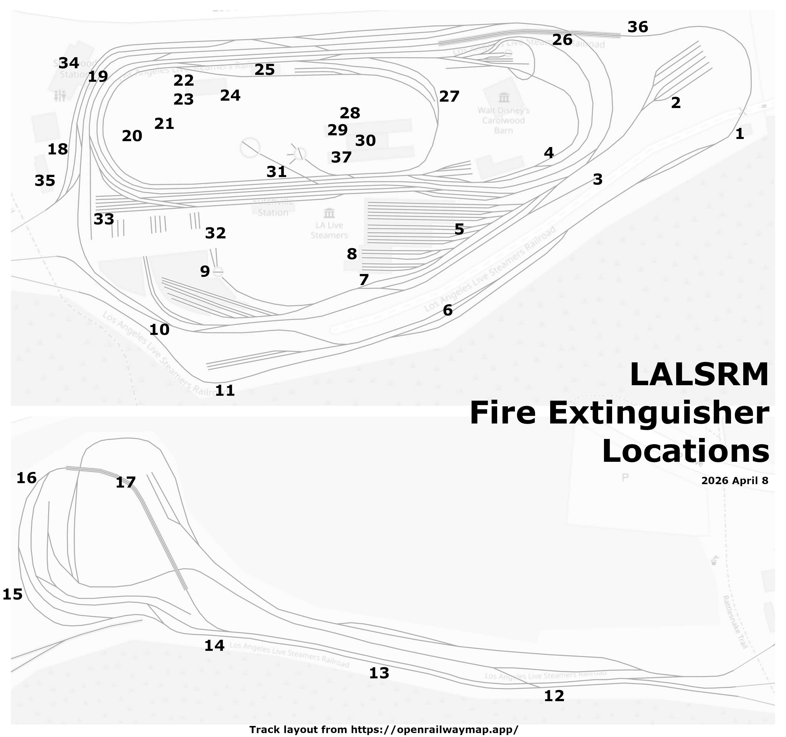

Everything looks good though I couldn't access three units: #34 in the ticket
booth, #35 in the caretaker caboose, and #37 in the meeting car. I'll ask about
them later.

---

## Monday 2026/4/6

* 3 hours today, 157.25 hours this track year.

#### 3:15PM - 4:45PM (1.5 hours)
#### 5:30PM - 7:00PM (1.5 hours)

On [March 17th](http://localhost:1313/lals/timecards/2026/#tuesday-2026317) I
took all the loose brown rust off the already mounted (south side) tool car
door. Now I'm back to work on the tougher black layer underneath. I got about
60% of the way down before I had to put the project on hold for board meeting.

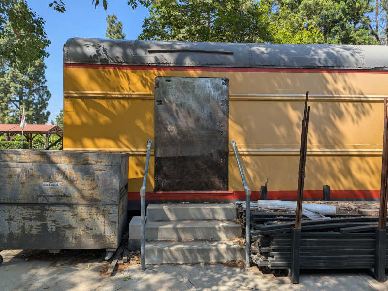

Interleaved with this work was a quick experiment trying to buff out the paint
on the meeting car to see if it's a viable alternative to repainting. It helps
but the final decision was to proceed with repaint plan.

---

## Sunday 2026/4/5

* 8 hours today, 154.25 hours this track year.

Sunday public train crew.

#### 8:00AM - 10:45AM (2.75 hours)

Engineer training on UP1989. Includes performing air line and brake check.
Staged it properly in station with a full tank of gas for a certified engineer
to do public runs with it for the day.

#### 10:45AM - 3:15PM (4.5 hours)

Conductor for CN2002 pulling public train rides.

#### 4:15PM - 5:00PM (0.75 hours)

After the public rides wrapped up there was an hour of socializing. After that
we put CN2002 away. This was the first time putting it on its storage track so
there were a few wrong turns. Next time it shouldn't take 45 minutes.

---

## Saturday 2026/4/4

* 1.75 hours today, 146.25 hours this track year.

Some club work but mostly focused on CN2002.

#### 10:30AM - 11:30AM (1 hour)

Execute step 2 of detector block musical chair plan. Move wires from existing
dual-block detector board...

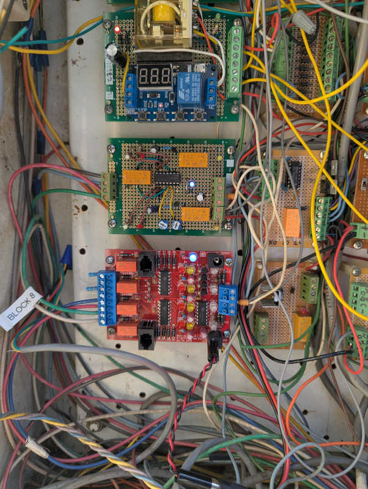

... and move them into the quad-block detector board as well as moving the
board up one slot.

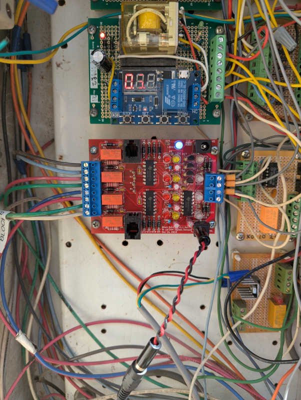

#### 1:00PM - 1:45PM (0.75 hours)

Merchant was here working on the new tool car door that I had partially de-rusted.
Moving it for work meant some previously-inaccessible portions are now
accessible. While Merchant enjoyed a late lunch I went in with my tools to remove
more rust.

#### Other activity (no logged hours)

Potential new club member Stark was on site to look around and meet people.
I will be one of his membership sponsors.

Help Alexander get CN2002 ready for inspection so it can be certified to pull
public ride trains tomorrow.

---

## Thursday 2026/4/2

* 6.25 hours today, 144.5 hours this track year.

Mid-week signals work

#### 8:00AM - 12:45PM (4.75 hours)

Started the day intending to fix false reds that came up during this past
Sunday public run and, annoyingly, they were all clear in the morning.
Intermittent issues, ugh!

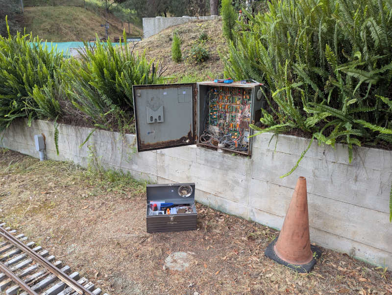

Fortunately the panel G false red came back later in the day so I could probe
it to find the track voltage within range so the fault is not a bad bond wire
or track resistor. I probed voltage from detector board input ground to the
track wire and... the fault LED cleared up! That's new.

Several minutes later, the fault returned and I could clear it the same way.
(Measure voltage from board input ground to track output.) It came back within
a minute, and I cleared it again, but then it didn't come back. Doesn't matter,
this board is now untrustworthy and on the replacement queue.

Panel K false red was tracked to a detector board as well. The failure mode on
this one is: we can trigger a false detection just by lightly touching the
circuit board. Behavior implies a loose solder joint somewhere but there were
no obvious candidates.

Plan:
1. Replace touch-sensitive panel K dual block detector board with newer quad
block detector board. This uses half the new board.
2. Move wires from adjacent dual block detector board to the new quad block
board. This frees up a currently-working dual block detector board.
3. Replace the faulty panel G dual block board with one freed up from panel K
in step 2.

Step #1 was done today, I'll come back for #2 and #3 later because we needed
the full team on installing a network timer node in panel M. This started with
cutting the track to install a timer-specific detector block, and we have to
return the rails to operating condition before we break for lunch. For one
thing, our work train is stranded until the track is back in! It is past the
cut point and there's a tree trimmer crew onsite today and they're blocking the
track ahead with cut branches.

Once the track was back and the wiring installed, our work train had the honor
of being the inaugural train to trigger the new timer as it backed over the new
detector block. That was a very satisfying relay **click**.

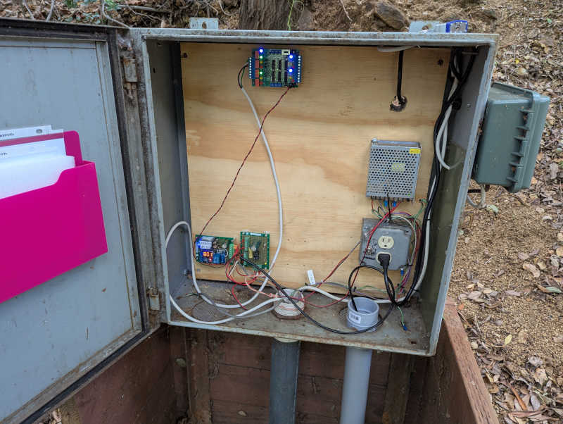

#### 1:30PM - 3:00PM (1.5 hours)

After lunch the team reviewed plans on how the track blocks will be rearranged
to support the new siding. Most of this will be handled in panel M, but there
will need to be a few interface points to adjacent panels I and K. This is
where we needed the vault I cleaned up the other day and I may have to do the
same to the big tangle of wires in panel I.

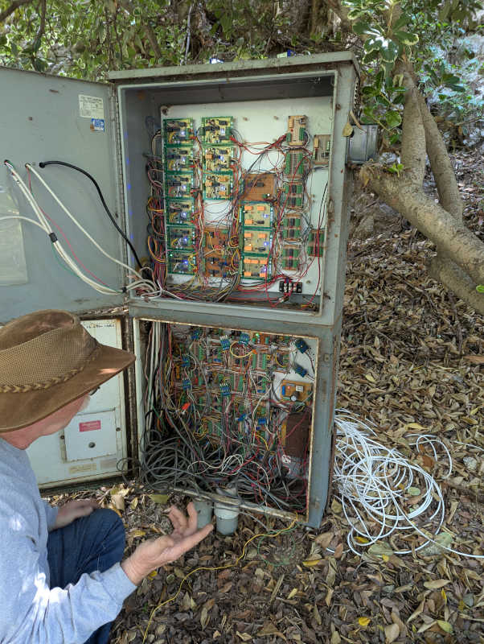
