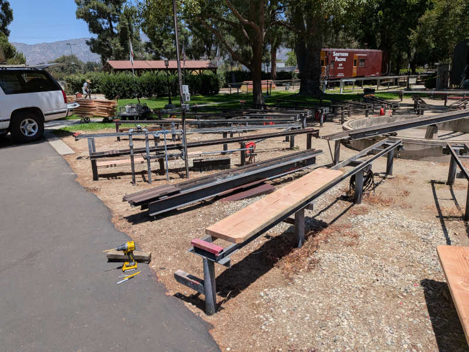
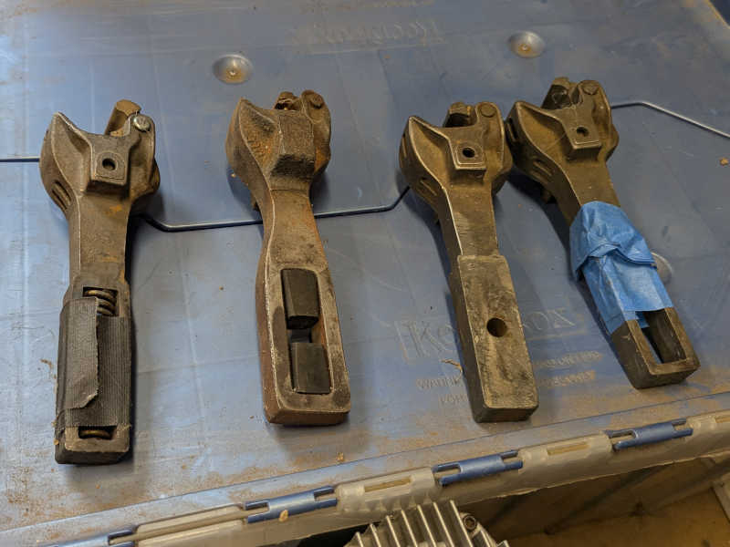
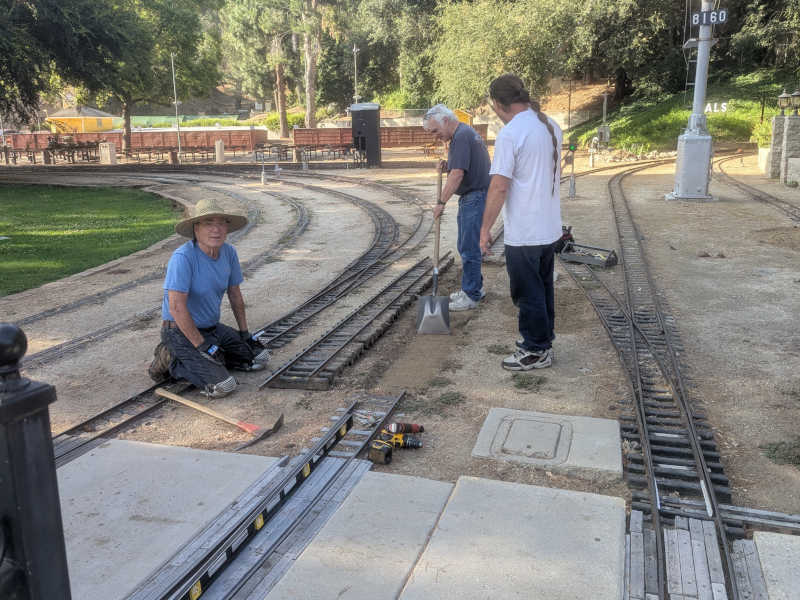
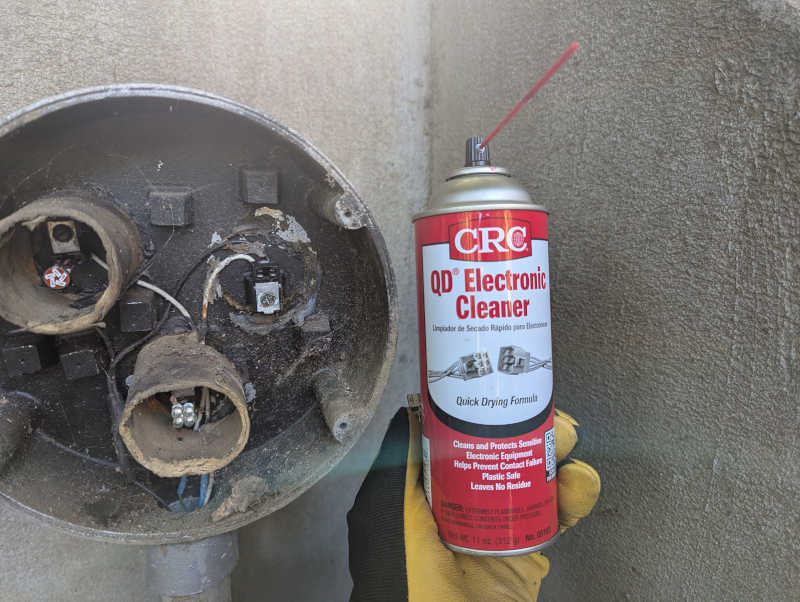
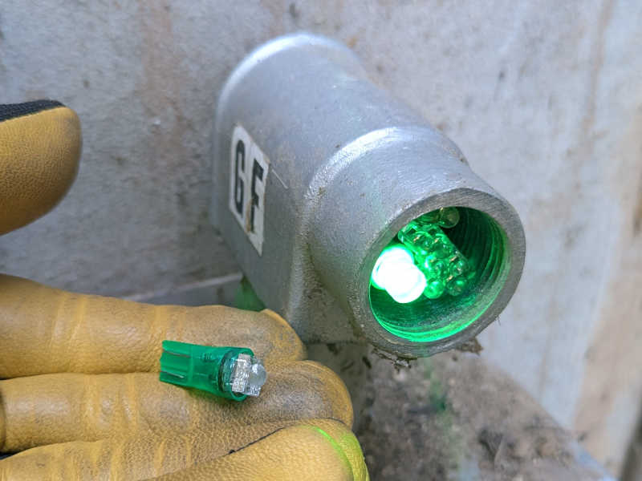
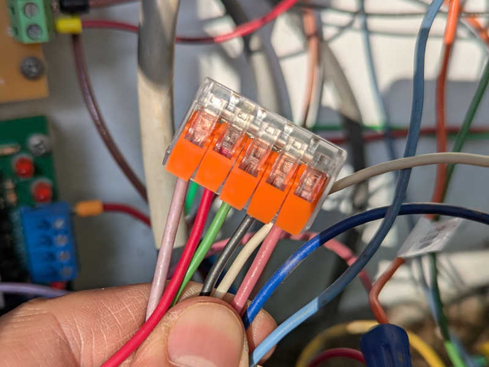
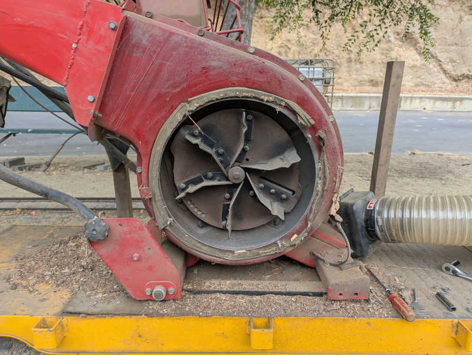
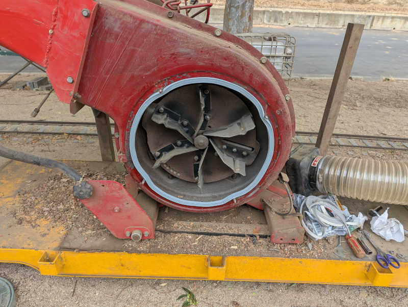
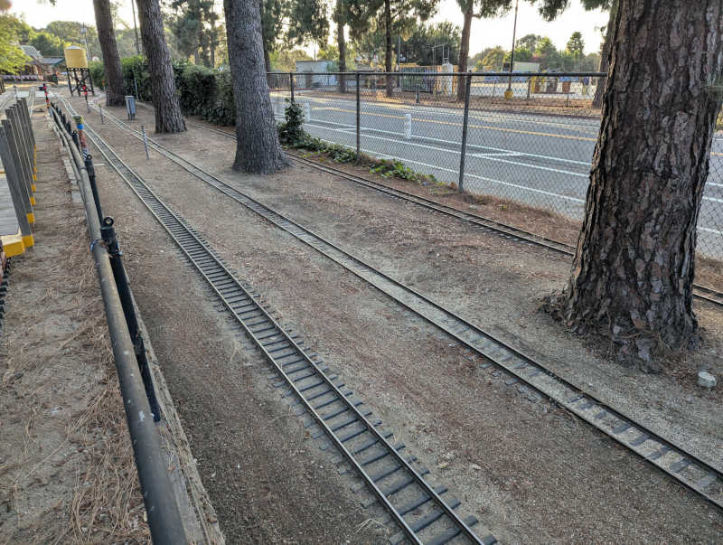
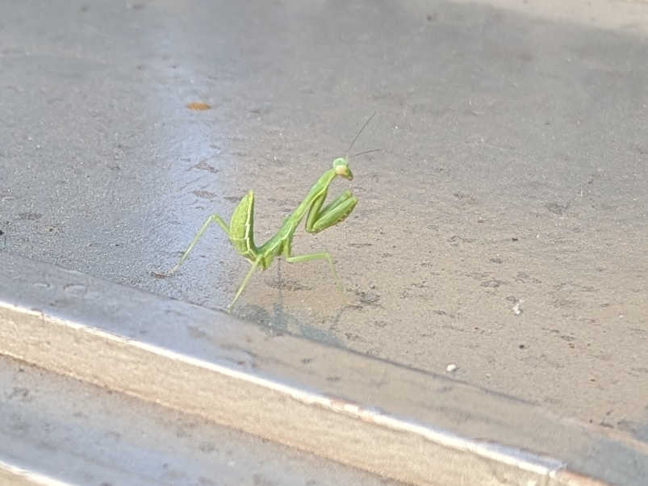

+++
date = '2026-07-08T15:01:39-07:00'
title = '2026 Q3 Timecards'
+++

---

## Thursday 2026/7/15

* 5.5 hours today, 365.5 hours this track year.

Start installing first batch of steaming bay benches.

#### 8:15AM - 1:45PM (5.5 hours)

Met Nelson in the morning for a Home Depot run. They didn't have the wood
treatment Nelson wanted so we went to Lowes. But then found Lowes didn't
have enough lumber of the desired dimension and quality, so back to Home
Depot again to finish the shopping list. This shouldn't have taken two hours
but it did.

Once we got all the planks back to the club we could start shaping them to
fit, drill mounting holes (unique for every single bay), and apply wood
treatment. We had ten bench planks drilled and fitted, with six of those
treated. Looks like about another ten to go before this first steaming bay
is done and we can see how people feel.

---

## Sunday 2026/7/19

* 9.5 hours today, 360 hours this track year.

Sunday public run day alongside Carolwood's monthly activities.

#### 7:00AM - 4:30PM (9.5 hours)

Started the day pulling UP1989 out just for the sake of verifying that the
yellow bench car set can hold pressure. Once verified, I handed UP1989
to Cook to run for the day. I then proceeded to start pulling CN2002 out to be
turned around. Alexander joined me for that task and also connected up to the
dark green bench car set to run for the day.

I conducted for CN2002 the whole day and aside from two passenger safety stops
there was an embarassing derailment as the first train through Disney crossing
but no harm done.

We started with four trains and a light crowd. By the end of the day we
ended up with just two trains that couldn't keep up with the rate of
incoming guests. To ensure everyone got a ride, we kept running past the point
Carolwood people packed up.

After the final load of public passengers disembarked, I took CN2002 for
another familiarization run without passengers. Thanks to advice from Alexander
on what to practice, I now feel comfortable enough with CN2002 to start running
with passengers on board.

---

## Thursday 2026/7/16

* 4 hours today, 350.5 hours this track year.

Signals work half day due to heat wave.

#### 8:15AM - 12:15PM (4 hours)

Revisited the CAA+CCA green+red problem and it appears that back-feeding power
when there's both a force-red and detect is just what these relay-based signal
driver boards do all the time. We checked two other boards and they both do the
same thing. It is rare for multiple signal driver boards to be connected
to the same XO board port, so that behavior doesn't usually cause a problem but
knowing that doesn't help us.

Since replacing a board isn't going to
solve any problems today, the next thing to do is to put a diode in the CAA
V+ port so it doesn't back-feed into CCA. This will make CAA dimmer but it's
facing the opposite direction so that is less critical. Perhaps we'll have to
move the diode from CAA to CCA in six months when running direction flips.

After we verified the diode hack was sufficient for today, we headed towards
panel R to look at erratic behavior of RSM2. But we barely left our panel C
work area when we noticed BH didn't turn red as the train entered BB5. Looking
in panel B we saw not only dangling wires but dangling boards on top of
dangling boards in front of the relevant wires we have to trace through.
Decided there was a high risk of causing unintended changes if we move those
dangling boards out of the way to dig any deeper. Other issues have
priority today so we closed panel B back up. And it turns out we were right!
Because BB5 now turns BH red. We did not intend to change anything yet we
"fixed" it. Is this a win or is this a loss?

Deliberately not thinking too much about that, onward to panel R we go. The
suspect was erratic pole switch behavior outside of the debounce time window
on the switch motor board, so I started rigging up my oscilloscope to watch
the transition. It was not a clean transition from +V to GND but that is
expected of real buttons. The value settled within 5-6ms which is within
range of buttons whose signal traverses over wires hundreds of feet in
length.

The real problem turned out to be the panel voltage which dipped when RSM2
started turning. This was the same problem that took a lot of effort to
diagnose in panel J and thus was a surprise because I was reassured that these
motor control board have worked flawlessly in panel R. My diagnosis tree for
both panel J and R were built on what I've been told and these foundational
pieces of information were wrong.

At least now we know what's going on and the upcoming rev. E motor control
board will be designed to handle the situation.

Before we closed up panel R its ESP32 firmware
was upgraded to the latest version and we moved onward to the adjacent
panel S to do the same thing. While we had panel S open we get started on
wiring up cross-panel communication to panel J. Panel S didn't have a signal
driver board so that was the first step we could do today before it got
uncomfortably hot. The other end in panel J will have to wait another day.

---

## Sunday 2026/7/12

* 8 hours today, 346.5 hours this track year.

Sunday operations crew.

#### 8:00AM - 4:00PM (8 hours)

Started the morning with intent to check fire extinguisher gauges but got
distracted by the black bench car set failing pressure leak test in one of
its new air lines. Pulled out my tool boxes and jumped in. Eventually pin
pointed the problem to the Schrader valve barb fitting for the rubber hose.
So, thankfully not the new novel hardware. There's a clamp that can be
installed for a more secure fit but redoing the connection seemed to have done
the job.

The yellow set didn't get pulled out today so its pressure holding capability
remains untested. I don't want to do the blue set until yellow set tests OK.

Also had an unexpected detour through UP1989 control panel during this
adventure as one of its internal air hoses fell out of its connector. Couldn't
imagine how fiddling with an air line at the back of the train could cause an
air line within the front control console to pop out but that's what happened.

As UP1989 was set up to depart from track 1, pruned the vines reaching out from
the chain link fence so they won't hit our guests in the face on the way out.

Took a signals status verification lap with Cammarata so he can see firsthand
all the issues covered in the signals status email sent yesterday. This might
become a regular thing. We turned on the water wheel on the way out but forgot
to unlock the west gate. Bassett covered for us on that front.

Restocked kitchen beverage refrigerator.

Lunch break engineer for Santa Fe 163 electric locomotive.

Club bench car coupler consultation with Kristman, who seemed surprised to
learn some of the springs are no longer springing. Can't imagine this being a
new thing but perhaps it's not considered normal wear and tear? Kristman
pointed me to a stockpile of couplers available for immediate repairs without
having to order new units. He prefers spring units, but rubber absorption is
preferable to solid units with no shock absorption capability. But even that is
better than a freely sliding slot allowing bench cars to build up momentum
before slamming into an end.

More reconnissance of existing network infrastructure as part of consultation
on what the club might want to install to support future projects.

Sunday operations were shut down early today due to slight drizzle around 2:20
making the track slippery.

Shut down water wheel and locked west gate.

Kitchen dishwashing.

---

## Saturday 2026/7/11

* 11 hours today, 338.5 hours this track year.

A much more satisfying signals work day.

#### 8:00AM - 12:15PM (4.25 hours)

This is an official club work day and it was a fortunate coincidence that
track work was underway in front of Sherwood station. Removing track triggers
a train detection fault similar to a train detection and that is convenient for
two projects on my to-do list. I had planned to park a train on this segment of
track while I diagnose... and now I don't have to!

Taking advantage of this situation, I went to EJA yellow to try more ideas
against its persistent intermittent illumination. It always lights up
immediately after we touch it but goes dark again sometime afterwards. There
were multiple short sessions spread throughout the day but I'm writing them
together here. First I tried an emery board in the hopes I can scrape off
surface corrosion. After EJA yellow went dark again, I sprayed some electric
contact cleaner spray. When that didn't last, I put some of my conductive
grease on the contacts. Yellow went dark again so I replaced the incadescent
automotive bulb LED retrofit module that isn't technically a bulb. Once that
was replaced, EJA yellow seemed to behave well again. I didn't think a simple
circuit like that LED module could hide an intermittent connection, but this
data point says I was wrong.

On the far side of the track work project I have CCA green+red when crossover
is active and there's a train in front of Sherwood. Or in today's case, track
work. Earlier sessions replaced the CCA signal driver board and traced it back
to a XO board that seemed to be working. Today I backtracked further and found
CAA signal board (on the other end of the crossover facing the opposite
direction) was connected to the same XO board, and CAA was doing the same
voltage backfeed that CCA was doing. I don't have a replacement board handy so
the short-term fix is to disconnect CAA's power wire so it can't backfeed. This
means it'll still light up in "Force Red" mode but would be dark outside of it.
As CAA is facing oppsite of the current operating direction, this is the lesser
of two evils until proper repair can be done.

#### 1:00PM - 7:45PM (6.75 hours)

During one of my trips checking how EJA yellow has held up, I noticed GF green
is dark. This was intermittent during movie night a few weeks ago and seemed to
be dark all the time now. Since I had the box of automotive style "bulbs" in
hand for EJA yellow, I opened up GF to replace the green "bulb".

Returned to panel S+J for further testing of the seven wires between them. Good
news: two of the seven may be usable. When I connect red (from 4-conductor
bundle) and blue (individually run wire) in S and measure resistance in J, the
round trip over those two wires measured just 4 ohms.

Three of the seven are heavily degraded. green from 4-conductor bundle,
individually run pink, and individually run purple measure megaohms or higher.

Black and white in the 4-conductor bundle are flat out open circuits.

When I returned from valley back to the station, I saw the track work crew had
wrapped up their mechanical work without reconnecting the electrical signal
feed and bond wires that they had disconnected for the job. This was a surprise
because we had talked about how wires were to be reconnected. I found Nelson
and was told "Well, we knew you would do a better job than we could, so we
figured we'd let you do it."

Fine. I'll do it, and I'll do it my way. Both bond wires were replaced with
fresh new bond wires, and six new fastening screws with conductive grease to
mitigate corrosion.

Ended the work day with a round of club bench car air line upgrade to metal
units that won't be fatally damaged in event of bench car separation. The
black and yellow bench sets were upgraded up to, but not including, the
locomotive connection. Let's see what happens tomorrow and upgrades will
proceed incrementally if things work well.

---

## Thursday 2026/7/9

* 10 hours today, 327.5 hours this track year.

An unsatisfying signals work day.

#### 7:45AM - 12:30PM (4.75 hours)

Started the morning at panel C tracing through CCA GRed weirdness. The key
is something not following the Smith "Force Red" concept, as there is voltage
on the signal driver board power input pin when it should be turned off by a
XO board. Is this malfunction inside the signal driver board, or is it a
malfunction from outside the signal driver board?

The answer was apparently "Why not both?"

The power wire was disconnected from the board. I probed the signal driver
board V+ and saw panel voltage. Aha! This board is broken and leaking "Force
Red" voltage back out to its V+ pin. This board needs to be replaced.

Then I probed the disconnected power wire, expecting to find panel ground,
and was disappointed to find panel voltage here as well. Crap. There's more
to this puzzle. At this point the sun started blazing hotly on panel C so
we retreated to panel J which have shaded trees.

Today's task for panel J was to map out all wires in preparation for ESP32
upgrade in the near future. Fortunately it already has the newer block detector
and signal driver boards, so those wires can be left untouched. The motor
driver situation is also moved up to the latest, with rev. D board now in
charge of both motors and the old Smith board retired. This sorted out the
pole button wires and they can stay untouched during the upgrade as well.

Rail switch position sensing microswitches accounted for two more wires,
one per switch, and they were located and labeled. That took me to lunch time
so I could tackle the biggest challenge with a full stomach.

#### 2:00PM - 7:15PM (5.25 hours)

After lunch it was time for the hard part: find and label all the wires that
carried signals to and from adjacent panels and move them to the isolator
and driver boards as appropriate. There were five wires to find: two red-out
yellow-in signal pairs, and passing along train detection for a block that
didn't match signal/panel boundary. Technically we also needed two ground
wires to send out as reference ground for adjacent panels R and S, but right
now those two panels have ground planes tied to each other due to unrelated
wiring issue so I could get away with just one ground wire. It also meant all
panel R signal wires make a pit stop in panel S with a wire nut, which might
be related but not important today.

That means I need six wires total, and I found seven wires already routed for
the job and already attached to old circuit boards that make sense for their
respective designated duties. I labeled them all so I don't lose them, and
moved outputs to driver board and inputs to isolator board. It all looked neat
and elegant as I powered the panel up to verify my work.

It didn't work. Nothing worked. No driver signals were received by S, and no
isolater signals were received from S. I disconnected wires and put a low
voltage across them to see if I'm looking at the right wires, and I was. But
no signals went through.

After going in (semi)circles a few times I had the hypothesis these wires might
have degraded. I picked five wires out of seven for the test, disconnected them
from the circuit, and tied them all together in a single 5-pole lever-lock
connector inside panel S.

I then went over to panel J and measured continuity between each pair of wires.
I'm supposed to get single digit ohms of resistance through these wires, but I
got megaohm level resistance if I got anything at all. I was losing daylight so
I didn't have time to check the last two. But the trend doesn't look good and
even if the last two worked perfectly (which I doubt) they're not enough to
meet the needs.

All my work labeling and organizing these wires were a waste of time, these
wires are toast. I wrote up this bad news of a status update to the team and..

"Oh yeah, I knew that."

Well that would have been useful to tell me earlier! Or maybe label the known
bad wires when they were found to be bad? Is that so much to ask?

---

## Tuesday 2026/7/7

* 9.5 hours today, 317.5 hours this track year.

A productive signals repair day

#### 8:15AM - 12:15PM (4 hours)

Started in panel K where KAA (signal indicating reversing track by covered
bridge) sensor needed a minor adjustment. Then the rev. C I/O board I installed
as part of the emergency repair on 6/9 was replaced with the intended rev. E
board allowing the corresponding emergency repair ESP32 firmware source code
changes to be reverted.

With rev. E in place, we can connected an input wire for detection state of
IB15. This signal has to travel a long way through two separate lengths of
wire, and it was labeled "Does not work". Traced through and reconnected the
wire to an IB15 signal so now it works, but that raised an interesting
question: If the wire was not connected to anything, we could not have traced
it back to IB15. If so, why was it labeled "IB15"? I can't remember.

Finally a loose 2.5mm ID barrel jack power cable was replaced with a properly
sized 2.1mm ID barrel jack cable.

Returning to panel I, we investigated II yellow not illuminating during this
past Sunday public run. Flipping II over to test mode confirmed that yellow
was not illuminaating. Looking inside the panel I noticed the yellow wire had
fallen out of the LED adapter pigtail board. Putting the wire back in the
connector seemed to have done the trick. I like it when fixes are easy. I also
put a ferrule on this wire so hopefully it's less likely to slip out again.

Also noted from Sunday run is EJA yellow failing to illuminate. Opened it up
again and jiggled the bulb again. I unscrewed the socket itself from the
housing to look for any signsl of damage, I found nothing. The clamping force
of the socket is quite strong, so it's not like the bulb is loose. Not sure why
the connection is not reliable. If this second jiggle doesn't work, I'll bring
in my electronic contact cleaning spray. If that doesn't work, either, it'll be
time for a little dab of my conductive grease. Will pull those tricks out of my
bag as needed.

After putting EJA back together and taking the train through the tunnel, we
took another look at CCA. It didn't do the weird green + red thing... then it
did! We figured out it was triggered by a train being present in a particular
segment of outer main, from the Nelson exit switch to after the CCA crossover
merge. A quick probe indicated the problem is not a red relay stuck on, as was
the case for BH and BG, but that the Smith XO power off + "force red" system
had broken down somewhere. The next step is to sit in front of panel C with a
meter but that's not healthy at high noon under SoCal summer sun. I'm happy we
have a reliable procedure to reproduce the issue, it'll make diagnostics easier
when we come back later.

We went to blissfully shaded panel J to examine feasibility of installing a
regulated power supply. The good news is that there's no NT board in this panel
so that's one headache crossed off the power supply headaches list. In order to
leave existing 110V AC lines untouched for the duration of this experiment (for
easy reverting if need be) we'll wire up the test power supply with a power
plug. Off to lunch and Home Depot.

#### 1:30PM - 7:00PM (5.5 hours)

Just as we were setting up to work in panel J, the NT ring blipped off.
Driving the train around to panel S NT block didn't do anything, that's a
problem for later investigation.

Home Depot power plug in hand, a regulated power supply claiming 12V 10A
capability was installed in panel J and the old linear power supply
disconnected but not removed. Verified the new power supply turns on and off
correctly with the NT ring, and that it had no problem supplying power as two
switch motors spun simultaneously. Very promising step forward. We'll leave it
to run for a while and, if we're satisfied it'll do what we want, we can hard
wire it properly and remove the old power supplies.

Investigation of panel S NT board found that it had time on the clock
but no volts on N+/-. Solder joints on the big relay looked fine. Probing
the smaller blue relay on the timer module, I found panel voltage on C (common)
pin but not on NC (normally closed) or NO (normally open) pins. If there's
panel voltage on C, there should be panel voltage on one of those! As I lifted
my voltage probe away, I heard relay click. I measured again and this time the
NO pin has panel V+. Is the pressure of my voltage probe affecting a loose
connection or something? No definitive answer just yet.

Reconnaissance of panel H found the crossing bell relay activation wire, as
well as candidate locations to tap into panel ground and panel V+. That's the
information necessary to support Perez experiment with gate warning lights,
the next step is up to him.

---

## Monday 2026/7/6

* 2 hours today, 308 hours this track year.

#### 4:30PM - 6:30PM (2 hours)

Arrived early afternoon intending to study documentation stored on board the
club's Santa Fe 163 electric locomotive. Got a ride on Davis' steam train and
a bit of socializing before I started studying in earnest, and the study
period stopped once people started gathering for the evening's board meeting.
In between I got two solid hours of reading, that's not bad.

---

## Sunday 2026/7/5

* 8 hours today, 306 hours this track year.

Smooth and successful first Sunday public run in new direction

#### 8:15AM - 4:15PM (8 hours)

Sunday public ride operations crew! Miscellaneous tasks including restocking
beverage refrigerator in the kitchen and engineering UP1989 for a few runs.
First start was an embarassing hard start but things were fine after that.

---

## Saturday 2026/7/4

* 4 hours today, 298 hours this track year.

Switch motor rev. D oscilloscope diagnostics w/Brock

#### 9:30AM - 1:30PM (4 hours)

Sat in front of panel J with oscilloscope and other tools so Brock can see
the same diagnostics information I gathered earlier. Motor board revision D
is not resiliant against voltage sagging and so its onboard digital logic
circuits behave erratically ("lose their minds" was the phrase I used) when
the motor starts turning and drawing power.

#### Chessie inspection

Stopped the time card clock afterwards because I put Chessie on the
maintenance bay to look around and that doesn't count for club work time.

---

## Friday 2026/7/3

* 5.5 hours today, 294 hours this track year.

Final signals verification before first Sunday run in new direction.

#### 7:45AM - 12:00PM (4.25 hours)

Completed tasks, some of which I postponed earlier. I found there was a second
set of power wires for the 5-way switch that were still connected, explaining
the surprising switch moves. Removing those wires depowered the motors and
eliminated risk of future surprises.

Since we've lost yellow for signal JH, disconnected wire connecting JFA red
out to JH yellow in. Now JH will show green when it would previously try to
show the yellow it doesn't have. Not ideal, but better than a dark signal. We
can reinstall that wire after JH yellow is restored.

Then we went to the false CCA yellow I diagnosed to a failed closed relay for
red of the following signal BH. Replacing BH signal driver board resolved
CCA false yellow.

#### 1:15PM - 2:30PM (1.25 hours)

After a long lunch in an air conditioned space, ventured back out into the
heat for final verification laps. Disappointed to find CCA (where the false
yellow was triggered by BH red relay stuck on) has its own weirdness
illuminating red and green at the same time when set to crossover. Since the
sun is blasting and it works fine for non-crossing-over trains, we'll come
back to this later. Helped put away SPSF and other pieces of equipment, then
retreated from the heat.

---

## Wednesday 2026/7/1

* 9.5 hours today, 288.5 hours this track year.

Reverse direction signs and club work equipment, track cleanup.

#### 8:15AM - 1:30PM (5.25 hours)

Club owned Sunday operations equipment were turned around the previous Sunday
but the official turn around day is today.

First thing was to flip three direction arrows informing everyone of the track
direction. This required a security Torx bit that I don't usually carry with me
to the club but I was prepared for the task.

Next I hitched up club-owned directional maintenance equipment that might have
seen use between Sunday and today.
* Center cab work locomotive (which Clouse did use for garden work)
* Super (track) sucker
* Big yellow flatbeds with F and B direction labels.

Since they were all hitched up and ready to run, I thought it was a convenient
time to run it across the entire Sunday public run route as well. But as soon
as I started the sucker engine I was reminded that the fan seal had decayed
and throwing stuff out of the leak. Those leaks are at 2 and 4 o'clock in this
picture before my repair.

I need to fix that first, which meant a Home Depot run for adhesive-backed
weatherstripping seal.

After the seal was installed I started using track sucker for real. This is a
minor hassle because I couldn't really empty the sucker bag by myself. I had to
resort to using a shovel and a garbage can to empty the bag piecemeal.

I had also loaded up some big garbage cans and brought back piles of leaves from
Bagley. There are still piles of leaves out there but I'm tackling it one train
load at a time. It was tiring work and I felt completely pooped by the time the
bag was emptied but there was another contributing factor: I completely forgot
about lunch. An empty stomach certainly would not have helped. It was a good
stopping point so I put everything away in case I felt like going straight
home after lunch.

#### 3:15PM - 7:30PM (4.25 hours)

After an extended lunch break and Train Shack visit, returned to do some
signals diagnosis. Switch motor failure by Nelson tunnel was easy: just a stuck
branch. Failed reversing track indicator (red/blink red) by covered bridge was
fixed by cleaning thick tough spider webs and debris out of microswitch
housing. Unexpected switch behavior near Phil West barn ladder track was due
to remnants of 5-way switch still receiving power for some reason. And the
false CCA yellow in front of station was caused by a BH red relay that had
failed closed.

Putting off the latter two issues until later, I picked up the two flatbeds
again and raked the thick layer of pine needles out of Bowlus siding. There
were clumps left from track sucker in the morning pushing things around and
the unsightly look got on my nerves.

I had a little friend for part of this project. A tiny preying mantis stowed
away on the train. I didn't see it arrive and I didn't see it depart but this
tiny thing would fit on the tip of my pinky finger. At the moment I would guess
it can go after ants before growing big enough to go after larger food.

